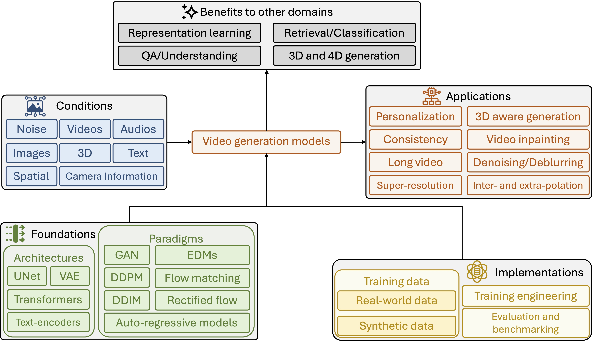

# Survey of Video Diffusion Models: Foundations, Implementations, and Applications [](https://arxiv.org/abs/2504.16081)

<p align="left">
  <div style="text-align:center; font-size: 18px;">
      <p>
      <a href="https://yimuwangcs.github.io">Yimu Wang</a><sup>1,*</sup>, 
      <a href="https://xuyeliu.github.io/" >Xuye Liu</a><sup>1,*</sup>,
      <a href="https://scholar.google.com/citations?user=f90pZOYAAAAJ&hl=en" >Wei Pang</a><sup>1,*</sup>,
      <a href="https://limacv.github.io/homepage/" >Li Ma</a><sup>3,*</sup>,
      <a href="https://shuaiyuan1996.github.io/home/" >Shuai Yuan</a><sup>2,*</sup>,
      <a href="https://www.pauldebevec.com/" >Paul Debevec</a><sup>3</sup>,
      <a href="https://ningyu1991.github.io/" >Ning Yu</a><sup>3,†</sup>
      </p>
  </div>
</p>

<p align="left">
  <sup>1</sup>University of Waterloo, <sup>2</sup>Duke University, <sup>3</sup>Netflix Eyeline Studios <br> <sup>*</sup>Contributed Equally, <sup>†</sup>Corresponding Author
</p>



## Industrial and academic video diffusion models

### Industrial models
*Papers, models, and benchmark datasets are listed in reserse order of their public time.*

| <div style="width:64%">Title</div> | <div style="width:8%">arXiv</div> | <div style="width:8%">Github</div>| <div style="width:8%">WebSite</div> | <div style="width:12%">Pub. & Date</div> |
|:------------------------------------------------------------|:-----------------------------------:|:-----------------------------------:|:-----------------------------------:|:-----------------------------------:|
| [Magic 1-for-1: Generating one minute video clips within one minute](https://arxiv.org/abs/2502.07701) | [](https://arxiv.org/abs/2502.07701) | [](https://github.com/Open-Magic-Video/Magic-1-For-1) | [](https://magic-research.github.io/magic-1-for-1/) | Arxiv 2025 |
| [SkyReels v1: Human-centric video foundation model](https://arxiv.org/abs/2502.10841) | [](https://arxiv.org/abs/2502.10841) | [](https://github.com/SkyworkAI/SkyReels-V1) | - | Arxiv 2025 |
| [Step-Video-T2V](https://arxiv.org/abs/2403.14339) | [](https://arxiv.org/abs/2403.14339) | - | [](https://step-video.github.io/) | Arxiv 2024 |
| [HunyuanVideo](https://arxiv.org/abs/2401.08514) | [](https://arxiv.org/abs/2401.08514) | - | [](https://hunyuan.tecent.com/) | Arxiv 2024 |
| [Sora](https://openai.com/sora) | - | - | [](https://openai.com/sora) | 2024 |
| [STIV](https://github.com/rhymes-ai/Allegro) | [](https://arxiv.org/abs/2402.13243) | [](https://github.com/rhymes-ai/Allegro) | [](https://stiv-ailab.github.io/STIV/) | Arxiv 2024 |
| [LTX-Video](https://arxiv.org/abs/2403.10251) | [](https://arxiv.org/abs/2403.10251) | - | [](https://ltx-video.github.io/) | Arxiv 2024 |
| [Allegro](https://github.com/rhymes-ai/Allegro) | [](https://arxiv.org/abs/2402.05233) | [](https://github.com/rhymes-ai/Allegro) | [](https://allegro-t2v.github.io/) | Arxiv 2024 |
| [Jimeng](https://jimeng.jianying.com/) | [](https://arxiv.org/abs/2402.15687) | - | [](https://jimeng.jianying.com/) | Arxiv 2024 |
| [Mochi 1](https://mochi1ai.com/) | [](https://arxiv.org/abs/2406.08275) | - | [](https://mochi1ai.com/) | Arxiv 2024 |
| [EasyAnimate](https://github.com/aigc-apps/EasyAnimate) | [](https://arxiv.org/abs/2402.15919) | [](https://github.com/aigc-apps/EasyAnimate) | [](https://github.com/aigc-apps/EasyAnimate/blob/main/README.md) | Arxiv 2024 |
| [Vidu](https://www.vidu.com/) | - | - | [](https://www.vidu.com/) | 2024 |
| [VideoCrafter2](https://arxiv.org/abs/2401.09047) | [](https://arxiv.org/abs/2401.09047) | [](https://github.com/AILab-CVC/VideoCrafter) | [](https://ailab-cvc.github.io/videocrafter2/) | Arxiv 2024 |
| [VideoCrafter1](https://arxiv.org/abs/2310.19512) | [](https://arxiv.org/abs/2310.19512) | [](https://github.com/AILab-CVC/VideoCrafter) | [](https://ailab-cvc.github.io/videocrafter/) | Arxiv 2023 |
| [Mira](https://mira-space.github.io/) | [](https://arxiv.org/abs/2403.19343) | - | [](https://mira-space.github.io/) | Arxiv 2024 |
| [Hailuo AI](https://hailuoai.video/) | - | - | [](https://hailuoai.video/) | 2024 |
| [Lumiere](https://lumiere-video.github.io/) | [](https://arxiv.org/abs/2401.12945) | - | [](https://lumiere-video.github.io/) | Arxiv 2024 |
| [VideoPoet](https://sites.research.google/videopoet/) | [](https://arxiv.org/abs/2312.14125) | - | [](https://sites.research.google/videopoet/) | Arxiv 2023 |
| [LumaAI Ray 2](https://lumalabs.ai/ray) | - | - | [](https://lumalabs.ai/ray) | 2024 |
| [LumaAI Dream Machine](https://lumalabs.ai/dream-machine) | - | - | [](https://lumalabs.ai/dream-machine) | 2023 |
| [Veo-2](https://deepmind.google/technologies/veo/veo-2/) | - | - | [](https://deepmind.google/technologies/veo/veo-2/) | 2024 |
| [Veo-1](https://deepmind.google/technologies/veo/veo-1/) | - | - | [](https://deepmind.google/technologies/veo/veo-1/) | 2023 |
| [Nova Real](https://docs.aws.amazon.com/ai/responsible-ai/nova-reel/overview.html) | - | - | [](https://docs.aws.amazon.com/ai/responsible-ai/nova-reel/overview.html) | 2024 |
| [Wanx 2.1](https://tongyi.aliyun.com/wanxiang/videoCreation) | - | - | [](https://tongyi.aliyun.com/wanxiang/videoCreation) | 2024 |
| [Kling](https://www.klingai.com/) | - | - | [](https://www.klingai.com/) | 2024 |
| [Show-1](https://showlab.github.io/Show-1/) | [](https://arxiv.org/abs/2309.15818) | [](https://github.com/showlab/Show-1) | [](https://showlab.github.io/Show-1/) | NeurIPS 2023 |
| [MovieGen](https://ai.meta.com/research/movie-gen/) | [](https://arxiv.org/abs/2401.15969) | - | [](https://ai.meta.com/research/movie-gen/) | Arxiv 2024 |
| [Pika](https://pika.art) | - | - | [](https://pika.art) | 2023 |
| [Vchitect-2.0](https://vchitect.intern-ai.org.cn/) | - | - | [](https://vchitect.intern-ai.org.cn/) | 2024 |
| [Optis](https://github.com/Vchitect/Optix) | [](https://arxiv.org/abs/2311.15255) | [](https://github.com/Vchitect/Optix) | [](https://vchitect.github.io/Optix-Site/) | NeurIPS 2023 |
| [VLogger](https://github.com/Vchitect/Vlogger) | [](https://arxiv.org/abs/2305.20082) | [](https://github.com/Vchitect/Vlogger) | [](https://vchitect.github.io/VLogger-project/) | ICCV 2023 |
| [Seine](https://github.com/Vchitect/SEINE) | [](https://arxiv.org/abs/2304.11334) | [](https://github.com/Vchitect/SEINE) | [](https://seine-ai.github.io/seine/) | CVPR 2023 |
| [Lavie](https://github.com/Vchitect/LaVie) | [](https://arxiv.org/abs/2309.15103) | [](https://github.com/Vchitect/LaVie) | [](https://vchitect.github.io/LaVie-project/) | ICCV 2023 |
| [MiracleVision](https://www.miraclevision.com/) | - | - | [](https://www.miraclevision.com/) | 2023 |
| [Phenaki](https://phenaki.video/) | [](https://arxiv.org/abs/2210.02399) | [](https://github.com/lucidrains/phenaki-pytorch) | [](https://phenaki.video/) | ICLR 2024 |
| [W.A.L.T](https://arxiv.org/abs/2403.06776) | [](https://arxiv.org/abs/2403.06776) | - | [](https://walt-video-diffusion.github.io/) | Arxiv 2024 |
| [Imagen video](https://imagen.research.google/video/) | [](https://arxiv.org/abs/2210.02303) | - | [](https://imagen.research.google/video/) | 2022 |
| [GEN-3 Alpha](https://runwayml.com/research/introducing-gen-3-alpha) | - | - | [](https://runwayml.com/research/introducing-gen-3-alpha) | 2024 |
| [GEN-2](https://runwayml.com/research/gen-2/) | - | - | [](https://runwayml.com/research/gen-2/) | 2023 |
| [GEN-1](https://runwayml.com/research/gen-1/) | - | - | [](https://runwayml.com/research/gen-1/) | 2022 |

### Academic models

*Papers, models, and benchmark datasets are listed in reserse order of their public time.*

| <div style="width:64%">Title</div> | <div style="width:8%">arXiv</div> | <div style="width:8%">Github</div>| <div style="width:8%">WebSite</div> | <div style="width:12%">Pub. & Date</div> |
|:------------------------------------------------------------|:-----------------------------------:|:-----------------------------------:|:-----------------------------------:|:-----------------------------------:|
| [RepVideo: Rethinking Cross-Layer Representation for Video Generation](https://arxiv.org/abs/2501.08994) | [](https://arxiv.org/abs/2501.08994) | [](https://github.com/Vchitect/RepVideo) | [](https://vchitect.github.io/RepVid-Webpage/) | Arxiv 2025 |
| [CausVid: Causality-Aware Video Generation with Slow-Fast Diffusion Models](https://arxiv.org/abs/2402.05602) | [](https://arxiv.org/abs/2402.05602) | [](https://github.com/tianweiy/CausVid) | [](https://causvid.github.io/) | CVPR 2025 |
| [Open-Sora Plan: Open-Source Large Video Generation Model](https://arxiv.org/abs/2412.00131) | [](https://arxiv.org/abs/2412.00131) | [](https://github.com/PKU-YuanGroup/Open-Sora-Plan) | [](https://pku-yuangroup.github.io/Open-Sora-Plan/) | Arxiv 2024 |
| [Open-Sora: Democratizing Efficient Video Production for All](https://arxiv.org/abs/2403.03227) | [](https://arxiv.org/abs/2403.03227) | [](https://github.com/hpcaitech/Open-Sora) | [](https://hpcaitech.github.io/Open-Sora/) | Arxiv 2024 |
| [Snap Video: Scaled Spatiotemporal Transformers for Text-to-Video Synthesis](https://arxiv.org/abs/2402.14797) | [](https://arxiv.org/abs/2402.14797) | - | [](https://snap-research.github.io/snapvideo/) | Arxiv 2024 |
| [SiT: Exploring Flow and Diffusion-Based Generative Models with Scalable Interpolant Transformers](https://arxiv.org/abs/2402.05546) | [](https://arxiv.org/abs/2402.05546) | [](https://github.com/willisma/SiT) | [](https://scalable-interpolant.github.io/) | Arxiv 2024 |
| [VideoDirectorGPT: Consistent Multi-scene Video Generation via LLM-Guided Planning](https://arxiv.org/abs/2401.13064) | [](https://arxiv.org/abs/2401.13064) | [](https://github.com/HL-hanlin/VideoDirectorGPT) | [](https://videodirectorgpt.github.io/) | COLM 2024 |
| [AnimateLCM: Accelerating the Animation of Personalized Diffusion Models and Adapters with Decoupled Consistency Learning](https://arxiv.org/abs/2402.00769) | [](https://arxiv.org/abs/2402.00769) | [](https://github.com/G-U-N/AnimateLCM) | [](https://animatelcm.github.io/) | Arxiv 2024 |
| [I4VGEN: Interactive Video Generation via Integrated Dynamic Control](https://arxiv.org/abs/2402.17483) | [](https://arxiv.org/abs/2402.17483) | [](https://github.com/xiefan-guo/i4vgen) | [](https://xiefan-guo.github.io/i4vgen/) | Arxiv 2024 |
| [SimDA: Simple Diffusion Adapter for Efficient Text-to-Video Generation](https://arxiv.org/abs/2308.09710) | [](https://arxiv.org/abs/2308.09710) | [](https://github.com/ChenHsing/SimDA) | [](https://chenhsing.github.io/SimDA/) | Arxiv 2023 |
| [AnimateDiff-v2](https://arxiv.org/abs/2307.04725) | [](https://arxiv.org/abs/2307.04725) | [](https://github.com/guoyww/AnimateDiff) | [](https://animatediff.github.io/) | ICLR 2024 |
| [Animate-A-Story: Storytelling with Retrieval-Augmented Video Generation](https://arxiv.org/abs/2307.06940) | [](https://arxiv.org/abs/2307.06940) | [](https://github.com/AILab-CVC/Animate-A-Story) | [](https://ailab-cvc.github.io/Animate-A-Story/) | Arxiv 2023 |
| [VideoGen: A Reference-Guided Latent Diffusion Approach for High-Definition Text-to-Video Generation](https://arxiv.org/abs/2309.00398) | [](https://arxiv.org/abs/2309.00398) | - | [](https://videogen.github.io/VideoGen/) | Arxiv 2023 |
| [Dysen-VDM: Diffusion Model with Dynamic Spatio-Temporal Fusion for Video Generation](https://arxiv.org/abs/2309.07906) | [](https://arxiv.org/abs/2309.07906) | [](https://github.com/scofield7419/Dysen) | - | Arxiv 2023 |
| [HiGen: Hierarchical 3D Feature Generation for 3D-Aware Image Synthesis and Manipulation](https://arxiv.org/abs/2306.17075) | [](https://arxiv.org/abs/2306.17075) | [](https://github.com/Karami-m/HiGen_main) | - | Arxiv 2023 |
| [ModelScope Text-to-Video Technical Report](https://arxiv.org/abs/2308.06571) | [](https://arxiv.org/abs/2308.06571) | - | [](https://modelscope.cn/models/damo/text-to-video-synthesis/summary) | Arxiv 2023 |
| [InstructVideo: Instructing Video Diffusion Models with Human Feedback](https://arxiv.org/abs/2312.12490) | [](https://arxiv.org/abs/2312.12490) | - | [](https://instructvideo.github.io/) | CVPR 2024 |
| [VideoComposer: Compositional Video Synthesis with Motion Controllability](https://arxiv.org/abs/2306.02018) | [](https://arxiv.org/abs/2306.02018) | [](https://github.com/damo-vilab/videocomposer) | [](https://videocomposer.github.io/) | NeurIPS 2023 |
| [VideoFusion: Decomposed Diffusion Models for High-Quality Video Generation](https://arxiv.org/abs/2303.08320) | [](https://arxiv.org/abs/2303.08320) | - | - | CVPR 2023 |
| [MagViT-v2: Masked Generative Video Transformer](https://arxiv.org/abs/2310.05737) | [](https://arxiv.org/abs/2310.05737) | [](https://github.com/lucidrains/magvit2-pytorch) | - | Arxiv 2023 |
| [MagViT: Masked Generative Video Transformer](https://arxiv.org/abs/2212.05199) | [](https://arxiv.org/abs/2212.05199) | [](https://github.com/google-research/magvit) | - | Arxiv 2022 |
| [Latent-Shift: Latent Diffusion with Temporal Shift for Efficient Text-to-Video Generation](https://arxiv.org/abs/2304.08477) | [](https://arxiv.org/abs/2304.08477) | - | [](https://latent-shift.github.io/) | Arxiv 2023 |
| [Align your Latents: High-Resolution Video Synthesis with Latent Diffusion Models](https://arxiv.org/abs/2304.08818) | [](https://arxiv.org/abs/2304.08818) | [](https://github.com/srpkdyy/VideoLDM) | [](https://research.nvidia.com/labs/toronto-ai/VideoLDM/) | CVPR 2023 |
| [Video Diffusion Models](https://arxiv.org/abs/2204.03458) | [](https://arxiv.org/abs/2204.03458) | [](https://github.com/lucidrains/video-diffusion-pytorch) | [](https://video-diffusion.github.io/) | Arxiv 2022 |
| [Make-A-Video: Text-to-Video Generation without Text-Video Data](https://arxiv.org/abs/2209.14792) | [](https://arxiv.org/abs/2209.14792) | [](https://github.com/lucidrains/make-a-video-pytorch) | [](https://makeavideo.studio/) | ICLR 2023 |
| [MagicVideo: Efficient Video Generation With Latent Diffusion Models](https://arxiv.org/abs/2211.11018) | [](https://arxiv.org/abs/2211.11018) | - | [](https://magicvideo.github.io/) | Arxiv 2022 |
| [CogVideoX: Enhancing Video Understanding in the Era of Large Language Models](https://arxiv.org/abs/2403.14238) | [](https://arxiv.org/abs/2403.14238) | [](https://github.com/THUDM/CogVideo) | [](https://zhipu-ai.feishu.cn/wiki/DHCjw1TrJiTyeukfc9RceoSRnCh) | Arxiv 2024 |
| [CogVideo: Large-scale Pretraining for Text-to-Video Generation via Transformers](https://arxiv.org/abs/2205.15868) | [](https://arxiv.org/abs/2205.15868) | [](https://github.com/THUDM/CogVideo) | [](https://zhipu-ai.feishu.cn/wiki/DHCjw1TrJiTyeukfc9RceoSRnCh) | ICLR 2023 |
| [VideoGPT: Video Generation using VQ-VAE and Transformers](https://arxiv.org/abs/2104.10157) | [](https://arxiv.org/abs/2104.10157) | [](https://github.com/wilson1yan/VideoGPT) | [](https://wilson1yan.github.io/videogpt/index.html) | Arxiv 2021 |


# Implementation

## Datasets

## Training engineering

## Evaluation metrics and benchmarking findings

*Papers, models, and benchmark datasets are listed in reserse order of their public time.*

[1] N. Bonneel, J. Tompkin, K. Sunkavalli, D. Sun, S. Paris, and H. Pfister. Blind video temporal consis-
tency. TOG, 34(6), 2015. 0.1
[2] F. Fan, C. Luo, W. Gao, and J. Zhan. Aigcbench: Comprehensive evaluation of image-to-video content
generated by ai, 2024. 0.1
[3] W. Feng, J. Li, M. Saxon, T.-j. Fu, W. Chen, and W. Y. Wang. Tc-bench: Benchmarking temporal
compositionality in text-to-video and image-to-video generation, June 2024. 0.1
[4] M.Heusel, H.Ramsauer, T.Unterthiner, B.Nessler, andS.Hochreiter. Ganstrainedbyatwotime-scale
update rule converge to a local nash equilibrium. In NeurIPS, pages 6626–6637, 2017. 0.1
[5] Z. Huang, Y. He, J. Yu, F. Zhang, C. Si, Y. Jiang, Y. Zhang, T. Wu, Q. Jin, N. Chanpaisit, Y. Wang,
X. Chen, L. Wang, D. Lin, Y. Qiao, and Z. Liu. Vbench: Comprehensive benchmark suite for video
generative models. In CVPR, 2024. 0.1
[6] Z. Huang, F. Zhang, X. Xu, Y. He, J. Yu, Z. Dong, Q. Ma, N. Chanpaisit, C. Si, Y. Jiang, Y. Wang,
X. Chen, Y.-C. Chen, L. Wang, D. Lin, Y. Qiao, and Z. Liu. Vbench++: Comprehensive and versatile
benchmark suite for video generative models, 2024. 0.1
[7] P. J. Kim, S. Kim, and J. Yoo. Stream: Spatio-temporal evaluation and analysis metric for video
generative models. In ICLR, 2023. 0.1
[8] Y. Liu, L. Li, S. Ren, R. Gao, S. Li, S. Chen, X. Sun, and L. Hou. Fetv: A benchmark for fine-grained
evaluation of open-domain text-to-video generation. In NeurIPS, 2023. 0.1
[9] A. Radford, J. W. Kim, C. Hallacy, A. Ramesh, G. Goh, S. Agarwal, G. Sastry, A. Askell, P. Mishkin,
J. Clark, et al. Learning transferable visual models from natural language supervision. In ICML, pages
8748–8763, 2021. 0.1
[10] Z. Teed and J. Deng. Raft: Recurrent all-pairs field transforms for optical flow. In ECCV, pages
402–419, 2020. 0.1
[11] T. Unterthiner, S. van Steenkiste, K. Kurach, R. Marinier, M. Michalski, and S. Gelly. Fvd: A new
metric for video generation. In ICLR Workshop, 2019. 0.1
[12] H. Wu, E. Zhang, L. Liao, C. Chen, J. Hou, A. Wang, W. Sun, Q. Yan, and W. Lin. Exploring video
quality assessment on user generated contents from aesthetic and technical perspectives. In ICCV, pages
20087–20097, 2023. 0.1

| <div style="width:64%">Title</div> | <div style="width:8%">arXiv</div> | <div style="width:8%">Github</div>| <div style="width:8%">WebSite</div> | <div style="width:12%">Pub. & Date</div> |
|:------------------------------------------------------------|:-----------------------------------:|:-----------------------------------:|:-----------------------------------:|:-----------------------------------:|
|

| [RepVideo: Rethinking Cross-Layer Representation for Video Generation](https://arxiv.org/abs/2501.08994) | [](https://arxiv.org/abs/2501.08994) | [](https://github.com/Vchitect/RepVideo) | [](https://vchitect.github.io/RepVid-Webpage/) | Arxiv 2025 |

## Table of Contents 
- [Survey of Video Diffusion Models: Foundations, Implementations, and Applications ](#survey-of-video-diffusion-models-foundations-implementations-and-applications-)
  - [Industrial and academic video diffusion models](#industrial-and-academic-video-diffusion-models)
    - [Industrial models](#industrial-models)
    - [Academic models](#academic-models)
- [Implementation](#implementation)
  - [Datasets](#datasets)
  - [Training engineering](#training-engineering)
  - [Evaluation metrics and benchmarking findings](#evaluation-metrics-and-benchmarking-findings)
  - [Table of Contents](#table-of-contents)
- [Foundations](#foundations)
  - [Video generative paradigms](#video-generative-paradigms)
    - [GAN video models](#gan-video-models)
    - [Auto-regressive video models](#auto-regressive-video-models)
    - [Video diffusion models](#video-diffusion-models)
    - [Auto-regressive video diffusion models](#auto-regressive-video-diffusion-models)
  - [Learning foundations](#learning-foundations)
    - [Classic denoising diffusion models](#classic-denoising-diffusion-models)
    - [Flow matching and rectified flow](#flow-matching-and-rectified-flow)
    - [Learning from feedback and reward models](#learning-from-feedback-and-reward-models)
    - [One-shot and few-shot learning](#one-shot-and-few-shot-learning)
    - [Training-free methods](#training-free-methods)
    - [Token learning](#token-learning)
  - [Guidances](#guidances)
    - [Classifier guidance](#classifier-guidance)
    - [Classifier-free guidance](#classifier-free-guidance)
  - [Diffusion model frameworks](#diffusion-model-frameworks)
    - [Pixel diffusion and latent diffusion](#pixel-diffusion-and-latent-diffusion)
    - [Optical-flow-based diffusion models](#optical-flow-based-diffusion-models)
    - [Noise scheduling](#noise-scheduling)
    - [Agent-based diffusion models](#agent-based-diffusion-models)
  - [Architectures](#architectures)
    - [UNet](#unet)
    - [Diffusion transformers](#diffusion-transformers)
    - [VAE for latent space compression](#vae-for-latent-space-compression)
    - [Text encoders](#text-encoders)
- [Applications](#applications)
  - [Conditions](#conditions)
    - [Image condition](#image-condition)
    - [Spatial condition](#spatial-condition)
    - [Camera parameter condition](#camera-parameter-condition)
    - [Audio condition](#audio-condition)
    - [High-level video condition](#high-level-video-condition)
    - [Other conditions](#other-conditions)
  - [Enhancement](#enhancement)
    - [Video denoising and deblurring](#video-denoising-and-deblurring)
    - [Video inpainting](#video-inpainting)
    - [Video interpolation and extrapolation/prediction](#video-interpolation-and-extrapolationprediction)
    - [Video super-resolution](#video-super-resolution)
    - [Combining multiple video enhancement tasks](#combining-multiple-video-enhancement-tasks)
  - [Personalization](#personalization)
  - [Consistency](#consistency)
  - [Long video](#long-video)
  - [3D-aware video diffusion](#3d-aware-video-diffusion)
    - [Training on 3D dataset](#training-on-3d-dataset)
    - [Architecture for 3D diffusion models](#architecture-for-3d-diffusion-models)
    - [Camera conditioning](#camera-conditioning)
    - [Inference-time tricks](#inference-time-tricks)
- [Benefits to other domains](#benefits-to-other-domains)
  - [Video representation learning](#video-representation-learning)
  - [Video retrieval](#video-retrieval)
  - [Video QA and captioning](#video-qa-and-captioning)
  - [3D and 4D generation](#3d-and-4d-generation)
    - [Video diffusion for 3D generation](#video-diffusion-for-3d-generation)
    - [Video diffusion for 4D generation](#video-diffusion-for-4d-generation)
- [Citation](#citation)
- [Acknowledgement](#acknowledgement)

# Foundations

## Video generative paradigms

### GAN video models
*Papers, models, and benchmark datasets are listed in reserse order of their public time.*
| <div style="width:64%">Title</div> | <div style="width:8%">arXiv</div> | <div style="width:8%">Github</div>| <div style="width:8%">WebSite</div> | <div style="width:12%">Pub. & Date</div> |
|:------------------------------------------------------------|:-----------------------------------:|:-----------------------------------:|:-----------------------------------:|:-----------------------------------:|
| [StyleInV: A Temporal Style Modulated Inversion Network for Unconditional Video Generation](https://arxiv.org/abs/2308.16909) | [](https://arxiv.org/abs/2308.16909) | [](https://github.com/johannwyh/StyleInV) | [](https://www.mmlab-ntu.com/project/styleinv/index.html) | ICCV 2023 |
| [StyleLipSync: Style-based Personalized Lip-sync Video Generation](https://arxiv.org/abs/2305.00521) | [](https://arxiv.org/abs/2305.00521) | - | [](https://stylelipsync.github.io/) | ICCV 2023 |
| [SIDGAN: High-Resolution Dubbed Video Generation via Shift-Invariant Learning](https://openaccess.thecvf.com/content/ICCV2023/papers/Muaz_SIDGAN_High-Resolution_Dubbed_Video_Generation_via_Shift-Invariant_Learning_ICCV_2023_paper.pdf) | [](https://openaccess.thecvf.com/content/ICCV2023/papers/Muaz_SIDGAN_High-Resolution_Dubbed_Video_Generation_via_Shift-Invariant_Learning_ICCV_2023_paper.pdf) | - | - | ICCV 2023 |
| [AniFaceGAN: Animatable 3D-Aware Face Image Generation for Video Avatars](https://arxiv.org/abs/2210.06465) | [](https://arxiv.org/abs/2210.06465) | - | - | NeurIPS 2022 |
| [StyleGAN-V: A Continuous Video Generator with the Price, Image Quality and Perks of StyleGAN2](https://arxiv.org/abs/2112.14683) | [](https://arxiv.org/abs/2112.14683) | [](https://github.com/universome/stylegan-v) | [](https://skor.sh/stylegan-v) | CVPR 2022 |
| [Generating Videos with Dynamics-aware Implicit Generative Adversarial Networks](https://arxiv.org/abs/2202.10571) | [](https://arxiv.org/abs/2202.10571) | [](https://github.com/sihyun-yu/digan) | [](https://sihyun.me/digan/) | ICLR 2022 |
| [A Good Image Generator Is What You Need for High-Resolution Video Synthesis](https://arxiv.org/abs/2104.15069) | [](https://arxiv.org/abs/2104.15069) | [](https://github.com/snap-research/MoCoGAN-HD) | [](https://bluer555.github.io/MoCoGAN-HD/) | ICLR 2021 |
| [Analyzing and Improving the Image Quality of StyleGAN](https://arxiv.org/abs/1912.04958) | [](https://arxiv.org/abs/1912.04958) | [](https://github.com/NVlabs/stylegan2) | - | CVPR 2020 |
| [Train Sparsely, Generate Densely: Memory-efficient Unsupervised Training of High-resolution Temporal GAN](https://arxiv.org/abs/1811.09245) | [](https://arxiv.org/abs/1811.09245) | [](https://github.com/pfnet-research/tgan2) | - | IJCV 2020 |
| [Adversarial Video Generation on Complex Datasets](https://arxiv.org/abs/1907.06571) | [](https://arxiv.org/abs/1907.06571) | - | - | Arxiv 2019 |
| [MoCoGAN: Decomposing Motion and Content for Video Generation](https://arxiv.org/abs/1707.04993) | [](https://arxiv.org/abs/1707.04993) | [](https://github.com/sergeytulyakov/mocogan) | - | CVPR 2018 |
| [Temporal Generative Adversarial Nets with Singular Value Clipping](https://arxiv.org/abs/1611.06624) | [](https://arxiv.org/abs/1611.06624) | [](https://github.com/pfnet-research/tgan) | [](https://pfnet-research.github.io/tgan/) | ICCV 2017 |

### Auto-regressive video models
*Papers, models, and benchmark datasets are listed in reserse order of their public time.*
| <div style="width:64%">Title</div> | <div style="width:8%">arXiv</div> | <div style="width:8%">Github</div>| <div style="width:8%">WebSite</div> | <div style="width:12%">Pub. & Date</div> |
|:------------------------------------------------------------|:-----------------------------------:|:-----------------------------------:|:-----------------------------------:|:-----------------------------------:|
| [CogVideo: Large-scale Pretraining for Text-to-Video Generation via Transformers](https://arxiv.org/abs/2205.15868) | [](https://arxiv.org/abs/2205.15868) | [](https://github.com/THUDM/CogVideo) | [](https://models.aminer.cn/cogvideo) | ICLR 2023 |
| [Single Image Video Prediction with Auto-Regressive GANs](https://www.mdpi.com/1424-8220/22/9/3533) | [](https://www.mdpi.com/1424-8220/22/9/3533) | - | - | Sensors 2022 |
| [HARP: Autoregressive Latent Video Prediction with High-Fidelity Image Generator](https://arxiv.org/abs/2209.07143) | [](https://arxiv.org/abs/2209.07143) | - | [](https://sites.google.com/view/harp-videos/home) | ICIP 2022 |
| [Long Video Generation with Time-Agnostic VQGAN and Time-Sensitive Transformer](https://arxiv.org/abs/2204.03638) | [](https://arxiv.org/abs/2204.03638) | [](https://github.com/songweige/TATS) | [](https://songweige.github.io/projects/tats/) | ECCV 2022 |
| [VideoGPT: Video Generation using VQ-VAE and Transformers](https://arxiv.org/abs/2104.10157) | [](https://arxiv.org/abs/2104.10157) | [](https://github.com/wilson1yan/VideoGPT) | [](https://wilsonyan.com/videogpt/index.html) | Arxiv 2021 |
| [Latent Video Transformer](https://arxiv.org/abs/2006.10704) | [](https://arxiv.org/abs/2006.10704) | [](https://github.com/rakhimovv/lvt) | - | Arxiv 2020 |
| [Parallel Multiscale Autoregressive Density Estimation](https://arxiv.org/abs/1703.03664) | [](https://arxiv.org/abs/1703.03664) | - | - | ICML 2017 |
| [Video Pixel Networks](https://arxiv.org/abs/1610.00527) | [](https://arxiv.org/abs/1610.00527) | - | - | ICML 2017 |


### Video diffusion models
*Papers, models, and benchmark datasets are listed in reserse order of their public time.*
| <div style="width:64%">Title</div> | <div style="width:8%">arXiv</div> | <div style="width:8%">Github</div>| <div style="width:8%">WebSite</div> | <div style="width:12%">Pub. & Date</div> |
|:------------------------------------------------------------|:-----------------------------------:|:-----------------------------------:|:-----------------------------------:|:-----------------------------------:|
| [CCEdit: Creative and Controllable Video Editing via Diffusion Models](https://arxiv.org/abs/2401.12345) | [](https://arxiv.org/abs/2401.12345) | - | - | Arxiv 2024 |
| [Align Your Latents: High-Resolution Video Synthesis with Latent Diffusion Models](https://arxiv.org/abs/2304.08818) | [](https://arxiv.org/abs/2304.08818) | [](https://github.com/srpkdyy/VideoLDM) | [](https://research.nvidia.com/labs/toronto-ai/VideoLDM/) | CVPR 2023 |
| [Make-A-Video: Text-to-Video Generation without Text-Video Data](https://arxiv.org/abs/2209.14792) | [](https://arxiv.org/abs/2209.14792) | [](https://github.com/lucidrains/make-a-video-pytorch) | [](https://make-a-video.github.io/) | Arxiv 2022 |
| [MagicVideo: Efficient Video Generation with Latent Diffusion Models](https://arxiv.org/abs/2211.11018) | [](https://arxiv.org/abs/2211.11018) | - | [](https://magicvideo.github.io/) | Arxiv 2022 |
| [Imagen Video: High Definition Video Generation with Diffusion Models](https://arxiv.org/abs/2210.02303) | [](https://arxiv.org/abs/2210.02303) | - | - | Arxiv 2022 |
| [Video Diffusion Models](https://arxiv.org/abs/2204.03458) | [](https://arxiv.org/abs/2204.03458) | [](https://github.com/lucidrains/video-diffusion-pytorch) | [](https://video-diffusion.github.io/) | Arxiv 2022 |
| [Cascaded Diffusion Models for High Fidelity Image Generation](https://arxiv.org/abs/2106.15282) | [](https://arxiv.org/abs/2106.15282) | - | [](https://cascaded-diffusion.github.io/) | JMLR 2022 |
| [High-Resolution Image Synthesis with Latent Diffusion Models](https://arxiv.org/abs/2112.10752) | [](https://arxiv.org/abs/2112.10752) | [](https://github.com/CompVis/latent-diffusion) | - | CVPR 2022 |


### Auto-regressive video diffusion models
*Papers, models, and benchmark datasets are listed in reserse order of their public time.*
| <div style="width:64%">Title</div> | <div style="width:8%">arXiv</div> | <div style="width:8%">Github</div>| <div style="width:8%">WebSite</div> | <div style="width:12%">Pub. & Date</div> |
|:------------------------------------------------------------|:-----------------------------------:|:-----------------------------------:|:-----------------------------------:|:-----------------------------------:|
| [From Slow Bidirectional to Fast Causal Video Generators](https://arxiv.org/abs/2412.07772) | [](https://arxiv.org/abs/2412.07772) | [](https://github.com/tianweiy/CausVid) | [](https://causvid.github.io/) | Arxiv 2024 |
| [Progressive Autoregressive Video Diffusion Models](https://arxiv.org/abs/2410.08151) | [](https://arxiv.org/abs/2410.08151) | [](https://github.com/desaixie/pa_vdm) | [](https://desaixie.github.io/pa-vdm/) | Arxiv 2024 |
| [Pyramidal Flow Matching for Efficient Video Generative Modeling](https://arxiv.org/abs/2410.05954) | [](https://arxiv.org/abs/2410.05954) | [](https://github.com/jy0205/Pyramid-Flow) | [](https://pyramid-flow.github.io/) | Arxiv 2024 |
| [ART·V: Auto-Regressive Text-to-Video Generation with Diffusion Models](https://arxiv.org/abs/2311.18834) | [](https://arxiv.org/abs/2311.18834) | [](https://github.com/WarranWeng/ART.V) | [](https://warranweng.github.io/art.v/) | CVPR 2024 |


## Learning foundations

### Classic denoising diffusion models
*Papers, models, and benchmark datasets are listed in reserse order of their public time.*
| <div style="width:64%">Title</div> | <div style="width:8%">arXiv</div> | <div style="width:8%">Github</div>| <div style="width:8%">WebSite</div> | <div style="width:12%">Pub. & Date</div> |
|:------------------------------------------------------------|:-----------------------------------:|:-----------------------------------:|:-----------------------------------:|:-----------------------------------:|
| [Elucidating the Design Space of Diffusion-Based Generative Models](https://arxiv.org/abs/2206.00364) | [](https://arxiv.org/abs/2206.00364) | [](https://github.com/NVlabs/edm) | - | NeurIPS 2022 |
| [Denoising Diffusion Implicit Models](https://arxiv.org/abs/2010.02502) | [](https://arxiv.org/abs/2010.02502) | [](https://github.com/ermongroup/ddim) | - | ICLR 2021 |
| [Improved Denoising Diffusion Probabilistic Models](https://arxiv.org/abs/2102.09672) | [](https://arxiv.org/abs/2102.09672) | [](https://github.com/openai/improved-diffusion) | - | ICML 2021 |
| [Denoising Diffusion Probabilistic Models](https://arxiv.org/abs/2006.11239) | [](https://arxiv.org/abs/2006.11239) | [](https://github.com/hojonathanho/diffusion) | [](https://hojonathanho.github.io/diffusion/) | NeurIPS 2020 |
| [Deep Unsupervised Learning using Nonequilibrium Thermodynamics](https://arxiv.org/abs/1503.03585) | [](https://arxiv.org/abs/1503.03585) | [](https://github.com/paulffm/Deep-Unsupervised-Learning-Using-Nonequilibrium-Thermodynamics-Reimplementation) | - | ICML 2015 |


### Flow matching and rectified flow
*Papers, models, and benchmark datasets are listed in reserse order of their public time.*
| <div style="width:64%">Title</div> | <div style="width:8%">arXiv</div> | <div style="width:8%">Github</div>| <div style="width:8%">WebSite</div> | <div style="width:12%">Pub. & Date</div> |
|:------------------------------------------------------------|:-----------------------------------:|:-----------------------------------:|:-----------------------------------:|:-----------------------------------:|
| [Voicebox: Text-Guided Multilingual Universal Speech Generation at Scale](https://arxiv.org/abs/2306.15687) | [](https://arxiv.org/abs/2306.15687) | [](https://github.com/lucidrains/voicebox-pytorch) | [](https://voicebox.metademolab.com) | NeurIPS 2023 |
| [Boosting Fast and High-Quality Speech Synthesis with Linear Diffusion](https://arxiv.org/abs/2306.05708) | [](https://arxiv.org/abs/2306.05708) | - | - | ICASSP 2023 |
| [InstaFlow: One Step is Enough for High-Quality Diffusion-Based Text-to-Image Generation](https://arxiv.org/abs/2309.06380) | [](https://arxiv.org/abs/2309.06380) | - | - | ICLR 2024 |
| [Stochastic Interpolants: A Unifying Framework for Flows and Diffusions](https://arxiv.org/abs/2303.08797) | [](https://arxiv.org/abs/2303.08797) | [](https://github.com/malbergo/stochastic-interpolants) | - | Arxiv 2023 |
| [Flow Matching for Generative Modeling](https://arxiv.org/abs/2210.02747) | [](https://arxiv.org/abs/2210.02747) | - | - | Arxiv 2022 |


### Learning from feedback and reward models
*Papers, models, and benchmark datasets are listed in reserse order of their public time.*
| <div style="width:64%">Title</div> | <div style="width:8%">arXiv</div> | <div style="width:8%">Github</div>| <div style="width:8%">WebSite</div> | <div style="width:12%">Pub. & Date</div> |
|:------------------------------------------------------------|:-----------------------------------:|:-----------------------------------:|:-----------------------------------:|:-----------------------------------:|
| [Improving Dynamic Object Interactions in Text-to-Video Generation with AI Feedback](https://arxiv.org/abs/2412.02617) | [](https://arxiv.org/abs/2412.02617) | - | - | Arxiv 2024 |
| [T2V-Turbo-v2: Enhancing Video Generation Model Post-Training through Data, Reward, and Conditional Guidance Design](https://arxiv.org/abs/2410.05677) | [](https://arxiv.org/abs/2410.05677) | [](https://github.com/Ji4chenLi/t2v-turbo) | [](https://t2v-turbo-v2.github.io/) | Arxiv 2024 |
| [T2V-Turbo: Breaking the Quality Bottleneck of Video Consistency Model with Mixed Reward Feedback](https://arxiv.org/abs/2405.18750) | [](https://arxiv.org/abs/2405.18750) | [](https://github.com/Ji4chenLi/t2v-turbo) | [](https://t2v-turbo.github.io/) | NeurIPS 2024 |
| [InstructVideo: Instructing Video Diffusion Models with Human Feedback](https://arxiv.org/abs/2312.12490) | [](https://arxiv.org/abs/2312.12490) | [](https://github.com/ali-vilab/VGen/blob/main/doc/InstructVideo.md) | [](https://instructvideo.github.io/) | CVPR 2024 |
| [Click to Move: Controlling Video Generation with Sparse Motion](https://arxiv.org/abs/2108.08815) | [](https://arxiv.org/abs/2108.08815) | [](https://github.com/PierfrancescoArdino/C2M) | - | ICCV 2021 |


### One-shot and few-shot learning
*Papers, models, and benchmark datasets are listed in reserse order of their public time.*
| <div style="width:64%">Title</div> | <div style="width:8%">arXiv</div> | <div style="width:8%">Github</div>| <div style="width:8%">WebSite</div> | <div style="width:12%">Pub. & Date</div> |
|:------------------------------------------------------------|:-----------------------------------:|:-----------------------------------:|:-----------------------------------:|:-----------------------------------:|
| [Make an Image Move: Few-Shot Based Video Generation Guided by CLIP](https://dl.acm.org/doi/10.1007/978-3-031-78172-8_10) | - | - | - | ICPR 2025 |
| [LAMP: Learn A Motion Pattern for Few-Shot-Based Video Generation](https://arxiv.org/abs/2310.10769) | [](https://arxiv.org/abs/2310.10769) | [](https://github.com/RQ-Wu/LAMP) | [](https://rq-wu.github.io/projects/LAMP/) | Oct., 2023 |
| [Tune-A-Video: One-Shot Tuning of Image Diffusion Models for Text-to-Video Generation](https://arxiv.org/abs/2212.11565) | [](https://arxiv.org/abs/2212.11565) | [](https://github.com/showlab/Tune-A-Video) | [](https://tuneavideo.github.io/) | ICCV 2023 |


### Training-free methods
*Papers, models, and benchmark datasets are listed in reserse order of their public time.*
| <div style="width:64%">Title</div> | <div style="width:8%">arXiv</div> | <div style="width:8%">Github</div>| <div style="width:8%">WebSite</div> | <div style="width:12%">Pub. & Date</div> |
|:------------------------------------------------------------|:-----------------------------------:|:-----------------------------------:|:-----------------------------------:|:-----------------------------------:|
| [DreamVideo-2: Zero-Shot Subject-Driven Video Customization with Precise Motion Control](https://arxiv.org/abs/2410.13830) | [](https://arxiv.org/abs/2410.13830) | - | [](https://dreamvideo2.github.io/) | Arxiv 2024 |
| [VideoElevator: Elevating Video Generation Quality with Versatile Text-to-Image Diffusion Models](https://arxiv.org/abs/2403.05438) | [](https://arxiv.org/abs/2403.05438) | [](https://github.com/YBYBZhang/VideoElevator) | [](https://videoelevator.github.io/) | Arxiv 2024 |
| [GPT4Motion: Scripting Physical Motions in Text-to-Video Generation via Blender-Oriented GPT Planning](https://arxiv.org/abs/2311.12631) | [](https://arxiv.org/abs/2311.12631) | [](https://github.com/jiaxilv/GPT4Motion) | [](https://gpt4motion.github.io/) | CVPR 2024 |
| [Peekaboo: Interactive Video Generation via Masked-Diffusion](https://arxiv.org/abs/2312.07509) | [](https://arxiv.org/abs/2312.07509) | [](https://github.com/microsoft/Peekaboo) | [](https://yash-jain.com/projects/Peekaboo/) | CVPR 2024 |
| [ControlVideo: Training-free Controllable Text-to-Video Generation](https://arxiv.org/abs/2305.13077) | [](https://arxiv.org/abs/2305.13077) | [](https://github.com/YBYBZhang/ControlVideo) | [](https://controlvideov1.github.io/) | ICLR 2024 |
| [Magic-Me: Identity-Specific Video Customized Diffusion](https://arxiv.org/abs/2402.09368) | [](https://arxiv.org/abs/2402.09368) | [](https://github.com/Zhen-Dong/Magic-Me) | [](https://magic-me-webpage.github.io/) | Arxiv 2024 |
| [AnyV2V: A Tuning-Free Framework For Any Video-to-Video Editing Tasks](https://arxiv.org/abs/2403.14468) | [](https://arxiv.org/abs/2403.14468) | [](https://github.com/TIGER-AI-Lab/AnyV2V) | [](https://tiger-ai-lab.github.io/AnyV2V/) | Arxiv 2024 |
| [Free-Bloom: Zero-Shot Text-to-Video Generator with LLM Director and LDM Animator](https://arxiv.org/abs/2309.14494) | [](https://arxiv.org/abs/2309.14494) | [](https://github.com/SooLab/Free-Bloom) | [](https://neurips.cc/virtual/2023/poster/70404) | NeurIPS 2023 |
| [FateZero: Fusing Attentions for Zero-shot Text-based Video Editing](https://arxiv.org/abs/2303.09535) | [](https://arxiv.org/abs/2303.09535) | [](https://github.com/ChenyangQiQi/FateZero) | - | ICCV 2023 |
| [Text2Video-Zero: Text-to-Image Diffusion Models are Zero-Shot Video Generators](https://arxiv.org/abs/2303.13439) | [](https://arxiv.org/abs/2303.13439) | [](https://github.com/Picsart-AI-Research/Text2Video-Zero) | [](https://text2video-zero.github.io/) | ICCV 2023 |


### Token learning
*Papers, models, and benchmark datasets are listed in reserse order of their public time.*
| <div style="width:64%">Title</div> | <div style="width:8%">arXiv</div> | <div style="width:8%">Github</div>| <div style="width:8%">WebSite</div> | <div style="width:12%">Pub. & Date</div> |
|:------------------------------------------------------------|:-----------------------------------:|:-----------------------------------:|:-----------------------------------:|:-----------------------------------:|
| [DreamVideo-2: Zero-Shot Subject-Driven Video Customization with Precise Motion Control](https://arxiv.org/abs/2410.13830) | [](https://arxiv.org/abs/2410.13830) | - | [](https://dreamvideo2.github.io/) | Arxiv 2024 |
| [Animate-A-Story: Storytelling with Retrieval-Augmented Video Generation](https://arxiv.org/abs/2307.06940) | [](https://arxiv.org/abs/2307.06940) | - | - | Arxiv 2023 |
| [An Image is Worth One Word: Personalizing Text-to-Image Generation using Textual Inversion](https://arxiv.org/abs/2208.01618) | [](https://arxiv.org/abs/2208.01618) | [](https://github.com/rinongal/textual_inversion) | [](https://textual-inversion.github.io/) | ICLR 2023 |

## Guidances

### Classifier guidance
*Papers, models, and benchmark datasets are listed in reserse order of their public time.*
| <div style="width:64%">Title</div> | <div style="width:8%">arXiv</div> | <div style="width:8%">Github</div>| <div style="width:8%">WebSite</div> | <div style="width:12%">Pub. & Date</div> |
|:------------------------------------------------------------|:-----------------------------------:|:-----------------------------------:|:-----------------------------------:|:-----------------------------------:|
| [CFG++: Manifold-Constrained Classifier Free Guidance for Diffusion Models](https://arxiv.org/abs/2406.08070) | [](https://arxiv.org/abs/2406.08070) | [](https://github.com/CFGpp-diffusion/CFGpp) | [](https://cfgpp-diffusion.github.io/) | Arxiv 2024 |
| [LLM-grounded Video Diffusion Models](https://arxiv.org/abs/2309.17444) | [](https://arxiv.org/abs/2309.17444) | [](https://github.com/TonyLianLong/LLM-groundedVideoDiffusion) | [](https://llm-grounded-video-diffusion.github.io/) | ICLR 2024 |
| [Exploring Compositional Visual Generation with Latent Classifier Guidance](https://arxiv.org/abs/2304.12536) | [](https://arxiv.org/abs/2304.12536) | - | - | CVPRW 2023 |
| [Diffusion Models Beat GANs on Image Synthesis](https://arxiv.org/abs/2105.05233) | [](https://arxiv.org/abs/2105.05233) | - | - | NeurIPS 2021 |


### Classifier-free guidance
*Papers, models, and benchmark datasets are listed in reserse order of their public time.*
| <div style="width:64%">Title</div> | <div style="width:8%">arXiv</div> | <div style="width:8%">Github</div>| <div style="width:8%">WebSite</div> | <div style="width:12%">Pub. & Date</div> |
|:------------------------------------------------------------|:-----------------------------------:|:-----------------------------------:|:-----------------------------------:|:-----------------------------------:|
| [Classifier-Free Diffusion Guidance](https://arxiv.org/abs/2207.12598) | [](https://arxiv.org/abs/2207.12598) | [](https://github.com/lucidrains/classifier-free-guidance-pytorch) | []() | 2022 |

## Diffusion model frameworks

### Pixel diffusion and latent diffusion
*Papers, models, and benchmark datasets are listed in reserse order of their public time.*
| <div style="width:64%">Title</div> | <div style="width:8%">arXiv</div> | <div style="width:8%">Github</div>| <div style="width:8%">WebSite</div> | <div style="width:12%">Pub. & Date</div> |
|:------------------------------------------------------------|:-----------------------------------:|:-----------------------------------:|:-----------------------------------:|:-----------------------------------:|
| [Latte: Latent Diffusion Transformer for Video Generation](https://arxiv.org/abs/2401.03048) | [](https://arxiv.org/abs/2401.03048) | [](https://github.com/Vchitect/Latte) | [](https://maxin-cn.github.io/latte_project/) | TMLR 2025 |
| [Show-1: Marrying Pixel and Latent Diffusion Models for Text-to-Video Generation](https://arxiv.org/abs/2309.15818) | [](https://arxiv.org/abs/2309.15818) | [](https://github.com/showlab/Show-1) | [](https://showlab.github.io/Show-1/) | Arxiv 2023 |
| [Preserve Your Own Correlation: A Noise Prior for Video Diffusion Models](https://arxiv.org/abs/2305.10474) | [](https://arxiv.org/abs/2305.10474) | - | - | ICCV 2023 |
| [ModelScope Text-to-Video Technical Report](https://arxiv.org/abs/2308.06571) | [](https://arxiv.org/abs/2308.06571) | - | [](https://modelscope.cn/models/damo/text-to-video-synthesis/summary) | Arxiv 2023 |
| [Structure and Content-Guided Video Synthesis with Diffusion Models](https://arxiv.org/abs/2303.13439) | [](https://arxiv.org/abs/2303.13439) | - | - | ICCV 2023 |
| [Align Your Latents: High-Resolution Video Synthesis with Latent Diffusion Models](https://arxiv.org/abs/2304.08818) | [](https://arxiv.org/abs/2304.08818) | [](https://github.com/srpkdyy/VideoLDM) | [](https://research.nvidia.com/labs/toronto-ai/VideoLDM/) | CVPR 2023 |
| [Text-To-4D Dynamic Scene Generation](https://arxiv.org/abs/2301.11280) | [](https://arxiv.org/abs/2301.11280) | - | [](https://make-a-video3d.github.io/) | Arxiv 2023 |


### Optical-flow-based diffusion models
*Papers, models, and benchmark datasets are listed in reserse order of their public time.*
| <div style="width:64%">Title</div> | <div style="width:8%">arXiv</div> | <div style="width:8%">Github</div>| <div style="width:8%">WebSite</div> | <div style="width:12%">Pub. & Date</div> |
|:------------------------------------------------------------|:-----------------------------------:|:-----------------------------------:|:-----------------------------------:|:-----------------------------------:|
| [Go-with-the-Flow: Motion-Controllable Video Diffusion Models Using Real-Time Warped Noise](https://arxiv.org/abs/2501.08331) | [](https://arxiv.org/abs/2501.08331) | [](https://github.com/Eyeline-Research/Go-with-the-Flow) | [](https://eyeline-research.github.io/Go-with-the-Flow/) | CVPR 2025 |
| [Infinite-Resolution Integral Noise Warping for Diffusion Models](https://arxiv.org/abs/2402.12345) | [](https://arxiv.org/abs/2402.12345) | [](https://github.com/yitongdeng-projects/infinite_resolution_integral_noise_warping_code)|[](https://yitongdeng-projects.github.io/noise_warping_webpage/)  | ICLR 2024 |
| [Motion-I2V: Consistent and Controllable Image-to-Video Generation with Explicit Motion Modeling](https://arxiv.org/abs/2401.12345) | [](https://arxiv.org/abs/2401.12345) | [](https://github.com/G-U-N/Motion-I2V)|[](https://xiaoyushi97.github.io/Motion-I2V/) | SIGGRAPH 2024 |
| [A Dynamic Multi-Scale Voxel Flow Network for Video Prediction](https://arxiv.org/abs/2305.12345) | [](https://arxiv.org/abs/2305.12345) | [](https://github.com/hzwer/CVPR2023-DMVFN)|[](https://huxiaotaostasy.github.io/DMVFN/) | CVPR 2023 |
| [FlowFormer++: Masked Cost Volume Autoencoding for Pretraining Optical Flow Estimation](https://arxiv.org/abs/2303.01237) | [](https://arxiv.org/abs/2303.01237) | [](https://github.com/XiaoyuShi97/FlowFormerPlusPlus) | - | Arxiv 2023 |
| [FlowFormer: A Transformer Architecture for Optical Flow](https://arxiv.org/abs/2203.16194) | [](https://arxiv.org/abs/2203.16194) | [](https://github.com/drinkingcoder/FlowFormer-Official)|[](https://drinkingcoder.github.io/publication/flowformer/) | Arxiv 2022 |
| [RAFT: Recurrent All-Pairs Field Transforms for Optical Flow](https://arxiv.org/abs/2003.12039) | [](https://arxiv.org/abs/2003.12039) | [](https://github.com/princeton-vl/RAFT) | - | ECCV 2020 |
| [LiteFlowNet: A Lightweight Convolutional Neural Network for Optical Flow Estimation](https://arxiv.org/abs/1805.07036) | [](https://arxiv.org/abs/1805.07036) | [](https://github.com/twhui/LiteFlowNet) | - | CVPR 2018 |
| [PWC-Net: CNNs for Optical Flow Using Pyramid, Warping, and Cost Volume](https://arxiv.org/abs/1709.02371) | [](https://arxiv.org/abs/1709.02371) | [](https://github.com/NVlabs/PWC-Net) | - | CVPR 2018 |
| [FlowNet 2.0: Evolution of Optical Flow Estimation with Deep Networks](https://arxiv.org/abs/1612.01925) | [](https://arxiv.org/abs/1612.01925) | [](https://github.com/NVIDIA/flownet2-pytorch) | - | Arxiv 2016 |
| [FlowNet: Learning Optical Flow with Convolutional Networks](https://arxiv.org/abs/1504.06852) | [](https://arxiv.org/abs/1504.06852) | [](https://github.com/ClementPinard/FlowNetPytorch) | - | ICCV 2015 |
| [A Quantitative Analysis of Current Practices in Optical Flow Estimation and the Principles Behind Them](https://doi.org/10.1007/s11263-013-0644-x) | - | - | - | IJCV 2014 |
| [Lucas/Kanade Meets Horn/Schunck: Combining Local and Global Optic Flow Methods](https://www.mia.uni-saarland.de/Publications/bruhn-ijcv05c.pdf) | - | - | - | IJCV 2005 |
| [A Framework for the Robust Estimation of Optical Flow](https://www.cs.washington.edu/education/courses/576/03sp/readings/black93.pdf) | - | - | - | ICCV 1993 |
| [Determining Optical Flow](https://people.csail.mit.edu/bkph/AIM/AIM-572.pdf) | - | - | - | AI Journal 1981 |


### Noise scheduling
*Papers, models, and benchmark datasets are listed in reserse order of their public time.*
| <div style="width:64%">Title</div> | <div style="width:8%">arXiv</div> | <div style="width:8%">Github</div>| <div style="width:8%">WebSite</div> | <div style="width:12%">Pub. & Date</div> |
|:------------------------------------------------------------|:-----------------------------------:|:-----------------------------------:|:-----------------------------------:|:-----------------------------------:|
| [Rethinking the Noise Schedule of Diffusion-Based Generative Models](https://openreview.net/forum?id=ylHLVq0psd) | [](https://openreview.net/forum?id=ylHLVq0psd) | - | - | ICLR 2024 |
| [On the Importance of Noise Scheduling for Diffusion Models](https://arxiv.org/abs/2301.10972) | [](https://arxiv.org/abs/2301.10972) | - | - | Arxiv 2023 |
| [simple diffusion: End-to-end diffusion for high resolution images](https://arxiv.org/abs/2301.11093) | [](https://arxiv.org/abs/2301.11093) | [](https://github.com/faverogian/simpleDiffusion) | - | ICML 2023 |
| [Elucidating the Design Space of Diffusion-Based Generative Models](https://arxiv.org/abs/2206.00364) | [](https://arxiv.org/abs/2206.00364) | [](https://github.com/NVlabs/edm) | - | NeurIPS 2022 |
| [Improved Denoising Diffusion Probabilistic Models](https://arxiv.org/abs/2102.09672) | [](https://arxiv.org/abs/2102.09672) | [](https://github.com/openai/improved-diffusion) | - | ICML 2021 |
| [Denoising Diffusion Probabilistic Models](https://arxiv.org/abs/2006.11239) | [](https://arxiv.org/abs/2006.11239) | [](https://github.com/hojonathanho/diffusion) | [](https://hojonathanho.github.io/diffusion/) | NeurIPS 2020 |
| [Score-Based Generative Modeling through Stochastic Differential Equations](https://arxiv.org/abs/2011.13456) | [](https://arxiv.org/abs/2011.13456) | [](https://github.com/yang-song/score_sde) | - | ICLR 2021 |


### Agent-based diffusion models
*Papers, models, and benchmark datasets are listed in reserse order of their public time.*
| <div style="width:64%">Title</div> | <div style="width:8%">arXiv</div> | <div style="width:8%">Github</div>| <div style="width:8%">WebSite</div> | <div style="width:12%">Pub. & Date</div> |
|:------------------------------------------------------------|:-----------------------------------:|:-----------------------------------:|:-----------------------------------:|:-----------------------------------:|
| [VideoAgent: Self-Improving Video Generation](https://arxiv.org/abs/2410.10076) | [](https://arxiv.org/abs/2410.10076) | [](https://github.com/Video-as-Agent/VideoAgent) | [](https://video-as-agent.github.io/) | ICLR 2025 |
| [Mora: Enabling Generalist Video Generation via A Multi-Agent Framework](https://arxiv.org/abs/2403.13248) | [](https://arxiv.org/abs/2403.13248) | [](https://github.com/lichao-sun/Mora) | - | Arxiv 2024 |
| [MetaGPT: Meta Programming for A Multi-Agent Collaborative Framework](https://arxiv.org/abs/2308.00352) | [](https://arxiv.org/abs/2308.00352) | [](https://github.com/geekan/MetaGPT) | - | Arxiv 2023 |
| [AutoGen: Enabling Next-Gen LLM Applications via Multi-Agent Conversation Framework](https://arxiv.org/abs/2308.08155) | [](https://arxiv.org/abs/2308.08155) | - | [](https://microsoft.github.io/autogen/) | Arxiv 2023 |
| [DriveGAN: Towards a Controllable High-Quality Neural Simulation](https://arxiv.org/abs/2104.15060) | [](https://arxiv.org/abs/2104.15060) | [](https://github.com/nv-tlabs/DriveGAN_code) | [](https://research.nvidia.com/labs/toronto-ai/DriveGAN/) | CVPR 2021 |


## Architectures

### UNet
*Papers, models, and benchmark datasets are listed in reserse order of their public time.*
| <div style="width:64%">Title</div> | <div style="width:8%">arXiv</div> | <div style="width:8%">Github</div>| <div style="width:8%">WebSite</div> | <div style="width:12%">Pub. & Date</div> |
|:------------------------------------------------------------|:-----------------------------------:|:-----------------------------------:|:-----------------------------------:|:-----------------------------------:|
| [MoVideo: Motion-Aware Video Generation with Diffusion Models](https://arxiv.org/abs/2311.11325) | [](https://arxiv.org/abs/2311.11325) | - | [](https://jingyunliang.github.io/MoVideo/) | ECCV 2025 |
| [ModelScope Text-to-Video Technical Report](https://arxiv.org/abs/2308.06571) | [](https://arxiv.org/abs/2308.06571) | - | - | Arxiv 2023 |
| [Latent-Shift: Latent Diffusion with Temporal Shift for Efficient Text-to-Video Generation](https://arxiv.org/abs/2304.08477) | [](https://arxiv.org/abs/2304.08477) | - | [](https://latent-shift.github.io/) | Arxiv 2023 |
| [MagicVideo: Efficient Video Generation with Latent Diffusion Models](https://arxiv.org/abs/2211.11018) | [](https://arxiv.org/abs/2211.11018) | - | [](https://magicvideo.github.io/) | Arxiv 2022 |
| [Latent Video Diffusion Models for High-Fidelity Video Generation with Arbitrary Lengths](https://arxiv.org/abs/2211.13221) | [](https://arxiv.org/abs/2211.13221) | - | - | Arxiv 2022 |
| [Imagen Video: High Definition Video Generation with Diffusion Models](https://arxiv.org/abs/2210.02303) | [](https://arxiv.org/abs/2210.02303) | - | - | Arxiv 2022 |
| [Video Diffusion Models](https://arxiv.org/abs/2204.03458) | [](https://arxiv.org/abs/2204.03458) | [](https://github.com/lucidrains/video-diffusion-pytorch) | [](https://video-diffusion.github.io/) | Arxiv 2022 |
| [Photorealistic Text-to-Image Diffusion Models with Deep Language Understanding](https://arxiv.org/abs/2205.11487) | [](https://arxiv.org/abs/2205.11487) | - | - | NeurIPS 2022 |
| [High-Resolution Image Synthesis with Latent Diffusion Models](https://arxiv.org/abs/2112.10752) | [](https://arxiv.org/abs/2112.10752) | [](https://github.com/CompVis/latent-diffusion) | - | CVPR 2022 |
| [An Image is Worth 16x16 Words: Transformers for Image Recognition at Scale](https://arxiv.org/abs/2010.11929) | [](https://arxiv.org/abs/2010.11929) | - | - | ICLR 2021 |
| [U-Net: Convolutional Networks for Biomedical Image Segmentation](https://arxiv.org/abs/1505.04597) | [](https://arxiv.org/abs/1505.04597) | [](https://github.com/Miltos-90/UNet_Biomedical_Image_Segmentation) | - | MICCAI 2015 |


### Diffusion transformers
*Papers, models, and benchmark datasets are listed in reserse order of their public time.*
| <div style="width:64%">Title</div> | <div style="width:8%">arXiv</div> | <div style="width:8%">Github</div>| <div style="width:8%">WebSite</div> | <div style="width:12%">Pub. & Date</div> |
|:------------------------------------------------------------|:-----------------------------------:|:-----------------------------------:|:-----------------------------------:|:-----------------------------------:|
| [Open-Sora: Democratizing Efficient Video Production for All](https://arxiv.org/abs/2412.20404) | [](https://arxiv.org/abs/2412.20404) | [](https://github.com/hpcaitech/Open-Sora) | - | Arxiv 2024 |
| [From Slow Bidirectional to Fast Causal Video Generators](https://arxiv.org/abs/2412.07772) | [](https://arxiv.org/abs/2412.07772) | [](https://github.com/tianweiy/CausVid) | [](https://causvid.github.io/) | Arxiv 2024 |
| [SiT: Exploring Flow and Diffusion-based Generative Models with Scalable Interpolant Transformers](https://arxiv.org/abs/2401.08740) | [](https://arxiv.org/abs/2401.08740) | - | [](https://scalable-interpolant.github.io/) | Arxiv 2024 |
| [GenTron: Diffusion Transformers for Image and Video Generation](https://arxiv.org/abs/2312.04557) | [](https://arxiv.org/abs/2312.04557) | - | [](https://www.shoufachen.com/gentron_website/) | CVPR 2024 |
| [VDT: General-purpose Video Diffusion Transformers via Mask Modeling](https://arxiv.org/abs/2305.13311) | [](https://arxiv.org/abs/2305.13311) | [](https://github.com/RERV/VDT) | - | ICLR 2024 |
| [Text2Performer: Text-Driven Human Video Generation](https://arxiv.org/abs/2304.08483) | [](https://arxiv.org/abs/2304.08483) | [](https://github.com/yumingj/Text2Performer) | - | ICCV 2023 |
| [Scalable Diffusion Models with Transformers](https://arxiv.org/abs/2212.09748) | [](https://arxiv.org/abs/2212.09748) | - | [](https://www.wpeebles.com/DiT) | ICCV 2023 |
| [CogVideo: Large-scale Pretraining for Text-to-Video Generation via Transformers](https://arxiv.org/abs/2205.15868) | [](https://arxiv.org/abs/2205.15868) | - | - | ICLR 2023 |
| [VersVideo: Leveraging Enhanced Temporal Diffusion Models for Versatile Video Generation](https://openreview.net/forum?id=K9sVJ17zvB) | - | - | - | ICLR 2023 |
| [ViViT: A Video Vision Transformer](https://arxiv.org/abs/2103.15691) | [](https://arxiv.org/abs/2103.15691) | - | - | ICCV 2021 |


### VAE for latent space compression
*Papers, models, and benchmark datasets are listed in reserse order of their public time.*
| <div style="width:64%">Title</div> | <div style="width:8%">arXiv</div> | <div style="width:8%">Github</div>| <div style="width:8%">WebSite</div> | <div style="width:12%">Pub. & Date</div> |
|:------------------------------------------------------------|:-----------------------------------:|:-----------------------------------:|:-----------------------------------:|:-----------------------------------:|
| [HunyuanVideo: A Systematic Framework for Large Video Generative Models](https://arxiv.org/abs/2405.18991) | [](https://arxiv.org/abs/2405.18991) | - | - | Arxiv 2025 |
| [SkyReels V1: Human-Centric Video Foundation Model](https://github.com/SkyworkAI/SkyReels-V1) | - | [](https://github.com/SkyworkAI/SkyReels-V1) | [](https://github.com/SkyworkAI/SkyReels-V1) | Arxiv 2025 |
| [Magic 1-for-1: Generating One Minute Video Clips Within One Minute](https://arxiv.org/abs/2405.20279) | [](https://arxiv.org/abs/2405.20279) | [](https://github.com/Open-Magic-Video/Magic-1-For-1) | [](https://magic-141.github.io/Magic-141/) | Arxiv 2025 |
| [Step-Video-T2V Technical Report: The Practice, Challenges, and Future of Video Foundation Model](https://arxiv.org/abs/2405.20279) | [](https://arxiv.org/abs/2405.20279) | [](https://github.com/stepfun-ai/Step-Video-T2V) | [](https://huggingface.co/stepfun-ai/stepvideo-t2v) | Arxiv 2025 |
| [Latte: Latent Diffusion Transformer for Video Generation](https://arxiv.org/abs/2401.03048) | [](https://arxiv.org/abs/2401.03048) | [](https://github.com/Vchitect/Latte) | [](https://maxin-cn.github.io/latte_project/) | TMLR 2025 |
| [AnimateDiff: Animate Your Personalized Text-to-Image Diffusion Models Without Specific Tuning](https://arxiv.org/abs/2307.04725) | [](https://arxiv.org/abs/2307.04725) | [](https://github.com/guoyww/AnimateDiff) | [](https://animatediff.github.io/) | ICLR 2024 |
| [VideoPoet: A Large Language Model for Zero-Shot Video Generation](https://arxiv.org/abs/2312.14125) | [](https://arxiv.org/abs/2312.14125) | - | [](https://research.google/blog/videopoet-a-large-language-model-for-zero-shot-video-generation/) | PMLR 2024 |
| [LaVie: Latent Video Encoding for Diffusion Models](https://arxiv.org/abs/2309.04512) | [](https://arxiv.org/abs/2309.04512) | [](https://github.com/Vchitect/LaVie) | [](https://vchitect.github.io/LaVie-project/) | IJCV 2024 |
| [Show-1: Marrying Pixel and Latent Diffusion Models for Text-to-Video Generation](https://arxiv.org/abs/2309.15818) | [](https://arxiv.org/abs/2309.15818) | [](https://github.com/showlab/Show-1) | [](https://showlab.github.io/Show-1/) | Arxiv 2023 |
| [VideoCrafter1: Open Diffusion Models for High-Quality Video Generation](https://arxiv.org/abs/2310.19512) | [](https://arxiv.org/abs/2310.19512) | [](https://github.com/AILab-CVC/VideoCrafter) | [](https://ailab-cvc.github.io/videocrafter1/) | Arxiv 2023 |
| [Make-A-Video: Text-to-Video Generation Without Text-Video Data](https://arxiv.org/abs/2209.14792) | [](https://arxiv.org/abs/2209.14792) | [](https://github.com/lucidrains/make-a-video-pytorch) | [](https://makeavideo.studio/) | ICLR 2023 |
| [Phenaki: Variable Length Video Generation from Open Domain Textual Descriptions](https://arxiv.org/abs/2203.09481) | [](https://arxiv.org/abs/2203.09481) | [](https://github.com/lucidrains/phenaki-pytorch) | [](https://phenaki.video/) | ICLR 2023 |
| [Denoising Diffusion Probabilistic Models](https://arxiv.org/abs/2006.11239) | [](https://arxiv.org/abs/2006.11239) | [](https://github.com/hojonathanho/diffusion) | - | NeurIPS 2020 |


### Text encoders

*Papers, models, and benchmark datasets are listed in reserse order of their public time.*
| <div style="width:64%">Title</div> | <div style="width:8%">arXiv</div> | <div style="width:8%">Github</div>| <div style="width:8%">WebSite</div> | <div style="width:12%">Pub. & Date</div> |
|:------------------------------------------------------------|:-----------------------------------:|:-----------------------------------:|:-----------------------------------:|:-----------------------------------:|
| [Magic 1-for-1: Generating one minute video clips within one minute](https://arxiv.org/abs/2502.07701) | [](https://arxiv.org/abs/2502.07701) | [](https://github.com/Open-Magic-Video/Magic-1-For-1) | [](https://magic-research.github.io/magic-1-for-1/) | Arxiv 2025 |
| [SkyReels v1: Human-centric video foundation model](https://arxiv.org/abs/2502.10841) | [](https://arxiv.org/abs/2502.10841) | [](https://github.com/SkyworkAI/SkyReels-V1) | - | Arxiv 2025 |
| [Hunyuanvideo: A systematic framework for large video generative models](https://arxiv.org/abs/2505.01827) | [](https://arxiv.org/abs/2505.01827) | - | [](https://hunyuan.tencent.com/video/) | Arxiv 2025 |
| [Step-video-t2v technical report: The practice, challenges, and future of video foundation model](https://arxiv.org/abs/2504.01999) | [](https://arxiv.org/abs/2504.01999) | - | [](https://stepvideo.alibaba.com/) | Arxiv 2025 |
| [Identity-Preserving Text-to-Video Generation by Frequency Decomposition](https://arxiv.org/abs/2411.17440) | [](https://arxiv.org/abs/2411.17440) | [](https://github.com/PKU-YuanGroup/ConsisID) | [](https://wilsonyan.com/videogpt/index.html) | Arxiv 2024 |
| [An empirical study and analysis of text-to-image generation using large language model-powered textual representation](https://arxiv.org/abs/2405.12914) | [](https://arxiv.org/abs/2405.12914) | - | - | Arxiv 2024 |
| [Hunyuan-dit: A powerful multi-resolution diffusion transformer with fine-grained chinese understanding](https://arxiv.org/abs/2405.08748) | [](https://arxiv.org/abs/2405.08748) | - | [](https://hunyuan.tencent.com/) | Arxiv 2024 |
| [FIT: Flexible Vision Transformer for Diffusion Model](https://arxiv.org/abs/2402.12376) | [](https://arxiv.org/abs/2402.12376) | [](https://github.com/whlzy/FiT) | [](https://vchitect.github.io/FIT-project/) | Arxiv 2024 |
| [CogVideoX: Text-to-Video Diffusion Models with an Expert Transformer](https://arxiv.org/abs/2408.06072) | [](https://arxiv.org/abs/2408.06072) | [](https://github.com/THUDM/CogVideo) | [](https://cogvidx.github.io/) | Arxiv 2024 |
| [Scaling Rectified Flow Transformers for High-Resolution Image Synthesis](https://arxiv.org/abs/2306.11423) | [](https://arxiv.org/abs/2306.11423) | [](https://github.com/Stability-AI/generative-models) | [](https://stability.ai/stable-image) | ICML 2024 |
| [SIT: Exploring Flow and Diffusion-based Generative Models with Scalable Interpolant Transformers](https://arxiv.org/abs/2401.08740) | [](https://arxiv.org/abs/2401.08740) | [](https://github.com/willisma/SIT) | [](https://scalable-interpolant-transformer.github.io/) | Arxiv 2024 |
| [Kolors: Effective training of diffusion model for photorealistic text-to-image synthesis](https://arxiv.org/abs/2404.13819) | [](https://arxiv.org/abs/2404.13819) | - | [](https://kolors.ai/) | Arxiv 2024 |
| [Open-Sora: Democratizing Efficient Video Production for All](https://arxiv.org/abs/2403.16506) | [](https://arxiv.org/abs/2403.16506) | [](https://github.com/hpcaitech/Open-Sora) | [](https://hpcaitech.github.io/Open-Sora/) | Arxiv 2024 |
| [Open-Sora-Plan](https://arxiv.org/abs/2403.18275) | [](https://arxiv.org/abs/2403.18275) | [](https://github.com/PKU-YuanGroup/Open-Sora-Plan) | [](https://open-sora-plan.github.io/) | Arxiv 2024 |
| [SimDA: Simple Diffusion Adapter for Efficient Video Generation](https://arxiv.org/abs/2308.09710) | [](https://arxiv.org/abs/2308.09710) | [](https://github.com/ChenHsing/SimDA) | [](https://chenhsing.github.io/SimDA/) | CVPR 2024 |
| [Latte: Latent Diffusion Transformer for Video Generation](https://arxiv.org/abs/2401.03048) | [](https://arxiv.org/abs/2401.03048) | [](https://github.com/maxin-cn/Latte) | [](https://maxin-cn.github.io/latte_project/) | Arxiv 2024 |
| [Flux](https://arxiv.org/abs/2311.13831) | [](https://arxiv.org/abs/2311.13831) | [](https://github.com/blackforestlabs/flux) | [](https://flux.blackforest.dev/) | Arxiv 2023 |
| [Scalable Diffusion Models with Transformers](https://arxiv.org/abs/2212.09748) | [](https://arxiv.org/abs/2212.09748) | [](https://github.com/facebookresearch/DiT) | [](https://www.wpeebles.com/DiT) | ICCV 2023 |
| [All are Worth Words: A ViT Backbone for Diffusion Models](https://arxiv.org/abs/2209.12152) | [](https://arxiv.org/abs/2209.12152) | [](https://github.com/baaivision/EVA) | [](https://github.com/baaivision/EVA) | CVPR 2023 |
| [Baichuan 2: Open Large-Scale Language Models](https://arxiv.org/abs/2309.10305) | [](https://arxiv.org/abs/2309.10305) | [](https://github.com/baichuan-inc/Baichuan2) | [](https://www.baichuan-ai.com/home) | Arxiv 2023 |
| [LLaMA 2: Open Foundation and Fine-Tuned Chat Models](https://arxiv.org/abs/2307.09288) | [](https://arxiv.org/abs/2307.09288) | [](https://github.com/facebookresearch/llama) | [](https://ai.meta.com/llama/) | Arxiv 2023 |
| [LLaMA: Open and Efficient Foundation Language Models](https://arxiv.org/abs/2302.13971) | [](https://arxiv.org/abs/2302.13971) | [](https://github.com/facebookresearch/llama) | [](https://ai.meta.com/llama/) | Arxiv 2023 |
| [ByT5: Towards a Token-Free Future with Pre-trained Byte-to-Byte Models](https://arxiv.org/abs/2105.13626) | [](https://arxiv.org/abs/2105.13626) | [](https://github.com/google-research/byt5) | - | TACL 2022 |
| [Imagen Video: High Definition Video Generation with Diffusion Models](https://arxiv.org/abs/2210.02303) | [](https://arxiv.org/abs/2210.02303) | - | [](https://imagen.research.google/video/) | Arxiv 2022 |
| [Hierarchical Text-Conditional Image Generation with CLIP Latents](https://arxiv.org/abs/2204.06125) | [](https://arxiv.org/abs/2204.06125) | - | [](https://openai.com/dall-e-2/) | Arxiv 2022 |
| [High-Resolution Image Synthesis with Latent Diffusion Models](https://arxiv.org/abs/2112.10752) | [](https://arxiv.org/abs/2112.10752) | [](https://github.com/CompVis/latent-diffusion) | [](https://ommer-lab.com/research/latent-diffusion-models/) | CVPR 2022 |
| [GLIDE: Towards Photorealistic Image Generation and Editing with Text-Guided Diffusion Models](https://arxiv.org/abs/2112.10741) | [](https://arxiv.org/abs/2112.10741) | [](https://github.com/openai/glide-text2im) | - | Arxiv 2021 |
| [GLM: General Language Model Pretraining with Autoregressive Blank Infilling](https://arxiv.org/abs/2103.10360) | [](https://arxiv.org/abs/2103.10360) | [](https://github.com/THUDM/GLM) | [](https://keg.cs.tsinghua.edu.cn/glm-130b/index.html) | Arxiv 2021 |
| [Learning Transferable Visual Models From Natural Language Supervision](https://arxiv.org/abs/2103.00020) | [](https://arxiv.org/abs/2103.00020) | [](https://github.com/openai/CLIP) | [](https://openai.com/research/clip) | ICML 2021 |
| [Zero-Shot Text-to-Image Generation](https://arxiv.org/abs/2102.12092) | [](https://arxiv.org/abs/2102.12092) | - | - | ICML 2021 |
| [Exploring the Limits of Transfer Learning with a Unified Text-to-Text Transformer](https://arxiv.org/abs/1910.10683) | [](https://arxiv.org/abs/1910.10683) | [](https://github.com/google-research/text-to-text-transfer-transformer) | - | JMLR 2020 |
| [BERT: Pre-training of Deep Bidirectional Transformers for Language Understanding](https://arxiv.org/abs/1810.04805) | [](https://arxiv.org/abs/1810.04805) | [](https://github.com/google-research/bert) | [](https://github.com/google-research/bert) | NAACL 2019 |


# Applications

## Conditions

### Image condition
*Papers, models, and benchmark datasets are listed in reserse order of their public time.*

| <div style="width:64%">Title</div> | <div style="width:8%">arXiv</div> | <div style="width:8%">Github</div>| <div style="width:8%">WebSite</div> | <div style="width:12%">Pub. & Date</div> |
|:-----|:-----:|:-----:|:-----:|:-----:|
| [CogVideoX: Text-to-Video Diffusion Models with An Expert Transformer](https://openreview.net/pdf?id=LQzN6TRFg9) | [](https://arxiv.org/abs/2408.06072) | [](https://github.com/THUDM/CogVideo) | [](https://github.com/THUDM/CogVideo) | ICLR 2025 |
| [DreamVideo-2: Zero-Shot Subject-Driven Video Customization with Precise Motion Control](https://openreview.net/pdf?id=TX0OsLcaWf) | [](https://arxiv.org/abs/2410.13830) | - | [](https://dreamvideo2.github.io/) | ICLR 2025 |
| [DreamVideo: High-Fidelity Image-to-Video Generation with Image Retention and Text Guidance](https://ieeexplore.ieee.org/document/10887583) | [](https://arxiv.org/abs/2312.03018) | [](https://github.com/anonymous0769/DreamVideo) | [](https://anonymous0769.github.io/DreamVideo/) | ICASSP 2025 |
| [EMO: Emote Portrait Alive-Generating Expressive Portrait Videos with Audio2Video Diffusion Model under Weak Conditions](https://www.ecva.net/papers/eccv_2024/papers_ECCV/papers/11028.pdf) | [](https://arxiv.org/abs/2402.17485) | - | [](https://humanaigc.github.io/emote-portrait-alive/) | ECCV 2024 |
| [Cinemo: Consistent and Controllable Image Animation with Motion Diffusion Models](https://arxiv.org/abs/2407.15642) | [](https://arxiv.org/abs/2407.15642) | [](https://github.com/maxin-cn/Cinemo) | [](https://maxin-cn.github.io/cinemo_project/) | CVPR 2025 |
| [MagDiff: Multi-alignment Diffusion for High-Fidelity Video Generation and Editing](https://www.ecva.net/papers/eccv_2024/papers_ECCV/papers/02738.pdf) | [](https://arxiv.org/abs/2311.17338) | [](https://github.com/gulucaptain/videoassembler?tab=readme-ov-file) | [](https://github.com/gulucaptain/videoassembler) | ECCV 2024 |
| [ConsistI2V: Enhancing Visual Consistency for Image-to-Video Generation](https://openreview.net/pdf?id=vqniLmUDvj) | [](https://arxiv.org/abs/2402.04324) | [](https://github.com/TIGER-AI-Lab/ConsistI2V) | [](https://tiger-ai-lab.github.io/ConsistI2V/) | TMLR |
| [I2V-Adapter: A General Image-to-Video Adapter for Diffusion Models](https://dl.acm.org/doi/10.1145/3641519.3657407) | [](https://arxiv.org/abs/2312.16693) | [](https://github.com/I2V-Adapter/I2V-Adapter-repo) | [](https://i2v-adapter.github.io/) | SIGGRAPH 2024 |
| [ID-Animator: Zero-Shot Identity-Preserving Human Video Generation](https://arxiv.org/abs/2404.15275) | [](https://arxiv.org/abs/2404.15275) | [](https://github.com/ID-Animator/ID-Animator) | [](https://id-animator.github.io/) | Arxiv 2024 |
| [CamCo: Camera-Controllable 3D-Consistent Image-to-Video Generation](https://arxiv.org/abs/2406.02509) | [](https://arxiv.org/abs/2406.02509) | - | [](https://ir1d.github.io/CamCo/) | Arxiv 2024 |
| [Generative Image Dynamics](https://openaccess.thecvf.com/content/CVPR2024/papers/Li_Generative_Image_Dynamics_CVPR_2024_paper.pdf) | [](https://arxiv.org/abs/2309.07906) | - | [](https://generative-dynamics.github.io/) | CVPR 2024 |
| [PIA: Your Personalized Image Animator via Plug-and-Play Modules in Text-to-Image Models](https://openaccess.thecvf.com/content/CVPR2024/papers/Zhang_PIA_Your_Personalized_Image_Animator_via_Plug-and-Play_Modules_in_Text-to-Image_CVPR_2024_paper.pdf) | [](https://arxiv.org/abs/2312.13964) | [](https://github.com/open-mmlab/PIA) | [](https://pi-animator.github.io/) | CVPR 2024 |
| [TRIP: Temporal Residual Learning with Image Noise Prior for Image-to-Video Diffusion Models](https://openaccess.thecvf.com/content/CVPR2024/papers/Zhang_TRIP_Temporal_Residual_Learning_with_Image_Noise_Prior_for_Image-to-Video_CVPR_2024_paper.pdf) | [](https://arxiv.org/abs/2403.17005) | - | [](https://trip-i2v.github.io/TRIP/) | CVPR 2024 |
| [AtomoVideo: High Fidelity Image-to-Video Generation](https://arxiv.org/abs/2403.01800) | [](https://arxiv.org/abs/2403.01800) | - | [](https://atomo-video.github.io/) | Arxiv 2024 |
| [Motion-i2v: Consistent and controllable image-to-video generation with explicit motion modeling](https://dl.acm.org/doi/pdf/10.1145/3641519.3657497) | [](https://arxiv.org/abs/2401.15977) | [](https://github.com/G-U-N/Motion-I2V) | [](https://xiaoyushi97.github.io/Motion-I2V/) | SIGGRAPH 2024 |
| [Seer: Language Instructed Video Prediction with Latent Diffusion Models](https://openreview.net/pdf?id=qHGgNyQk31) | [](https://arxiv.org/abs/2303.14897) | [](https://github.com/seervideodiffusion/SeerVideoLDM) | [](https://seervideodiffusion.github.io/) | ICLR 2024 |
| [AnimateAnything: Fine-Grained Open Domain Image Animation with Motion Guidance](https://arxiv.org/abs/2311.12886) | [](https://arxiv.org/abs/2311.12886) | [](https://github.com/alibaba/animate-anything) | [](https://animationai.github.io/AnimateAnything/) | Arxiv 2023 |
| [VideoBooth: Diffusion-based Video Generation with Image Prompts](https://openaccess.thecvf.com/content/CVPR2024/papers/Jiang_VideoBooth_Diffusion-based_Video_Generation_with_Image_Prompts_CVPR_2024_paper.pdf) | [](https://arxiv.org/abs/2312.00777) | [](https://github.com/Vchitect/VideoBooth) | [](https://vchitect.github.io/VideoBooth-project/) | CVPR 2024 |
| [Sparsectrl: Adding sparse controls to text-to-video diffusion models](https://www.ecva.net/papers/eccv_2024/papers_ECCV/papers/05885.pdf) | [](https://arxiv.org/abs/2311.16933) | [](https://github.com/guoyww/AnimateDiff#202312-animatediff-v3-and-sparsectrl) | [](https://guoyww.github.io/projects/SparseCtrl/) | ECCV 2024 |
| [DynamiCrafter: Animating Open-domain Images with Video Diffusion Priors](https://www.ecva.net/papers/eccv_2024/papers_ECCV/papers/06298.pdf) | [](https://arxiv.org/abs/2310.12190) | [](https://github.com/Doubiiu/DynamiCrafter) | [](https://doubiiu.github.io/projects/DynamiCrafter/) | ECCV 2024 |
| [Adding Conditional Control to Text-to-Image Diffusion Models](https://openaccess.thecvf.com/content/ICCV2023/papers/Zhang_Adding_Conditional_Control_to_Text-to-Image_Diffusion_Models_ICCV_2023_paper.pdf) | [](https://arxiv.org/abs/2302.05543) | [](https://github.com/lllyasviel/ControlNet) | [](https://github.com/lllyasviel/ControlNet) | ICCV 2023 |
| [Stable video diffusion: Scaling latent video diffusion models to large datasets](https://arxiv.org/abs/2311.15127) | [](https://arxiv.org/abs/2311.15127) | [](https://github.com/Stability-AI/generative-models) | [](https://stability.ai/research/stable-video-diffusion-scaling-latent-video-diffusion-models-to-large-datasets) | Arxix 2023 |
| [Make pixels dance: High-dynamic video generation](https://openaccess.thecvf.com/content/CVPR2024/html/Zeng_Make_Pixels_Dance_High-Dynamic_Video_Generation_CVPR_2024_paper.html) | [](https://arxiv.org/abs/2311.10982) | - | [](https://makepixelsdance.github.io/) | CVPR 2024 |
| [I2VGen-XL: High-Quality Image-to-Video Synthesis via Cascaded Diffusion Models](https://arxiv.org/abs/2311.04145) | [](https://arxiv.org/abs/2311.04145) | [](https://github.com/ali-vilab/VGen) | [](https://i2vgen-xl.github.io/) | Arxiv 2023 |
| [Videocrafter1: Open diffusion models for high-quality video generation](https://arxiv.org/abs/2310.19512) | [](https://arxiv.org/abs/2310.19512) | [](https://github.com/AILab-CVC/VideoCrafter) | [](https://ailab-cvc.github.io/videocrafter2/) | Arxiv 2023 |
| [VDT: General-purpose Video Diffusion Transformers via Mask Modeling](https://openreview.net/pdf?id=Un0rgm9f04) | [](https://arxiv.org/abs/2305.13311) | [](https://github.com/RERV/VDT) | [](https://vdt-2023.github.io/) | ICLR 2024 |
| [VideoComposer: Compositional Video Synthesis with Motion Controllability](https://proceedings.neurips.cc/paper_files/paper/2023/file/180f6184a3458fa19c28c5483bc61877-Paper-Conference.pdf) | [](https://arxiv.org/abs/2306.02018) | [](https://github.com/ali-vilab/videocomposer) | [](https://videocomposer.github.io/) | NIPS 2023 |
| [Conditional Image-to-Video Generation with Latent Flow Diffusion Models](https://openaccess.thecvf.com/content/CVPR2023/papers/Ni_Conditional_Image-to-Video_Generation_With_Latent_Flow_Diffusion_Models_CVPR_2023_paper.pdf) | [](https://arxiv.org/abs/2303.13744) | [](https://github.com/nihaomiao/CVPR23_LFDM) | [](https://github.com/nihaomiao/CVPR23_LFDM) | CVPR 2023 |

### Spatial condition
*Papers, models, and benchmark datasets are listed in reserse order of their public time.*
| <div style="width:64%">Title</div> | <div style="width:8%">arXiv</div> | <div style="width:8%">Github</div>| <div style="width:8%">WebSite</div> | <div style="width:12%">Pub. & Date</div> |
|:------------------------------------------------------------|:-----------------------------------:|:-----------------------------------:|:-----------------------------------:|:-----------------------------------:|
| [CineMaster: A 3D-Aware and Controllable Framework for Cinematic Text-to-Video Generation](https://arxiv.org/abs/2502.08639) | [](https://arxiv.org/abs/2502.08639) | - | [](https://cinemaster-dev.github.io/) | SIGGRAPH 2025 |
| [ObjCtrl-2.5D: Training-free Object Control with Camera Poses](https://arxiv.org/abs/2412.07721) | [](https://arxiv.org/abs/2412.07721) | [](https://github.com/wzhouxiff/ObjCtrl-2.5D) | [](https://wzhouxiff.github.io/projects/ObjCtrl-2.5D/) | Arxiv 2024 |
| [Motion Prompting: Controlling Video Generation with Motion Trajectories](https://arxiv.org/pdf/2412.02700) | [](https://arxiv.org/pdf/2412.02700) | - | [](https://motion-prompting.github.io/) | CVPR 2025 |
| [SG-I2V: Self-Guided Trajectory Control in Image-to-Video Generation](https://arxiv.org/abs/2411.04989) | [](https://arxiv.org/abs/2411.04989) | [](https://github.com/Kmcode1/SG-I2V) | [](https://kmcode1.github.io/Projects/SG-I2V/) | ICLR 2025 |
| [MVideo: Motion Control for Enhanced Complex Action Video Generation](https://arxiv.org/abs/2411.08328) | [](https://arxiv.org/abs/2411.08328) | - | [](https://mvideo-v1.github.io/) | Arxiv 2024 |
| [DreamVideo-2: Zero-Shot Subject-Driven Video Customization with Precise Motion Control](https://arxiv.org/abs/2410.13830) | [](https://arxiv.org/abs/2410.13830) | - | [](https://dreamvideo2.github.io/) | Arxiv 2024 |
| [Tora: Trajectory-oriented Diffusion Transformer for Video Generation](https://arxiv.org/abs/2407.21705) | [](https://arxiv.org/abs/2407.21705) | [](https://github.com/alibaba/Tora) | [](https://ali-videoai.github.io/tora_video/) | CVPR 2025 |
| [Streetscapes: Large-scale Consistent Street View Generation Using Autoregressive Video Diffusion](http://arxiv.org/abs/2407.13759) | [](http://arxiv.org/abs/2407.13759) | - | [](https://boyangdeng.com/streetscapes/) | SIGGRAPH 2024 |
| [FreeTraj: Tuning-Free Trajectory Control in Video Diffusion Models](https://arxiv.org/abs/2406.16863) | [](https://arxiv.org/abs/2406.16863) | [](https://github.com/arthur-qiu/FreeTraj) | [](http://haonanqiu.com/projects/FreeTraj.html) | Arxiv 2024 |
| [MotionBooth: Motion-Aware Customized Text-to-Video Generation](https://arxiv.org/abs/2406.17758) | [](https://arxiv.org/abs/2406.17758) | [](https://github.com/jianzongwu/MotionBooth) | [](https://jianzongwu.github.io/projects/motionbooth/) | NeurIPS 2024 |
| [DragAnything: Motion Control for Anything using Entity Representation](https://arxiv.org/abs/2403.07420) | [](https://arxiv.org/abs/2403.07420) | [](https://github.com/showlab/DragAnything) | [](https://weijiawu.github.io/draganything_page/) | ECCV 2024 |
| [Boximator: Generating Rich and Controllable Motions for Video Synthesis](https://arxiv.org/abs/2402.01566) | [](https://arxiv.org/abs/2402.01566) | - | [](https://boximator.github.io/) | Arxiv 2024 |
| [Motion-I2V: Consistent and Controllable Image-to-Video Generation with Explicit Motion Modeling](https://arxiv.org/abs/2401.15977) | [](https://arxiv.org/abs/2401.15977) | [](https://github.com/G-U-N/Motion-I2V) | [](https://xiaoyushi97.github.io/Motion-I2V/) | SIGGRAPH 2024 |
| [PEEKABOO: Interactive Video Generation via Masked-Diffusion](https://arxiv.org/abs/2312.07509) | [](https://arxiv.org/abs/2312.07509) | [](https://github.com/microsoft/Peekaboo) | [](https://yash-jain.com/projects/Peekaboo/) | CVPR 2024 |
| [SparseCtrl: Adding Sparse Controls to Text-to-Video Diffusion Models](https://arxiv.org/abs/2311.16933) | [](https://arxiv.org/abs/2311.16933) | - | [](https://guoyww.github.io/projects/SparseCtrl/) | ECCV 2024 |
| [DragNUWA: Fine-grained Control in Video Generation by Integrating Text, Image, and Trajectory](https://arxiv.org/abs/2308.08089) | [](https://arxiv.org/abs/2308.08089) | [](https://github.com/chaojie/ComfyUI-DragNUWA) | [](https://www.microsoft.com/en-us/research/project/dragnuwa/) | Arxiv 2023 |

### Camera parameter condition
*Papers, models, and benchmark datasets are listed in reserse order of their public time.*
| <div style="width:64%">Title</div> | <div style="width:8%">arXiv</div> | <div style="width:8%">Github</div>| <div style="width:8%">WebSite</div> | <div style="width:12%">Pub. & Date</div> |
|:------------------------------------------------------------|:-----------------------------------:|:-----------------------------------:|:-----------------------------------:|:-----------------------------------:|
| [CineMaster: A 3D-Aware and Controllable Framework for Cinematic Text-to-Video Generation](https://arxiv.org/abs/2502.08639) | [](https://arxiv.org/abs/2502.08639) | - | [](https://cinemaster-dev.github.io/) | SIGGRAPH 2025 |
| [3DTrajMaster: Mastering 3D Trajectory for Multi-Entity Motion in Video Generation](https://arxiv.org/abs/2412.07759) | [](https://arxiv.org/abs/2412.07759) | [](https://github.com/KwaiVGI/3DTrajMaster) | [](https://fuxiao0719.github.io/projects/3dtrajmaster/) | ICLR 2025 |
| [AC3D: Analyzing and Improving 3D Camera Control in Video Diffusion Transformers](https://arxiv.org/abs/2411.18673) | [](https://arxiv.org/abs/2411.18673) | [](https://github.com/snap-research/ac3d/) | [](https://snap-research.github.io/ac3d/) | CVPR 2025 |
| [Cavia: Camera-controllable Multi-view Video Diffusion with View-Integrated Attention](https://arxiv.org/abs/2410.10774) | [](https://arxiv.org/abs/2410.10774) | - | [](https://ir1d.github.io/Cavia/) | Arxiv 2024 |
| [VD3D: Taming Large Video Diffusion Transformers for 3D Camera Control](https://arxiv.org/abs/2407.12781) | [](https://arxiv.org/abs/2407.12781) | - | [](https://snap-research.github.io/vd3d/) | ICLR 2025 |
| [CamCo: Camera-Controllable 3D-Consistent Image-to-Video Generation](https://arxiv.org/abs/2406.02509) | [](https://arxiv.org/abs/2406.02509) | - | [](https://ir1d.github.io/CamCo/) | Arxiv 2024 |
| [MotionBooth: Motion-Aware Customized Text-to-Video Generation](https://arxiv.org/abs/2406.17758) | [](https://arxiv.org/abs/2406.17758) | [](https://github.com/jianzongwu/MotionBooth) | [](https://jianzongwu.github.io/projects/motionbooth/) | NeurIPS 2024 |
| [Collaborative Video Diffusion: Consistent Multi-video Generation with Camera Control](https://arxiv.org/abs/2405.17414) | [](https://arxiv.org/abs/2405.17414) | [](https://github.com/CollaborativeVideoDiffusion/CVD) | [](https://collaborativevideodiffusion.github.io/) | NeurIPS 2024 |
| [CameraCtrl: Enabling Camera Control for Text-to-Video Generation](https://arxiv.org/abs/2404.02101) | [](https://arxiv.org/abs/2404.02101) | [](https://github.com/hehao13/CameraCtrl) | [](https://hehao13.github.io/projects-CameraCtrl/) | Arxiv 2024 |
| [Direct-a-Video: Customized Video Generation with User-Directed Camera Movement and Object Motion](https://arxiv.org/abs/2402.03162) | [](https://arxiv.org/abs/2402.03162) | [](https://github.com/ysy31415/direct_a_video) | [](https://direct-a-video.github.io/) | Arxiv 2024 |
| [MotionCtrl: A Unified and Flexible Motion Controller for Video Generation](https://arxiv.org/abs/2312.03641) | [](https://arxiv.org/abs/2312.03641) | [](https://github.com/TencentARC/MotionCtrl) | [](https://wzhouxiff.github.io/projects/MotionCtrl/) | SIGGRAPH 2024 |

### Audio condition
*Papers, models, and benchmark datasets are listed in reserse order of their public time.*
| <div style="width:64%">Title</div> | <div style="width:8%">arXiv</div> | <div style="width:8%">Github</div>| <div style="width:8%">WebSite</div> | <div style="width:12%">Pub. & Date</div> |
|:------------------------------------------------------------|:-----------------------------------:|:-----------------------------------:|:-----------------------------------:|:-----------------------------------:|
| [OmniHuman-1: Rethinking the Scaling-Up of One-Stage Conditioned Human Animation Models](https://arxiv.org/abs/2502.01061) | [](https://arxiv.org/abs/2502.01061) | - | [](https://omnihuman-lab.github.io/) | Arxiv 2025 |
| [AniTalker: Animate Vivid and Diverse Talking Faces through Identity-Decoupled Facial Motion Encoding](https://arxiv.org/abs/2405.03121) | [](https://arxiv.org/abs/2405.03121) | [](https://github.com/X-LANCE/AniTalker) | [](https://x-lance.github.io/AniTalker/) | ACM MM 2024 |
| [VASA-1: Lifelike Audio-Driven Talking Faces Generated in Real Time](https://arxiv.org/abs/2404.10667) | [](https://arxiv.org/abs/2404.10667) | - | [](https://www.microsoft.com/en-us/research/project/vasa-1/) | NeurIPS 2024 |
| [EMOPortraits: Emotion-enhanced Multimodal One-shot Head Avatars](https://arxiv.org/abs/2404.19110) | [](https://arxiv.org/abs/2404.19110) | [](https://github.com/neeek2303/EMOPortraits) | [](https://neeek2303.github.io/EMOPortraits/) | CVPR 2024 |
| [FlowVQTalker: High-Quality Emotional Talking Face Generation through Normalizing Flow and Quantization](https://arxiv.org/abs/2403.06375) | [](https://arxiv.org/abs/2403.06375) | - | - | CVPR 2024 |
| [AniPortrait: Audio-Driven Synthesis of Photorealistic Portrait Animation](https://arxiv.org/abs/2403.17694) | [](https://arxiv.org/abs/2403.17694) | [](https://github.com/Zejun-Yang/AniPortrait) | - | Arxiv 2024 |
| [EMO: Emote Portrait Alive -- Generating Expressive Portrait Videos with Audio2Video Diffusion Model under Weak Conditions](https://arxiv.org/abs/2402.17485) | [](https://arxiv.org/abs/2402.17485) | [](https://github.com/HumanAIGC/EMO) | [](https://humanaigc.github.io/emote-portrait-alive/) | ECCV 2024 |
| [Speech2Lip: High-fidelity Speech to Lip Generation by Learning from a Short Video](https://arxiv.org/abs/2309.04814) | [](https://arxiv.org/abs/2309.04814) | [](https://github.com/CVMI-Lab/Speech2Lip) | [](https://wxzwxzwxz.github.io/Speech2Lip/) | ICCV 2023 |
| [Audio-Driven Co-Speech Gesture Video Generation](https://arxiv.org/abs/2212.02350) | [](https://arxiv.org/abs/2212.02350) | [](https://github.com/alvinliu0/ANGIE) | [](https://alvinliu0.github.io/projects/ANGIE) | NeurIPS 2022 |
| [CCVS: Context-aware Controllable Video Synthesis](https://arxiv.org/abs/2107.08037) | [](https://arxiv.org/abs/2107.08037) | [](https://github.com/16lemoing/ccvs) | [](https://16lemoing.github.io/ccvs/) | NeurIPS 2021 |

### High-level video condition
*Papers, models, and benchmark datasets are listed in reserse order of their public time.*
| <div style="width:64%">Title</div> | <div style="width:8%">arXiv</div> | <div style="width:8%">Github</div>| <div style="width:8%">WebSite</div> | <div style="width:12%">Pub. & Date</div> |
|:------------------------------------------------------------|:-----------------------------------:|:-----------------------------------:|:-----------------------------------:|:-----------------------------------:|
| [TokenFlow: Unified Image Tokenizer for Multimodal Understanding and Generation](https://arxiv.org/abs/2412.03069) | [](https://arxiv.org/abs/2412.03069) | [](https://github.com/omerbt/TokenFlow) | [](https://diffusion-tokenflow.github.io/) | ICLR 2024 |
| [MotionClone: Training-Free Motion Cloning for Controllable Video Generation](https://arxiv.org/abs/2406.05338) | [](https://arxiv.org/abs/2406.05338) | [](https://github.com/LPengYang/MotionClone) | [](https://bujiazi.github.io/motionclone.github.io/) | ICLR 2025 |
| [I2VEdit: First-Frame-Guided Video Editing via Image-to-Video Diffusion Models](https://arxiv.org/abs/2405.16537) | [](https://arxiv.org/abs/2405.16537) | [](https://github.com/Vicky0522/I2VEdit) | [](https://i2vedit.github.io/) | SIGGRAPH Asia 2024 |
| [ReVideo: Remake a Video with Motion and Content Control](https://arxiv.org/abs/2405.13865) | [](https://arxiv.org/abs/2405.13865) | [](https://github.com/MC-E/ReVideo) | [](https://mc-e.github.io/project/ReVideo/) | NeurIPS 2024 |
| [AniTalker: Animate Vivid and Diverse Talking Faces through Identity-Decoupled Facial Motion Encoding](https://arxiv.org/abs/2405.03121) | [](https://arxiv.org/abs/2405.03121) | [](https://github.com/X-LANCE/AniTalker) | [](https://x-lance.github.io/AniTalker/) | ACM MM 2024 |
| [AnyV2V: A Tuning-Free Framework For Any Video-to-Video Editing Tasks](https://arxiv.org/abs/2403.14468) | [](https://arxiv.org/abs/2403.14468) | [](https://github.com/TIGER-AI-Lab/AnyV2V) | [](https://tiger-ai-lab.github.io/AnyV2V/) | TMLR 2024 |
| [UniEdit: A Unified Tuning-Free Framework for Video Motion and Appearance Editing](https://arxiv.org/abs/2402.13185) | [](https://arxiv.org/abs/2402.13185) | [](https://github.com/JianhongBai/UniEdit) | [](https://jianhongbai.github.io/UniEdit/) | Arxiv 2024 |
| [VidToMe: Video Token Merging for Zero-Shot Video Editing](https://arxiv.org/abs/2312.10656) | [](https://arxiv.org/abs/2312.10656) | [](https://github.com/lixirui142/VidToMe) | [](https://vidtome-diffusion.github.io/) | CVPR 2024 |
| [FlowVid: Taming Imperfect Optical Flows for Consistent Video-to-Video Synthesis](https://arxiv.org/abs/2312.17681) | [](https://arxiv.org/abs/2312.17681) | - | [](https://jeff-liangf.github.io/projects/flowvid/) | CVPR 2024 |
| [SAVE: Protagonist Diversification with Structure Agnostic Video Editing](https://arxiv.org/abs/2312.02503) | [](https://arxiv.org/abs/2312.02503) | [](https://github.com/ldynx/SAVE) | [](https://ldynx.github.io/SAVE/) | ECCV 2024 |
| [RAVE: Randomized Noise Shuffling for Fast and Consistent Video Editing with Diffusion Models](https://arxiv.org/abs/2312.04524) | [](https://arxiv.org/abs/2312.04524) | [](https://github.com/RehgLab/RAVE) | [](https://rave-video.github.io/) | CVPR 2024 |
| [DiffusionAtlas: High-Fidelity Consistent Diffusion Video Editing](https://arxiv.org/abs/2312.03772) | [](https://arxiv.org/abs/2312.03772) | - | [](https://diffusionatlas.github.io/) | Arxiv 2023 |
| [DragVideo: Interactive Drag-style Video Editing](https://arxiv.org/abs/2312.02216) | [](https://arxiv.org/abs/2312.02216) | [](https://github.com/RickySkywalker/DragVideo-Official) | [](https://dragvideo.github.io/) | ECCV 2024 |
| [Drag-A-Video: Non-rigid Video Editing with Point-based Interaction](https://arxiv.org/abs/2312.02936) | [](https://arxiv.org/abs/2312.02936) | [](https://github.com/tyshiwo1/drag-a-video) | [](https://drag-a-video.github.io/) | Arxiv 2023 |
| [VideoSwap: Customized Video Subject Swapping with Interactive Semantic Point Correspondence](https://arxiv.org/abs/2312.02087) | [](https://arxiv.org/abs/2312.02087) | [](https://github.com/showlab/VideoSwap) | [](https://videoswap.github.io/) | CVPR 2024 |
| [A Video is Worth 256 Bases: Spatial-Temporal Expectation-Maximization Inversion for Zero-Shot Video Editing](https://arxiv.org/abs/2312.05856) | [](https://arxiv.org/abs/2312.05856) | [](https://github.com/STEM-Inv/STEM-Inv) | [](https://stem-inv.github.io/page/) | CVPR 2024 |
| [Motion-Conditioned Image Animation for Video Editing](https://arxiv.org/abs/2311.18827) | [](https://arxiv.org/abs/2311.18827) | [](https://github.com/facebookresearch/MoCA) | [](https://facebookresearch.github.io/MoCA/) | Arxiv 2023 |
| [MagicPose: Realistic Human Poses and Facial Expressions Retargeting with Identity-aware Diffusion](https://arxiv.org/abs/2311.12052) | [](https://arxiv.org/abs/2311.12052) | [](https://github.com/Boese0601/MagicDance) | [](https://boese0601.github.io/magicdance/) | ICML 2024 |
| [Animate Anyone: Consistent and Controllable Image-to-Video Synthesis for Character Animation](https://arxiv.org/abs/2311.17117) | [](https://arxiv.org/abs/2311.17117) | [](https://github.com/HumanAIGC/AnimateAnyone) | [](https://humanaigc.github.io/animate-anyone/) | CVPR 2024 |
| [Consistent Video-to-Video Transfer Using Synthetic Dataset](https://arxiv.org/abs/2311.00213) | [](https://arxiv.org/abs/2311.00213) | [](https://github.com/amazon-science/instruct-video-to-video) | [](https://www.amazon.science/publications/consistent-video-to-video-transfer-using-synthetic-dataset) | ICLR 2024 |
| [MotionDirector: Motion Customization of Text-to-Video Diffusion Models](https://arxiv.org/abs/2310.08465) | [](https://arxiv.org/abs/2310.08465) | [](https://github.com/showlab/MotionDirector) | [](https://showlab.github.io/MotionDirector/) | ECCV 2024 |
| [SimDA: Simple Diffusion Adapter for Efficient Video Generation](https://arxiv.org/abs/2308.09710) | [](https://arxiv.org/abs/2308.09710) | [](https://github.com/ChenHsing/SimDA) | [](https://chenhsing.github.io/SimDA/) | CVPR 2024 |
| [MagicEdit: High-Fidelity and Temporally Coherent Video Editing](https://arxiv.org/abs/2308.14749) | [](https://arxiv.org/abs/2308.14749) | [](https://github.com/magic-research/magic-edit) | [](https://magic-edit.github.io/) | Arxiv 2023 |
| [CoDeF: Content Deformation Fields for Temporally Consistent Video Processing](https://arxiv.org/abs/2308.07926) | [](https://arxiv.org/abs/2308.07926) | [](https://github.com/qiuyu96/CoDeF) | [](https://qiuyu96.github.io/CoDeF/) | CVPR 2024 |
| [StableVideo: Text-driven Consistency-aware Diffusion Video Editing](https://arxiv.org/abs/2308.09592) | [](https://arxiv.org/abs/2308.09592) | [](https://github.com/rese1f/StableVideo) | [](https://wenhaochai.com/StableVideo/) | ICCV 2023 |
| [VideoControlNet: A Motion-Guided Video-to-Video Translation Framework by Using Diffusion Model with ControlNet](https://arxiv.org/abs/2307.14073) | [](https://arxiv.org/abs/2307.14073) | [](https://github.com/ZhihaoHu/VideoControlNet) | [](https://vcg-aigc.github.io/) | Arxiv 2023 |
| [VideoComposer: Compositional Video Synthesis with Motion Controllability](https://arxiv.org/abs/2306.02018) | [](https://arxiv.org/abs/2306.02018) | [](https://github.com/ali-vilab/videocomposer) | [](https://videocomposer.github.io/) | NeurIPS 2023 |
| [Rerender A Video: Zero-Shot Text-Guided Video-to-Video Translation](https://arxiv.org/abs/2306.07954) | [](https://arxiv.org/abs/2306.07954) | [](https://github.com/williamyang1991/Rerender_A_Video) | [](https://www.mmlab-ntu.com/project/rerender/) | SIGGRAPH Asia 2023 |
| [Video Colorization with Pre-trained Text-to-Image Diffusion Models](https://arxiv.org/abs/2306.01732) | [](https://arxiv.org/abs/2306.01732) | [](https://github.com/ColorDiffuser/ColorDiffuser) | [](https://colordiffuser.github.io/) | Arxiv 2023 |
| [VidEdit: Zero-Shot and Spatially Aware Text-Driven Video Editing](https://arxiv.org/abs/2306.08707) | [](https://arxiv.org/abs/2306.08707) | - | [](https://videdit.github.io/) | TMLR 2024 |
| [DisCo: Disentangled Control for Realistic Human Dance Generation](https://arxiv.org/abs/2307.00040) | [](https://arxiv.org/abs/2307.00040) | [](https://github.com/Wangt-CN/DisCo) | [](https://disco-dance.github.io/) | CVPR 2024 |
| [Towards Consistent Video Editing with Text-to-Image Diffusion Models](https://arxiv.org/abs/2305.17431) | [](https://arxiv.org/abs/2305.17431) | - | - | NeurIPS 2023 |
| [Video ControlNet: Towards Temporally Consistent Synthetic-to-Real Video Translation Using Conditional Image Diffusion Models](https://arxiv.org/abs/2305.19193) | [](https://arxiv.org/abs/2305.19193) | - | - | - |  | 2023 Mar | [Text2Video-Zero: Text-to-Image Diffusion Models are Zero-Shot Video Generators](https://arxiv.org/abs/2303.13439) | [](https://arxiv.org/abs/2303.13439) | [](https://github.com/Picsart-AI-Research/Text2Video-Zero) | [](https://text2video-zero.github.io/) | ICCV 2023 |
| [ControlVideo: Training-free Controllable Text-to-Video Generation](https://arxiv.org/abs/2305.13077) | [](https://arxiv.org/abs/2305.13077) | [](https://github.com/YBYBZhang/ControlVideo) | [](https://controlvideov1.github.io/) | ICLR 2024 |
| [InstructVid2Vid: Controllable Video Editing with Natural Language Instructions](https://arxiv.org/abs/2305.12328) | [](https://arxiv.org/abs/2305.12328) | - | - | Arxiv 2023 |
| [Follow Your Pose: Pose-Guided Text-to-Video Generation using Pose-Free Videos](https://arxiv.org/abs/2304.01186) | [](https://arxiv.org/abs/2304.01186) | [](https://github.com/mayuelala/FollowYourPose) | [](https://follow-your-pose.github.io/) | AAAI 2024 |
| [DreamPose: Fashion Image-to-Video Synthesis via Stable Diffusion](https://arxiv.org/abs/2304.06025) | [](https://arxiv.org/abs/2304.06025) | [](https://github.com/johannakarras/DreamPose) | [](https://grail.cs.washington.edu/projects/dreampose/) | ICCV 2023 |
| [Zero-Shot Video Editing Using Off-The-Shelf Image Diffusion Models](https://arxiv.org/abs/2303.17599) | [](https://arxiv.org/abs/2303.17599) | [](https://github.com/baaivision/vid2vid-zero) | - | IEEE Trans On Multimedia, 2023 |
| [Pix2Video: Video Editing using Image Diffusion](https://arxiv.org/abs/2303.12688) | [](https://arxiv.org/abs/2303.12688) | [](https://github.com/duyguceylan/pix2video) | [](https://duyguceylan.github.io/pix2video.github.io/) | ICCV 2023 |
| [Structure and Content-Guided Video Synthesis with Diffusion Models](https://arxiv.org/abs/2302.03011) | [](https://arxiv.org/abs/2302.03011) | - | [](https://runwayml.com/research/gen-1) | ICCV 2023 |
| [Shape-aware Text-driven Layered Video Editing](https://arxiv.org/abs/2301.13173) | [](https://arxiv.org/abs/2301.13173) | [](https://github.com/text-video-edit/shape-aware-text-driven-layered-video-editing-release) | [](https://text-video-edit.github.io/) | CVPR 2023 |
| [DPE: Disentanglement of Pose and Expression for General Video Portrait Editing](https://arxiv.org/abs/2301.06281) | [](https://arxiv.org/abs/2301.06281) | [](https://github.com/OpenTalker/DPE) | [](https://carlyx.github.io/DPE/) | CVPR 2023 |
| [Tune-A-Video: One-Shot Tuning of Image Diffusion Models for Text-to-Video Generation](https://arxiv.org/abs/2212.11565) | [](https://arxiv.org/abs/2212.11565) | [](https://github.com/showlab/Tune-A-Video) | [](https://tuneavideo.github.io/) | ICCV 2023 |
| [Diffusion Video Autoencoders: Toward Temporally Consistent Face Video Editing via Disentangled Video Encoding](https://arxiv.org/abs/2212.02802) | [](https://arxiv.org/abs/2212.02802) | [](https://github.com/gmkim-ai/Diffusion-Video-Autoencoders) | [](https://diff-video-ae.github.io/) | CVPR 2023 |
| [Layered Neural Atlases for Consistent Video Editing](https://arxiv.org/abs/2109.11418) | [](https://arxiv.org/abs/2109.11418) | [](https://github.com/ykasten/layered-neural-atlases) | [](https://layered-neural-atlases.github.io/) | SIGGRAPH Asia 2021 |

### Other conditions
*Papers, models, and benchmark datasets are listed in reserse order of their public time.*
| <div style="width:64%">Title</div> | <div style="width:8%">arXiv</div> | <div style="width:8%">Github</div>| <div style="width:8%">WebSite</div> | <div style="width:12%">Pub. & Date</div> |
|:------------------------------------------------------------|:-----------------------------------:|:-----------------------------------:|:-----------------------------------:|:-----------------------------------:|
| [Mind the Time: Temporally-Controlled Multi-Event Video Generation](https://arxiv.org/abs/2412.05263) | [](https://arxiv.org/abs/2412.05263) | - | [](https://mint-video.github.io/) | CVPR 2025 |
| [PhysGen: Rigid-Body Physics-Grounded Image-to-Video Generation](https://arxiv.org/abs/2409.18964) | [](https://arxiv.org/abs/2409.18964) | [](https://github.com/stevenlsw/physgen) | [](https://stevenlsw.github.io/physgen/) | ECCV 2024 |
| [MotionCraft: Physics-based Zero-Shot Video Generation](https://arxiv.org/abs/2405.13557) | [](https://arxiv.org/abs/2405.13557) | [](https://github.com/cure-lab/MotionCraft) | [](https://cure-lab.github.io/MotionCraft/) | AAAI 2025 |
| [VideoAgent: Long-form Video Understanding with Large Language Model as Agent](https://arxiv.org/abs/2403.10517) | [](https://arxiv.org/abs/2403.10517) | [](https://github.com/YueFan1014/VideoAgent) | [](https://videoagent.github.io/) | ECCV 2024 |
| [Synthetic Generation of Face Videos with Plethysmograph Physiology](https://openaccess.thecvf.com/content/CVPR2022/papers/Wang_Synthetic_Generation_of_Face_Videos_With_Plethysmograph_Physiology_CVPR_2022_paper.pdf) | [](https://openaccess.thecvf.com/content/CVPR2022/papers/Wang_Synthetic_Generation_of_Face_Videos_With_Plethysmograph_Physiology_CVPR_2022_paper.pdf) | - | - | CVPR 2022 |


## Enhancement

### Video denoising and deblurring
*Papers, models, and benchmark datasets are listed in reserse order of their public time.*
| <div style="width:64%">Title</div> | <div style="width:8%">arXiv</div> | <div style="width:8%">Github</div>| <div style="width:8%">WebSite</div> | <div style="width:12%">Pub. & Date</div> |
|:------------------------------------------------------------|:-----------------------------------:|:-----------------------------------:|:-----------------------------------:|:-----------------------------------:|
| [Video restoration based on deep learning: a comprehensive survey](https://link.springer.com/content/pdf/10.1007/s10462-022-10302-5.pdf) |  |  | | Oct., 2022 |


### Video inpainting
*Papers, models, and benchmark datasets are listed in reserse order of their public time.*
| <div style="width:64%">Title</div> | <div style="width:8%">arXiv</div> | <div style="width:8%">Github</div>| <div style="width:8%">WebSite</div> | <div style="width:12%">Pub. & Date</div> |
|:------------------------------------------------------------|:-----------------------------------:|:-----------------------------------:|:-----------------------------------:|:-----------------------------------:|
| [CoCoCo: Improving Text-Guided Video Inpainting for Better Consistency](https://ojs.aaai.org/index.php/AAAI/article/view/33203/35358) | [](https://arxiv.org/abs/2403.12035) | [](https://github.com/zibojia/COCOCO)|[](https://cococozibojia.github.io/) | AAAI 2025 |
| [UniPaint: Unified Space-time Video Inpainting via Mixture-of-Experts](https://arxiv.org/abs/2412.06340) | [](https://arxiv.org/abs/2412.06340) | | | Dec., 2024 |
| [Semantically Consistent Video Inpainting with Conditional Diffusion Models](https://arxiv.org/abs/2405.00251) | [](https://arxiv.org/abs/2405.00251) | || Oct., 2024 |
| [AVID: Any-Length Video Inpainting with Diffusion Model](https://openaccess.thecvf.com/content/CVPR2024/papers/Zhang_AVID_Any-Length_Video_Inpainting_with_Diffusion_Model_CVPR_2024_paper.pdf) | [](https://arxiv.org/abs/2312.03816) | [](https://github.com/zhang-zx/AVID)|[](https://zhang-zx.github.io/AVID/) | CVPR 2024 |
| [Towards language-driven video inpainting via multimodal large language models](https://openaccess.thecvf.com/content/CVPR2024/papers/Wu_Towards_Language-Driven_Video_Inpainting_via_Multimodal_Large_Language_Models_CVPR_2024_paper.pdf) | [](https://arxiv.org/abs/2401.10226) | [](https://github.com/jianzongwu/Language-Driven-Video-Inpainting)|[](https://jianzongwu.github.io/projects/rovi/) | CVPR 2024 |
| [Deep Learning-Based Image and Video Inpainting: A Survey](https://arxiv.org/abs/2401.03395) | [](https://arxiv.org/abs/2401.03395) | | | Jan., 2024 |
| [Smartbrush: Text and shape guided object inpainting with diffusion model](https://openaccess.thecvf.com/content/CVPR2023/papers/Xie_SmartBrush_Text_and_Shape_Guided_Object_Inpainting_With_Diffusion_Model_CVPR_2023_paper.pdf) | [](https://arxiv.org/abs/2212.05034) | | | CVPR 2023|
| [Repaint: Inpainting using denoising diffusion probabilistic models](https://openaccess.thecvf.com/content/CVPR2022/papers/Lugmayr_RePaint_Inpainting_Using_Denoising_Diffusion_Probabilistic_Models_CVPR_2022_paper.pdf) | [](https://arxiv.org/abs/2201.09865) | [](https://github.com/andreas128/RePaint)| | CVPR 2022 |
| [Free-form video inpainting with 3d gated convolution and temporal patchgan](https://openaccess.thecvf.com/content_ICCV_2019/papers/Chang_Free-Form_Video_Inpainting_With_3D_Gated_Convolution_and_Temporal_PatchGAN_ICCV_2019_paper.pdf) | [](https://arxiv.org/abs/1904.10247) | [](https://github.com/amjltc295/Free-Form-Video-Inpainting)| | ICCV 2019 |
| [Generative image inpainting with contextual attention](https://openaccess.thecvf.com/content_cvpr_2018/papers/Yu_Generative_Image_Inpainting_CVPR_2018_paper.pdf) | [](https://arxiv.org/abs/1801.07892) | [](https://github.com/JiahuiYu/generative_inpainting)|| CVPR 2018 |
| [Context encoders: Feature learning by inpainting](https://openaccess.thecvf.com/content_cvpr_2016/papers/Pathak_Context_Encoders_Feature_CVPR_2016_paper.pdf) | [](https://arxiv.org/abs/1604.07379) | [](https://github.com/pathak22/context-encoder)|[](https://www.cs.cmu.edu/~dpathak/context_encoder/) | CVPR 2016 |


### Video interpolation and extrapolation/prediction
*Papers, models, and benchmark datasets are listed in reserse order of their public time.*
| <div style="width:64%">Title</div> | <div style="width:8%">arXiv</div> | <div style="width:8%">Github</div>| <div style="width:8%">WebSite</div> | <div style="width:12%">Pub. & Date</div> |
|:------------------------------------------------------------|:-----------------------------------:|:-----------------------------------:|:-----------------------------------:|:-----------------------------------:|
| [Video interpolation with diffusion models](https://openaccess.thecvf.com/content/CVPR2024/papers/Jain_Video_Interpolation_with_Diffusion_Models_CVPR_2024_paper.pdf) | [](https://arxiv.org/abs/2404.01203) | |[](https://vidim-interpolation.github.io/) | CVPR 2024|
| [ToonCrafter: Generative Cartoon Interpolation](https://dl.acm.org/doi/pdf/10.1145/3687761) | [](https://arxiv.org/abs/2405.17933) | [](https://github.com/Doubiiu/ToonCrafter)|[](https://doubiiu.github.io/projects/ToonCrafter/) | TOG 2024 |
| [Ldmvfi: Video frame interpolation with latent diffusion models](https://ojs.aaai.org/index.php/AAAI/article/view/27912/27846) | [](https://arxiv.org/abs/2303.09508) | [](https://github.com/danier97/LDMVFI)|[](https://github.com/danier97/LDMVFI/blob/main/TODO) | AAAI 2024 |
| [Tell me what happened: Unifying text-guided video completion via multimodal masked video generation](https://openaccess.thecvf.com/content/CVPR2023/papers/Fu_Tell_Me_What_Happened_Unifying_Text-Guided_Video_Completion_via_Multimodal_CVPR_2023_paper.pdf) | [](https://arxiv.org/abs/2211.12824) | [](https://github.com/tsujuifu/pytorch_tvc)|[](https://tvc-mmvg.github.io/) | CVPR 2023 |
| [MCVD - Masked Conditional Video Diffusion for Prediction](https://proceedings.neurips.cc/paper_files/paper/2022/file/944618542d80a63bbec16dfbd2bd689a-Paper-Conference.pdf) | [](https://arxiv.org/abs/2205.09853) | [](https://github.com/voletiv/mcvd-pytorch)|[](https://mask-cond-video-diffusion.github.io/) | NeurIPS 2022 |
| [Diffusion models for video prediction and infilling](https://arxiv.org/abs/2206.07696) | [](https://arxiv.org/abs/2206.07696) | [](https://github.com/Tobi-r9/RaMViD)|[](https://sites.google.com/view/video-diffusion-prediction) | TMLR 2022 |


### Video super-resolution
*Papers, models, and benchmark datasets are listed in reserse order of their public time.*
| <div style="width:64%">Title</div> | <div style="width:8%">arXiv</div> | <div style="width:8%">Github</div>| <div style="width:8%">WebSite</div> | <div style="width:12%">Pub. & Date</div> |
|:------------------------------------------------------------|:-----------------------------------:|:-----------------------------------:|:-----------------------------------:|:-----------------------------------:|
| [FreeScale: High-Resolution Video Generation with Cascaded Diffusion Models](https://arxiv.org/pdf/2412.09626?) | [](https://arxiv.org/pdf/2412.09626?) | [](https://github.com/ali-vilab/FreeScale)|[](http://haonanqiu.com/projects/FreeScale.html) | Dec., 2024 |
| [Make a cheap scaling: A self-cascade diffusion model for higher-resolution adaptation](https://arxiv.org/pdf/2402.10491) | [](https://arxiv.org/pdf/2402.10491) | [](https://github.com/GuoLanqing/Self-Cascade/)|[](https://guolanqing.github.io/Self-Cascade/) | ECCV 2024 |
| [VEnhancer: Generative Space-Time Enhancement for Video Generation](https://arxiv.org/abs/2407.07667) | [](https://arxiv.org/abs/2407.07667) | [](https://github.com/Vchitect/VEnhancer)|[](https://vchitect.github.io/VEnhancer-project/) | Jul., 2024 |
| [Exploiting diffusion prior for real-world image super-resolution](https://arxiv.org/pdf/2305.07015) | [](https://arxiv.org/pdf/2305.07015) | [](https://github.com/IceClear/StableSR)|[](https://iceclear.github.io/projects/stablesr/) | IJCV 2024 |
| [Learning Spatial Adaptation and Temporal Coherence in Diffusion Models for Video Super-Resolution](https://openaccess.thecvf.com/content/CVPR2024/papers/Chen_Learning_Spatial_Adaptation_and_Temporal_Coherence_in_Diffusion_Models_for_CVPR_2024_paper.pdf) |[](https://arxiv.org/abs/2403.17000) | | | CVPR 2024 |
| [Upscale-A-Video: Temporal-Consistent Diffusion Model for Real-World Video Super-Resolution](https://openaccess.thecvf.com/content/CVPR2024/papers/Zhou_Upscale-A-Video_Temporal-Consistent_Diffusion_Model_for_Real-World_Video_Super-Resolution_CVPR_2024_paper.pdf) | [](https://arxiv.org/abs/2312.06640) | [](https://github.com/sczhou/Upscale-A-Video)|[](https://shangchenzhou.com/projects/upscale-a-video/) | CVPR 2024 |
| [Inflation with Diffusion: Efficient Temporal Adaptation for Text-to-Video Super-Resolution](https://openaccess.thecvf.com/content/WACV2024W/VAQ/papers/Yuan_Inflation_With_Diffusion_Efficient_Temporal_Adaptation_for_Text-to-Video_Super-Resolution_WACVW_2024_paper.pdf) | [](https://arxiv.org/abs/2401.10404) | | | WACV Workshop 2024 |


### Combining multiple video enhancement tasks
*Papers, models, and benchmark datasets are listed in reserse order of their public time.*
| <div style="width:64%">Title</div> | <div style="width:8%">arXiv</div> | <div style="width:8%">Github</div>| <div style="width:8%">WebSite</div> | <div style="width:12%">Pub. & Date</div> |
|:------------------------------------------------------------|:-----------------------------------:|:-----------------------------------:|:-----------------------------------:|:-----------------------------------:|
| [UniPaint: Unified Space-time Video Inpainting via Mixture-of-Experts](https://arxiv.org/abs/2412.06340) | [](https://arxiv.org/abs/2412.06340) | | | Dec., 2024 |
| [VEnhancer: Generative Space-Time Enhancement for Video Generation](https://arxiv.org/abs/2407.07667) | [](https://arxiv.org/abs/2407.07667) | [](https://github.com/Vchitect/VEnhancer)|[](https://vchitect.github.io/VEnhancer-project/) | Jul., 2024 |
| [MCVD - Masked Conditional Video Diffusion for Prediction](https://proceedings.neurips.cc/paper_files/paper/2022/file/944618542d80a63bbec16dfbd2bd689a-Paper-Conference.pdf) | [](https://arxiv.org/abs/2205.09853) | [](https://github.com/voletiv/mcvd-pytorch)|[](https://mask-cond-video-diffusion.github.io/) | NeurIPS 2022 |


## Personalization
*Papers, models, and benchmark datasets are listed in reserse order of their public time.*
| <div style="width:64%">Title</div> | <div style="width:8%">arXiv</div> | <div style="width:8%">Github</div>| <div style="width:8%">WebSite</div> | <div style="width:12%">Pub. & Date</div> |
|:------------------------------------------------------------|:-----------------------------------:|:-----------------------------------:|:-----------------------------------:|:-----------------------------------:|
| [Dynamic Concepts Personalization from Single Videos](https://arxiv.org/abs/2502.14844) | [](https://arxiv.org/abs/2502.14844) | - | [](https://snap-research.github.io/dynamic_concepts/) | SIGGRAPH 2025 |
| [VideoAlchemy: Open-set Personalization in Video Generation](https://arxiv.org/abs/2501.06187) | [](https://arxiv.org/abs/2501.06187) | [](https://github.com/snap-research/MSRVTT-Personalization) | [](https://snap-research.github.io/open-set-video-personalization/) | CVPR 2025 |
| [PersonalVideo: High ID-Fidelity Video Customization without Dynamic and Semantic Degradation](https://arxiv.org/abs/2411.17048) | [](https://arxiv.org/abs/2411.17048) | [](https://github.com/EchoPluto/PersonalVideo) | [](https://personalvideo.github.io/) | Arxiv 2024 |
| [Identity-PreservingText-to-VideoGenerationbyFrequencyDecomposition](https://arxiv.org/abs/2411.17440) | [](https://arxiv.org/abs/2411.17440) | [](https://github.com/PKU-YuanGroup/ConsisID) | [](https://pku-yuangroup.github.io/ConsisID/) | CVPR 2025 |
| [DreamVideo-2: Zero-Shot Subject-Driven Video Customization with Precise Motion Control](https://openreview.net/pdf?id=TX0OsLcaWf) | [](https://arxiv.org/abs/2410.13830) | - | [](https://dreamvideo2.github.io/) | ICLR 2025 |
| [Still-Moving: Customized Video Generation without Customized Video Data](https://arxiv.org/abs/2407.08674) | [](https://arxiv.org/abs/2407.08674) | [](https://github.com/harshbhatt7585/StillMoving) | [](https://still-moving.github.io/) | ACM TOG 2024 |
| [MCNet: Rethinking the Core Ingredients for Accurate and Efficient Homography Estimation](https://openaccess.thecvf.com/content/CVPR2024/papers/Zhu_MCNet_Rethinking_the_Core_Ingredients_for_Accurate_and_Efficient_Homography_CVPR_2024_paper.pdf) | [](https://openaccess.thecvf.com/content/CVPR2024/papers/Zhu_MCNet_Rethinking_the_Core_Ingredients_for_Accurate_and_Efficient_Homography_CVPR_2024_paper.pdf) | [](https://github.com/zjuzhk/MCNet) | - | CVPR 2024 |
| [AniTalker: Animate Vivid and Diverse Talking Faces through Identity-Decoupled Facial Motion Encoding](https://arxiv.org/abs/2405.03121) | [](https://arxiv.org/abs/2405.03121) | [](https://github.com/X-LANCE/AniTalker) | [](https://x-lance.github.io/AniTalker/) | ACM MM 2024 |
| [VASA-1: Lifelike Audio-Driven Talking Faces Generated in Real Time](https://arxiv.org/abs/2404.10667) | [](https://arxiv.org/abs/2404.10667) | - | [](https://www.microsoft.com/en-us/research/project/vasa-1/) | NeurIPS 2024 |
| [FlowVQTalker: High-Quality Emotional Talking Face Generation through Normalizing Flow and Quantization](https://arxiv.org/abs/2403.06375) | [](https://arxiv.org/abs/2403.06375) | - | - | CVPR 2024 |
| [EMO: Emote Portrait Alive - Generating Expressive Portrait Videos with Audio2Video Diffusion Model under Weak Conditions](https://www.ecva.net/papers/eccv_2024/papers_ECCV/papers/11028.pdf) | [](https://arxiv.org/abs/2402.17485) | [](https://github.com/HumanAIGC/EMO) | [](https://humanaigc.github.io/emote-portrait-alive/) | ECCV 2024 |
| [DreamVideo: High-Fidelity Image-to-Video Generation with Image Retention and Text Guidance](https://ieeexplore.ieee.org/document/10887583) | [](https://arxiv.org/abs/2312.03018) | [](https://github.com/anonymous0769/DreamVideo) | [](https://anonymous0769.github.io/DreamVideo/) | ICASSP 2025 |
| [Audio-Driven Co-Speech Gesture Video Generation](https://arxiv.org/abs/2212.02350) | [](https://arxiv.org/abs/2212.02350) | [](https://github.com/alvinliu0/ANGIE) | [](https://alvinliu0.github.io/projects/ANGIE) | NeurIPS 2022 |

## Consistency
*Papers, models, and benchmark datasets are listed in reserse order of their public time.*
| <div style="width:64%">Title</div> | <div style="width:8%">arXiv</div> | <div style="width:8%">Github</div>| <div style="width:8%">WebSite</div> | <div style="width:12%">Pub. & Date</div> |
|:------------------------------------------------------------|:-----------------------------------:|:-----------------------------------:|:-----------------------------------:|:-----------------------------------:|
| [Generating Videos with Dynamics-aware Implicit Generative Adversarial Networks](https://openreview.net/forum?id=Czsdv-S4-w9) | [](https://arxiv.org/abs/2202.10571) | [](https://github.com/sihyun-yu/digan)|[](https://sihyun.me/digan/) | ICLR 2022 |
| [StyleGAN-V: A Continuous Video Generator with the Price, Image Quality and Perks of StyleGAN2](https://openaccess.thecvf.com/content/CVPR2022/papers/Skorokhodov_StyleGAN-V_A_Continuous_Video_Generator_With_the_Price_Image_Quality_CVPR_2022_paper.pdf) | [](https://arxiv.org/abs/2112.14683) | [](https://github.com/universome/stylegan-v)|[](https://skor.sh/stylegan-v.html) | CVPR 2022 |
| [Towards Smooth Video Composition](https://openreview.net/forum?id=W918Ora75q) | [](https://arxiv.org/abs/2212.07413) | [](https://github.com/genforce/StyleSV)|[](https://genforce.github.io/StyleSV/) | ICLR 2023 |
| [Conditional Image-to-Video Generation with Latent Flow Diffusion Models](https://openaccess.thecvf.com/content/CVPR2023/papers/Ni_Conditional_Image-to-Video_Generation_With_Latent_Flow_Diffusion_Models_CVPR_2023_paper.pdf) | [](https://arxiv.org/abs/2303.13744) | [](https://github.com/nihaomiao/CVPR23_LFDM)| - | CVPR 2023 |
| [MoStGAN-V: Video Generation with Temporal Motion Styles](https://openaccess.thecvf.com/content/CVPR2023/papers/Shen_MoStGAN-V_Video_Generation_With_Temporal_Motion_Styles_CVPR_2023_paper.pdf) | [](https://arxiv.org/abs/2304.02777) | [](https://github.com/xiaoqian-shen/MoStGAN-V)| - | CVPR 2023 |
| [MOSO: Decomposing MOtion, Scene and Object for Video Prediction](https://openaccess.thecvf.com/content/CVPR2023/papers/Sun_MOSO_Decomposing_MOtion_Scene_and_Object_for_Video_Prediction_CVPR_2023_paper.pdf) | [](https://arxiv.org/abs/2303.03684) | [](https://github.com/iva-mzsun/MOSO)| - | CVPR 2023 |
| [Stablevideo: Text-driven consistency-aware diffusion video editing](https://openaccess.thecvf.com/content/ICCV2023/papers/Chai_StableVideo_Text-driven_Consistency-aware_Diffusion_Video_Editing_ICCV_2023_paper.pdf) | [](https://arxiv.org/abs/2308.09592) |[](https://github.com/rese1f/StableVideo)|[](https://huggingface.co/spaces/wchai/StableVideo) | ICCV 2023 |
| [Preserve your own correlation: A noise prior for video diffusion models](https://openaccess.thecvf.com/content/ICCV2023/papers/Ge_Preserve_Your_Own_Correlation_A_Noise_Prior_for_Video_Diffusion_ICCV_2023_paper.pdf) | [](https://arxiv.org/abs/2305.10474) | - |[](https://research.nvidia.com/labs/dir/pyoco/) | ICCV 2023 |
| [Scenescape: Text-driven consistent scene generation](https://openreview.net/forum?id=NU2kGsA4TT) | [](https://arxiv.org/abs/2302.01133) | [](https://github.com/RafailFridman/SceneScape)|[](https://scenescape.github.io) | NeurIPS 2023 |
| [GLOBER: Coherent Non-autoregressive Video Generation via GLOBal Guided Video DecodER](https://openreview.net/forum?id=TRbklCR2ZW&referrer=%5Bthe%20profile%20of%20Jing%20Liu%5D(%2Fprofile%3Fid%3D~Jing_Liu1)) | [](https://arxiv.org/abs/2309.13274) | [](https://github.com/iva-mzsun/GLOBER)| - | NeurIPS 2023 |
| [VideoComposer: Compositional Video Synthesis with Motion Controllability](https://openreview.net/forum?id=h4r00NGkjR) | [](https://arxiv.org/abs/2306.02018) | [](https://github.com/ali-vilab/videocomposer)|[](https://videocomposer.github.io) | NeurIPS 2023 |
| [How i warped your noise: a temporally-correlated noise prior for diffusion models](https://openreview.net/forum?id=pzElnMrgSD) | - | - | [](https://warpyournoise.github.io) | ICLR 2024 |
| [Tokenflow: Consistent diffusion features for consistent video editing](https://openreview.net/forum?id=lKK50q2MtV) | [](https://arxiv.org/abs/2307.10373) | [](https://github.com/omerbt/TokenFlow)|[](https://diffusion-tokenflow.github.io) | ICLR 2024 |
| [Seine: Short-to-long video diffusion model for generative transition and prediction.](https://openreview.net/forum?id=FNq3nIvP4F) | [](https://arxiv.org/abs/2310.20700) | [](https://github.com/Vchitect/SEINE)|[](https://vchitect.github.io/SEINE-project/) | ICLR 2024 |
| [VideoBooth: Diffusion-based Video Generation with Image Prompts](https://openaccess.thecvf.com/content/CVPR2024/papers/Jiang_VideoBooth_Diffusion-based_Video_Generation_with_Image_Prompts_CVPR_2024_paper.pdf) | [](https://arxiv.org/abs/2312.00777) | [](https://github.com/Vchitect/VideoBooth)|[](https://vchitect.github.io/VideoBooth-project/) | CVPR 2024 |
| [TRIP: Temporal Residual Learning with Image Noise Prior for Image-to-Vieo Diffusion Models](https://openaccess.thecvf.com/content/CVPR2024/papers/Zhang_TRIP_Temporal_Residual_Learning_with_Image_Noise_Prior_for_Image-to-Video_CVPR_2024_paper.pdf) | [](https://arxiv.org/abs/2403.17005) | - |[](https://trip-i2v.github.io/TRIP/) | CVPR 2024 |
| [CAMEL: CAusal Motion Enhancement tailored for Lifting Text-driven Video Editing](https://openaccess.thecvf.com/content/CVPR2024/papers/Zhang_CAMEL_CAusal_Motion_Enhancement_Tailored_for_Lifting_Text-driven_Video_Editing_CVPR_2024_paper.pdf) | [](https://ieeexplore.ieee.org/stamp/stamp.jsp?arnumber=10655591) | [](https://github.com/zhangguiwei610/CAMEL)| - | CVPR 2024 |
| [VidToMe: Video Token Merging for Zero-Shot Video Editing](https://openaccess.thecvf.com/content/CVPR2024/papers/Li_VidToMe_Video_Token_Merging_for_Zero-Shot_Video_Editing_CVPR_2024_paper.pdf) | [](https://arxiv.org/abs/2312.10656) | [](https://github.com/lixirui142/VidToMe)|[](https://vidtome-diffusion.github.io) | CVPR 2024 |
| [EMO: Emote Portrait Alive - Generating Expressive Portrait Videos with Audio2Video Diffusion Model under Weak Conditions](https://www.ecva.net/papers/eccv_2024/papers_ECCV/papers/11028.pdf) | [](https://arxiv.org/abs/2402.17485) | [](https://github.com/HumanAIGC/EMO)|[](https://humanaigc.github.io/emote-portrait-alive/) | ECCV 2024 |
| [StoryDiffusion: Consistent Self-Attention for Long-Range Image and Video Generation](https://openreview.net/pdf/992e1d8483d14f713dff3f74f664f722bfa72930.pdf) | [](https://arxiv.org/abs/2405.01434) | [](https://github.com/HVision-NKU/StoryDiffusion)|[](https://storydiffusion.github.io) | NeurIPS 2024 |
| [Streetscapes: Large-scale consistent street view generation using autoregressive video diffusion](https://dl.acm.org/doi/10.1145/3641519.3657513) | [](https://arxiv.org/abs/2407.13759) | - |[](https://boyangdeng.com/streetscapes/) | SIGGRAPH 2024 |
| [Motion-i2v: Consistent and controllable image-to-video generation with explicit motion modeling](https://dl.acm.org/doi/10.1145/3641519.3657497) | [](https://arxiv.org/abs/2401.15977) | [](https://github.com/G-U-N/Motion-I2V)|[](https://xiaoyushi97.github.io/Motion-I2V/) | SIGGRAPH 2024 |
| [Consisti2v: Enhancing visual consistency for image-to-video generation](https://openreview.net/forum?id=vqniLmUDvj) | [](https://arxiv.org/abs/2402.04324) | [](https://github.com/TIGER-AI-Lab/ConsistI2V)|[](https://tiger-ai-lab.github.io/ConsistI2V/) | TMLR 2024 |
| [StreamingT2V: Consistent, Dynamic, and Extendable Long Video Generation from Text](https://arxiv.org/abs/2403.14773) | [](https://arxiv.org/abs/2403.14773) | [](https://github.com/Picsart-AI-Research/StreamingT2V)|[](https://streamingt2v.github.io) | Arxiv 2024 |
| [Flexifilm: Long video generation with flexible conditions](https://arxiv.org/abs/2404.18620) | [](https://arxiv.org/abs/2404.18620) | [](https://github.com/Y-ichen/FlexiFilm)|[](https://y-ichen.github.io/FlexiFilm-Page/) | Arxiv 2024 |
| [Cinemo: Consistent and Controllable Image Animation with Motion Diffusion Models  ](https://arxiv.org/abs/2407.15642) | [](https://arxiv.org/abs/2407.15642) | [](https://github.com/maxin-cn/Cinemo)|[](https://maxin-cn.github.io/cinemo_project/) | CVPR 2025 |
| [AniPortrait: Audio-Driven Synthesis of Photorealistic Portrait Animation](https://arxiv.org/abs/2403.17694) | [](https://arxiv.org/abs/2403.17694) | [](https://github.com/Zejun-Yang/AniPortrait) | - | - |
| [DreamTalk: When Emotional Talking Head Generation Meets Diffusion Probabilistic Models](https://arxiv.org/abs/2312.09767) | [](https://arxiv.org/abs/2312.09767) | [](https://github.com/ali-vilab/dreamtalk) | [](https://dreamtalk-project.github.io/) | - |
| [EMOPortraits: Emotion-enhanced Multimodal One-shot Head Avatars](https://arxiv.org/abs/2404.19110) | [](https://arxiv.org/abs/2404.19110) | [](https://github.com/neeek2303/EMOPortraits) | [](https://neeek2303.github.io/EMOPortraits/) | CVPR 2024 |

## Long video
*Papers, models, and benchmark datasets are listed in reserse order of their public time.*

| <div style="width:64%">Title</div> | <div style="width:8%">arXiv</div> | <div style="width:8%">Github</div>| <div style="width:8%">WebSite</div> | <div style="width:12%">Pub. & Date</div> |
|:------------------------------------------------------------|:-----------------------------------:|:-----------------------------------:|:-----------------------------------:|:-----------------------------------:|
| [StyleGAN-V: A Continuous Video Generator with the Price, Image Quality and Perks of StyleGAN2](https://openaccess.thecvf.com/content/CVPR2022/papers/Skorokhodov_StyleGAN-V_A_Continuous_Video_Generator_With_the_Price_Image_Quality_CVPR_2022_paper.pdf) | [](https://arxiv.org/abs/2112.14683) | - |[](https://skor.sh/stylegan-v.html) | CVPR 2022 |
| [Long Video Generation with Time-Agnostic VQGAN and Time-Sensitive Transformer](https://www.ecva.net/papers/eccv_2022/papers_ECCV/papers/136770103.pdf) | [](https://arxiv.org/abs/2204.03638) | [](https://github.com/SongweiGe/TATS)|[](https://songweige.github.io/projects/tats/index.html) | ECCV 2022 |
| [Generating Long Videos of Dynamic Scenes](https://openreview.net/forum?id=VnAwNNJiwDb) | [](https://arxiv.org/abs/2206.03429) | [](https://github.com/NVlabs/long-video-gan)|[](https://www.timothybrooks.com/tech/long-video-gan/) | NeurIPS 2022 |
| [Flexible Diffusion Modeling of Long Videos](https://openreview.net/forum?id=0RTJcuvHtIu) | [](https://arxiv.org/abs/2205.11495) | - |[](https://fdmolv.github.io) | NeurIPS 2022 |
| [CogVideo: Large-scale Pretraining for Text-to-Video Generation via Transformers](https://openreview.net/forum?id=rB6TpjAuSRy) | [](https://arxiv.org/abs/2205.15868) | [](https://github.com/THUDM/CogVideo)| - | ICLR 2023 |
| [Towards Smooth Video Composition](https://openreview.net/forum?id=W918Ora75q) | [](https://arxiv.org/abs/2212.07413) | [](https://github.com/genforce/StyleSV)|[](https://genforce.github.io/StyleSV/) | ICLR 2023 |
| [NUWA-XL: Diffusion over Diffusion for eXtremely Long Video Generation](https://aclanthology.org/2023.acl-long.73/) | [](https://arxiv.org/abs/2303.12346) | - |[](https://msra-nuwa.azurewebsites.net) | ACL 2023 |
| [Gen-L-Video: Multi-Text to Long Video Generation via Temporal Co-Denoising](https://arxiv.org/abs/2305.18264) | [](https://arxiv.org/abs/2305.18264) | [](https://github.com/G-U-N/Gen-L-Video)|[](https://g-u-n.github.io/projects/gen-long-video/index.html) | Arxiv 2023 |
| [FreeNoise: Tuning-Free Longer Video Diffusion via Noise Rescheduling](https://openreview.net/pdf/bd47f35c18df619e675c737ccc56c1d802537b73.pdf) | [](https://arxiv.org/abs/2310.15169) | [](https://github.com/AILab-CVC/FreeNoise)|[](http://haonanqiu.com/projects/FreeNoise.html) | ICLR 2024 |
| [ViD-GPT: Introducing GPT-style Autoregressive Generation in Video Diffusion Models](https://arxiv.org/abs/2406.10981) | [](https://arxiv.org/abs/2406.10981) | [](https://github.com/Dawn-LX/CausalCache-VDM)| - | Arxiv 2024 |
| [Video-Infinity: Distributed Long Video Generation](https://arxiv.org/abs/2406.16260) | [](https://arxiv.org/abs/2406.16260) | [](https://github.com/Yuanshi9815/Video-Infinity)| - | Arxiv 2024 |
| [Progressive Autoregressive Video Diffusion Models](https://arxiv.org/abs/2410.08151) | [](https://arxiv.org/abs/2410.08151) | [](https://github.com/desaixie/pa_vdm)|[](https://desaixie.github.io/pa-vdm/) | Arxiv 2024 |
| [MAVIN: Multi-Action Video Generation with Diffusion Models via Transition Video Infilling](https://arxiv.org/abs/2405.18003) | [](https://arxiv.org/abs/2405.18003) | [](https://github.com/18445864529/MAVIN)| - | Arxiv 2024 |
| [MovieDreamer: Hierarchical Generation for Coherent Long Visual Sequences](https://openreview.net/forum?id=QHj2LL958o) | [](https://arxiv.org/abs/2407.16655) | [](https://github.com/aim-uofa/MovieDreamer)|[](https://aim-uofa.github.io/MovieDreamer/) | ICLR 2025 |

## 3D-aware video diffusion

### Training on 3D dataset
*Papers, models, and benchmark datasets are listed in reserse order of their public time.*
| <div style="width:64%">Title</div> | <div style="width:8%">arXiv</div> | <div style="width:8%">Github</div>| <div style="width:8%">WebSite</div> | <div style="width:12%">Pub. & Date</div> |
|:------------------------------------------------------------|:-----------------------------------:|:-----------------------------------:|:-----------------------------------:|:-----------------------------------:|
| [OpenVid-1M: A Large-Scale High-Quality Dataset for Text-to-video Generation](https://openreview.net/pdf?id=j7kdXSrISM) | [](https://arxiv.org/abs/2407.02371) | [](https://github.com/NJU-PCALab/OpenVid-1M) | [](https://github.com/NJU-PCALab/OpenVid-1M) | ICLR 2025 |
| [CineMaster: A 3D-Aware and Controllable Framework for Cinematic Text-to-Video Generation](https://arxiv.org/abs/2502.08639) | [](https://arxiv.org/abs/2502.08639) | - | [](https://cinemaster-dev.github.io/) | Arxiv 2025 |
| [HumanVid: Demystifying Training Data for Camera-controllable Human Image Animation](https://proceedings.neurips.cc/paper_files/paper/2024/file/23f3a0f82d79d985b6076bc84d14f66b-Paper-Datasets_and_Benchmarks_Track.pdf) | [](https://arxiv.org/abs/2407.17438) | [](https://github.com/zhenzhiwang/HumanVid) | [](https://humanvid.github.io/) | NeurIPS D&B 2024 |
| [Generating 3D-Consistent Videos from Unposed Internet Photos](https://arxiv.org/abs/2411.13549) | [](https://arxiv.org/abs/2411.13549) | - | [](https://genechou.com/kfcw/) | CVPR 2025 |
| [Cavia: Camera-controllable multi-view video diffusion with view-integrated attention](https://arxiv.org/abs/2410.10774) | [](https://arxiv.org/abs/2410.10774) | - | [](https://ir1d.github.io/Cavia/) | Arxiv 2024 |
| [RGBD Objects in the Wild: Scaling Real-World 3D Object Learning from RGB-D Videos](https://openaccess.thecvf.com/content/CVPR2024/papers/Xia_RGBD_Objects_in_the_Wild_Scaling_Real-World_3D_Object_Learning_CVPR_2024_paper.pdf) | [](https://arxiv.org/abs/2401.12592) | [](https://github.com/wildrgbd/wildrgbd) | [](https://wildrgbd.github.io/) | CVPR 2024 |
| [VFusion3D: Learning Scalable 3D Generative Models from Video Diffusion Models](https://www.ecva.net/papers/eccv_2024/papers_ECCV/papers/00255.pdf) | [](https://arxiv.org/abs/2403.12034) | [](https://github.com/facebookresearch/vfusion3d) | [](https://junlinhan.github.io/projects/vfusion3d.html) | ECCV 2024 |
| [Generative Camera Dolly: Extreme Monocular Dynamic Novel View Synthesis](https://www.ecva.net/papers/eccv_2024/papers_ECCV/papers/03510.pdf) | [](https://arxiv.org/abs/2405.14868) | [](https://github.com/basilevh/gcd) | [](https://gcd.cs.columbia.edu/) | ECCV 2024 |
| [CamCo: Camera-Controllable 3D-Consistent Image-to-Video Generation](https://arxiv.org/abs/2406.02509) | [](https://arxiv.org/abs/2406.02509) | - | [](https://ir1d.github.io/CamCo/) | - |
| [Collaborative Video Diffusion: Consistent Multi-video Generation with Camera Control](https://proceedings.neurips.cc/paper_files/paper/2024/file/1d49235669869ab737c1da9d64b7c769-Paper-Conference.pdf) | [](https://arxiv.org/abs/2405.17414) | [](https://github.com/CollaborativeVideoDiffusion/CVD) | [](https://collaborativevideodiffusion.github.io/) | NeurIPS 2024 |
| [Diffusion4D: Fast Spatial-temporal Consistent 4D generation via Video Diffusion Models](https://proceedings.neurips.cc/paper_files/paper/2024/file/c7f4dbb8f3739b36029ba71a47844696-Paper-Conference.pdf) | [](https://arxiv.org/abs/2405.16645) | [](https://github.com/VITA-Group/Diffusion4D) | [](https://vita-group.github.io/Diffusion4D/) | NeurIPS 2024 |
| [V3D: Video Diffusion Models are Effective 3D Generators](https://arxiv.org/abs/2403.06738) | [](https://arxiv.org/abs/2403.06738) | [](https://github.com/heheyas/V3D) | [](https://heheyas.github.io/V3D/) | Arxiv 2024 |
| [Sora Generates Videos with Stunning Geometrical Consistency](https://arxiv.org/abs/2402.17403) | [](https://arxiv.org/abs/2402.17403) | [](https://github.com/meteorshowers/Sora-Generates-Videos-with-Stunning-Geometrical-Consistency) | [](https://sora-geometrical-consistency.github.io/) | Arxiv 2024 |
| [IM-3D: Iterative Multiview Diffusion and Reconstruction for High-Quality 3D Generation](https://dl.acm.org/doi/10.5555/3692070.3693507) | [](https://arxiv.org/abs/2402.08682) | - | [](https://lukemelas.github.io/IM-3D/) | ICML 2024 |
| [InternVid: Learning Text-to-Video Generation from Web-scale Video-Text Data](https://openreview.net/pdf?id=MLBdiWu4Fw) | [](https://arxiv.org/abs/2307.06942) | [](https://github.com/OpenGVLab/InternVideo/tree/main/Data/InternVid) | [](https://github.com/OpenGVLab/InternVideo/tree/main/Data/InternVid) | ICLR 2024 |
| [DL3DV-10K: A Large-Scale Scene Dataset for Deep Learning-based 3D Vision](https://openaccess.thecvf.com/content/CVPR2024/papers/Ling_DL3DV-10K_A_Large-Scale_Scene_Dataset_for_Deep_Learning-based_3D_Vision_CVPR_2024_paper.pdf) | [](https://arxiv.org/abs/2312.16256) | [](https://github.com/DL3DV-10K/Dataset) | [](https://dl3dv-10k.github.io/DL3DV-10K/) | CVPR 2024 |
| [Stable video diffusion: Scaling latent video diffusion models to large datasets](https://arxiv.org/abs/2311.15127) | [](https://arxiv.org/abs/2311.15127) | [](https://github.com/Stability-AI/generative-models) | [](https://stability.ai/research/stable-video-diffusion-scaling-latent-video-diffusion-models-to-large-datasets) | Arxiv 2023 |
| [Objaverse-XL: A Universe of 10M+ 3D Objects](https://proceedings.neurips.cc/paper_files/paper/2023/file/70364304877b5e767de4e9a2a511be0c-Paper-Datasets_and_Benchmarks.pdf) | [](https://arxiv.org/abs/2307.05663) | [](https://github.com/allenai/objaverse-xl) | [](https://objaverse.allenai.org/) | NeurIPS D&B 2023 |
| [OmniObject3D: Large-Vocabulary 3D Object Dataset for Realistic Perception, Reconstruction and Generation](https://openaccess.thecvf.com/content/CVPR2023/papers/Wu_OmniObject3D_Large-Vocabulary_3D_Object_Dataset_for_Realistic_Perception_Reconstruction_and_CVPR_2023_paper.pdf) | [](https://arxiv.org/abs/2301.07525) | [](https://github.com/omniobject3d/OmniObject3D/tree/main) | [](https://omniobject3d.github.io/) | CVPR 2023 |
| [MVImgNet: A Large-scale Dataset of Multi-view Images](https://openaccess.thecvf.com/content/CVPR2023/papers/Yu_MVImgNet_A_Large-Scale_Dataset_of_Multi-View_Images_CVPR_2023_paper.pdf) | [](https://arxiv.org/abs/2303.06042) | [](https://github.com/GAP-LAB-CUHK-SZ/MVImgNet) | [](https://gaplab.cuhk.edu.cn/projects/MVImgNet/) | CVPR 2023 |
| [Objaverse: A Universe of Annotated 3D Objects](https://openaccess.thecvf.com/content/CVPR2023/papers/Deitke_Objaverse_A_Universe_of_Annotated_3D_Objects_CVPR_2023_paper.pdf) | [](https://arxiv.org/abs/2212.08051) | [](https://github.com/allenai/objaverse-xl) | [](https://objaverse.allenai.org/) | CVPR 2023 |
| [Frozen in Time: A Joint Video and Image Encoder for End-to-End Retrieval](https://openaccess.thecvf.com/content/ICCV2021/papers/Bain_Frozen_in_Time_A_Joint_Video_and_Image_Encoder_for_ICCV_2021_paper) | [](https://arxiv.org/abs/2104.00650) | [](https://github.com/m-bain/webvid?tab=readme-ov-file) | [](https://www.robots.ox.ac.uk/~vgg/research/frozen-in-time/) | ICCV 2021 |
| [Google Scanned Objects: A High-Quality Dataset of 3D Scanned Household Items](https://ieeexplore.ieee.org/abstract/document/9811809) | [](https://arxiv.org/abs/2204.11918) | - | [](https://research.google/blog/scanned-objects-by-google-research-a-dataset-of-3d-scanned-common-household-items/) | ICRA 2022 |
| [Common Objects in 3D: Large-Scale Learning and Evaluation of Real-life 3D Category Reconstruction](https://openaccess.thecvf.com/content/ICCV2021/papers/Reizenstein_Common_Objects_in_3D_Large-Scale_Learning_and_Evaluation_of_Real-Life_ICCV_2021_paper.pdf) | [](https://arxiv.org/abs/2109.00512) | [](https://github.com/facebookresearch/co3d) | [](https://github.com/facebookresearch/co3d) | ICCV 2021 |
| [Stereo magnification: Learning view synthesis using multiplane images](https://dl.acm.org/doi/pdf/10.1145/3197517.3201323) | [](https://arxiv.org/abs/1805.09817) | [](https://github.com/google/stereo-magnification) | [](https://tinghuiz.github.io/projects/mpi/) | SIGGRAPH 2018 |


### Architecture for 3D diffusion models
*Papers, models, and benchmark datasets are listed in reserse order of their public time.*
| <div style="width:64%">Title</div> | <div style="width:8%">arXiv</div> | <div style="width:8%">Github</div>| <div style="width:8%">WebSite</div> | <div style="width:12%">Pub. & Date</div> |
|:------------------------------------------------------------|:-----------------------------------:|:-----------------------------------:|:-----------------------------------:|:-----------------------------------:|
| [SV4D: Dynamic 3D Content Generation with Multi-Frame and Multi-View Consistency](https://openreview.net/pdf?id=tJoS2d0Onf) | [](https://arxiv.org/abs/2407.17470) | [](https://github.com/Stability-AI/generative-models) | [](https://sv4d.github.io/) | ICLR 2025 |
| [CineMaster: A 3D-Aware and Controllable Framework for Cinematic Text-to-Video Generation](https://arxiv.org/abs/2502.08639) | [](https://arxiv.org/abs/2502.08639) | - | [](https://cinemaster-dev.github.io/) | Arxiv 2025 |
| [Diffusion as Shader: 3D-aware Video Diffusion for Versatile Video Generation Control](https://arxiv.org/abs/2501.03847) | [](https://arxiv.org/abs/2501.03847) | [](https://github.com/IGL-HKUST/DiffusionAsShader) | [](https://igl-hkust.github.io/das/) | Arxiv 2025 |
| [Magic-Boost: Boost 3D Generation with Mutli-View Conditioned Diffusion](https://arxiv.org/abs/2404.06429) | [](https://arxiv.org/abs/2404.06429) | [](https://github.com/magic-research/magic-boost) | [](https://magic-research.github.io/magic-boost/) | Arxiv 2025 |
| [Wonderland: Navigating 3D Scenes from a Single Image](https://arxiv.org/abs/2412.12091) | [](https://arxiv.org/abs/2412.12091) | [](https://github.com/snap-research/wonderland/) | [](https://snap-research.github.io/wonderland/index.html) | Arxiv 2024 |
| [CamI2V: Camera-Controlled Image-to-Video Diffusion Model](https://arxiv.org/abs/2410.15957) | [](https://arxiv.org/abs/2410.15957) | [](https://github.com/ZGCTroy/CamI2V) | [](https://zgctroy.github.io/CamI2V/) | Arxiv 2024 |
| [Generating 3D-Consistent Videos from Unposed Internet Photos](https://arxiv.org/abs/2411.13549) | [](https://arxiv.org/abs/2411.13549) | - | [](https://genechou.com/kfcw/) | CVPR 2025 |
| [Cavia: Camera-controllable multi-view video diffusion with view-integrated attention](https://arxiv.org/abs/2410.10774) | [](https://arxiv.org/abs/2410.10774) | - | [](https://ir1d.github.io/Cavia/) | Arxiv 2024 |
| [ControlDreamer: Blending Geometry and Style in Text-to-3D](https://bmva-archive.org.uk/bmvc/2024/papers/Paper_74/paper.pdf) | [](https://arxiv.org/abs/2312.01129) | [](https://github.com/oyt9306/ControlDreamer) | [](https://controldreamer.github.io/) | BMVC 2024 |
| [UniDream: Unifying Diffusion Priors for Relightable Text-to-3D Generation](https://www.ecva.net/papers/eccv_2024/papers_ECCV/papers/00698.pdf) | [](https://arxiv.org/abs/2312.08754) | - | [](/) | ECCV 2024 |
| [Vivid-ZOO: Multi-View Video Generation with Diffusion Model](https://proceedings.neurips.cc/paper_files/paper/2024/file/71c9eb0913e6c7fda3afd69c914b1a0c-Paper-Conference.pdf) | [](https://arxiv.org/abs/2406.08659) | [](https://github.com/hi-zhengcheng/vividzoo) | [](https://hi-zhengcheng.github.io/vividzoo/) | NeurIPS 2024 |
| [CamCo: Camera-Controllable 3D-Consistent Image-to-Video Generation](https://arxiv.org/abs/2406.02509) | [](https://arxiv.org/abs/2406.02509) | - | [](https://ir1d.github.io/CamCo/) | Arxix 2024 |
| [CAT3D: Create Anything in 3D with Multi-View Diffusion Models](https://proceedings.neurips.cc/paper_files/paper/2024/file/89e4433fec4b99f1d859db57af1e0a0f-Paper-Conference.pdf) | [](https://arxiv.org/abs/2405.10314) | - | [](https://cat3d.github.io/) | NeurIPS 2024 |
| [MVDiffusion++: A Dense High-resolution Multi-view Diffusion Model for Single or Sparse-view 3D Object Reconstruction](https://www.ecva.net/papers/eccv_2024/papers_ECCV/papers/02446.pdf) | [](https://arxiv.org/abs/2402.12712) | - | [](https://mvdiffusion-plusplus.github.io/) | ECCV 2024 |
| [MVDream: Multi-view Diffusion for 3D Generation](https://openreview.net/pdf?id=FUgrjq2pbB) | [](https://arxiv.org/abs/2308.16512) | [](https://github.com/bytedance/MVDream) | [](https://mv-dream.github.io/) | ICLR 2024 |
| [MVD-Fusion: Single-view 3D via Depth-consistent Multi-view Generation](https://openaccess.thecvf.com/content/CVPR2024/papers/Hu_MVD-Fusion_Single-view_3D_via_Depth-consistent_Multi-view_Generation_CVPR_2024_paper.pdf) | [](https://arxiv.org/abs/2404.03656) | [](https://github.com/zhizdev/mvdfusion) | [](https://mvd-fusion.github.io/) | CVPR 2024 |
| [EpiDiff: Enhancing Multi-View Synthesis via Localized Epipolar-Constrained Diffusion](https://openaccess.thecvf.com/content/CVPR2024/papers/Huang_EpiDiff_Enhancing_Multi-View_Synthesis_via_Localized_Epipolar-Constrained_Diffusion_CVPR_2024_paper.pdf) | [](https://arxiv.org/abs/2312.06725) | [](https://github.com/huanngzh/EpiDiff) | [](https://huanngzh.github.io/EpiDiff/) | CVPR 2024 |
| [Make-Your-3D: Fast and Consistent Subject-Driven 3D Content Generation](https://dl.acm.org/doi/10.1007/978-3-031-72907-2_23) | [](https://arxiv.org/abs/2403.09625) | [](https://github.com/liuff19/Make-Your-3D) | [](https://liuff19.github.io/Make-Your-3D/) | ECCV 2024 |
| [SPAD: Spatially Aware Multi-View Diffusers](https://openaccess.thecvf.com/content/CVPR2024/papers/Kant_SPAD_Spatially_Aware_Multi-View_Diffusers_CVPR_2024_paper.pdf) | [](https://arxiv.org/abs/2402.05235) | [](https://github.com/yashkant/spad) | [](https://yashkant.github.io/spad/) | CVPR 2024 |
| [MVDiffusion: Enabling Holistic Multi-view Image Generation with Correspondence-Aware Diffusion](https://proceedings.neurips.cc/paper_files/paper/2023/file/a0da690a47b2f52faa63f6fe054057b5-Paper-Conference.pdf) | [](https://arxiv.org/abs/2307.01097) | [](https://github.com/Tangshitao/MVDiffusion) | [](https://mvdiffusion.github.io/) | NeuIPS 2023 |
| [ConsistNet: Enforcing 3D Consistency for Multi-view Images Diffusion](https://openaccess.thecvf.com/content/CVPR2024/papers/Yang_ConsistNet_Enforcing_3D_Consistency_for_Multi-view_Images_Diffusion_CVPR_2024_paper.pdf) | [](https://arxiv.org/abs/2310.10343) | - | [](https://jiayuyang.github.io/Consist_Net/) | CVPR 2024 |


### Camera conditioning
*Papers, models, and benchmark datasets are listed in reserse order of their public time.*

| <div style="width:64%">Title</div> | <div style="width:8%">arXiv</div> | <div style="width:8%">Github</div>| <div style="width:8%">WebSite</div> | <div style="width:12%">Pub. & Date</div> |
|:------------------------------------------------------------|:-----------------------------------:|:-----------------------------------:|:-----------------------------------:|:-----------------------------------:|
| [Motion Prompting: Controlling Video Generation with Motion Trajectories](https://arxiv.org/abs/2412.02700) | [](https://arxiv.org/abs/2412.02700) | - | [](https://motion-prompting.github.io/) | CVPR 2025 |
| [Vd3d: Taming large video diffusion transformers for 3d camera control](https://openreview.net/pdf?id=0n4bS0R5MM) | [](https://arxiv.org/abs/2407.12781) | [](https://github.com/snap-research/ac3d) | [](https://snap-research.github.io/vd3d/) | ICLR 2025 |
| [AC3D: Analyzing and Improving 3D Camera Control in Video Diffusion Transformers](https://arxiv.org/abs/2411.18673) | [](https://arxiv.org/abs/2411.18673) | [](https://github.com/snap-research/ac3d) | [](https://snap-research.github.io/ac3d/) | CVPR 2025 |
| [Cameractrl: Enabling camera control for text-to-video generation](https://openreview.net/pdf?id=Z4evOUYrk7) | [](https://arxiv.org/abs/2404.02101) | [](https://github.com/hehao13/CameraCtrl) | [](https://hehao13.github.io/projects-CameraCtrl/) | ICLR 2025 |
| [I2VControl-Camera: Precise Video Camera Control with Adjustable Motion Strength](https://openreview.net/pdf?id=AcAD4VEgCX) | [](https://arxiv.org/abs/2411.06525) | [](https://github.com/WanquanF/I2VControl-Camera) | [](https://wanquanf.github.io/I2VControlCamera) | ICLR 2025 |
| [CineMaster: A 3D-Aware and Controllable Framework for Cinematic Text-to-Video Generation](https://arxiv.org/abs/2502.08639) | [](https://arxiv.org/abs/2502.08639) | - | [](https://cinemaster-dev.github.io/) | Arxiv 2025 |
| [Diffusion as Shader: 3D-aware Video Diffusion for Versatile Video Generation Control](https://arxiv.org/abs/2501.03847) | [](https://arxiv.org/abs/2501.03847) | [](https://github.com/IGL-HKUST/DiffusionAsShader) | [](https://igl-hkust.github.io/das/) | Arxiv 2025 |
| [CAT4D: Create Anything in 4D with Multi-View Video Diffusion Models](https://arxiv.org/abs/2411.18613) | [](https://arxiv.org/abs/2411.18613) | - | [](https://cat-4d.github.io/) | Arxiv 2024 |
| [Wonderland: Navigating 3D Scenes from a Single Image](https://arxiv.org/abs/2412.12091) | [](https://arxiv.org/abs/2412.12091) | [](https://github.com/snap-research/wonderland/) | [](https://snap-research.github.io/wonderland/index.html) | Arxiv 2024 |
| [CamI2V: Camera-Controlled Image-to-Video Diffusion Model](https://arxiv.org/abs/2410.15957) | [](https://arxiv.org/abs/2410.15957) | [](https://github.com/ZGCTroy/CamI2V) | [](https://zgctroy.github.io/CamI2V/) | Arxiv 2024 |
| [HumanVid: Demystifying Training Data for Camera-controllable Human Image Animation](https://openreview.net/pdf?id=catfRXDWcb) | [](https://arxiv.org/abs/2407.17438) | [](https://github.com/zhenzhiwang/HumanVid) | [](https://humanvid.github.io/) | NeurIPS D&B 2024 |
| [Cavia: Camera-controllable multi-view video diffusion with view-integrated attention](https://arxiv.org/abs/2410.10774) | [](https://arxiv.org/abs/2410.10774) | - | [](https://ir1d.github.io/Cavia/) | Arxiv 2024 |
| [Hi3D: Pursuing High-Resolution Image-to-3D Generation with Video Diffusion Models](https://openreview.net/pdf?id=VEHNTupyIU) | [](https://arxiv.org/abs/2409.07452) | [](https://github.com/yanghb22-fdu/Hi3D-Official) | [](https://github.com/yanghb22-fdu/Hi3D-Official) | Multimedia 2024 |
| [MyGo: Consistent and Controllable Multi-View Driving Video Generation with Camera Control](https://arxiv.org/abs/2409.06189) | [](https://arxiv.org/abs/2409.06189) | - | [](https://metadrivescape.github.io/papers_project/MyGo/page.html) | Arxiv 2024 |
| [MotionCtrl: A Unified and Flexible Motion Controller for Video Generation](https://dl.acm.org/doi/10.1145/3641519.3657518) | [](https://arxiv.org/abs/2312.03641) | [](https://github.com/TencentARC/MotionCtrl) | [](https://wzhouxiff.github.io/projects/MotionCtrl/) | SIGGRAPH 2024 |
| [Controlling Space and Time with Diffusion Models](https://openreview.net/pdf?id=d2UrCGtntF) | [](https://arxiv.org/abs/2407.07860) | - | [](https://4d-diffusion.github.io/) | ICLR 2025 |
| [Generative Camera Dolly: Extreme Monocular Dynamic Novel View Synthesis](https://www.ecva.net/papers/eccv_2024/papers_ECCV/papers/03510.pdf) | [](https://arxiv.org/abs/2405.14868) | [](https://github.com/basilevh/gcd) | [](https://gcd.cs.columbia.edu/) | ECCV 2024 |
| [CamCo: Camera-Controllable 3D-Consistent Image-to-Video Generation](https://arxiv.org/abs/2406.02509) | [](https://arxiv.org/abs/2406.02509) | - | [](https://ir1d.github.io/CamCo/) | Arxiv 2024 |
| [Collaborative Video Diffusion: Consistent Multi-video Generation with Camera Control](https://proceedings.neurips.cc/paper_files/paper/2024/file/1d49235669869ab737c1da9d64b7c769-Paper-Conference.pdf) | [](https://arxiv.org/abs/2405.17414) | [](https://github.com/CollaborativeVideoDiffusion/CVD) | [](https://collaborativevideodiffusion.github.io/) | NeurIPS 2024 |
| [CAT3D: Create Anything in 3D with Multi-View Diffusion Models](https://proceedings.neurips.cc/paper_files/paper/2024/file/89e4433fec4b99f1d859db57af1e0a0f-Paper-Conference.pdf) | [](https://arxiv.org/abs/2405.10314) | - | [](https://cat3d.github.io/) | NeurIPS 2024 |
| [Direct-a-Video: Customized Video Generation with User-Directed Camera Movement and Object Motion](https://dl.acm.org/doi/10.1145/3641519.3657481) | [](https://arxiv.org/abs/2402.03162) | [](https://github.com/ysy31415/direct_a_video) | [](https://direct-a-video.github.io/) | SIGGRAPH 2024 |
| [Sv3d: Novel multi-view synthesis and 3d generation from a single image using latent video diffusion](https://www.ecva.net/papers/eccv_2024/papers_ECCV/papers/00150.pdf) | [](https://arxiv.org/abs/2403.12008) | - | [](https://sv3d.github.io/) | ECCV 2024 |


### Inference-time tricks
*Papers, models, and benchmark datasets are listed in reserse order of their public time.*
| <div style="width:64%">Title</div> | <div style="width:8%">arXiv</div> | <div style="width:8%">Github</div>| <div style="width:8%">WebSite</div> | <div style="width:12%">Pub. & Date</div> |
|:------------------------------------------------------------|:-----------------------------------:|:-----------------------------------:|:-----------------------------------:|:-----------------------------------:|
| [NVS-Solver: Video Diffusion Model as Zero-Shot Novel View Synthesizer](https://openreview.net/pdf?id=zDJf7fvdid) | [](https://arxiv.org/abs/2405.15364) | [](https://github.com/ZHU-Zhiyu/NVS_Solver) | [](https://github.com/ZHU-Zhiyu/NVS_Solver) | ICLR 2025 |
| [Training-free Camera Control for Video Generation](https://openreview.net/pdf?id=KI1zldOFz9) | [](https://arxiv.org/abs/2406.10126) | - | [](https://lifedecoder.github.io/CamTrol/) | ICLR 2025 |
| [ViVid-1-to-3: Novel View Synthesis with Video Diffusion Models](https://openaccess.thecvf.com/content/CVPR2024/papers/Kwak_ViVid-1-to-3_Novel_View_Synthesis_with_Video_Diffusion_Models_CVPR_2024_paper.pdf) | [](https://arxiv.org/abs/2312.01305) | [](https://github.com/ubc-vision/vivid123) | [](https://jgkwak95.github.io/ViVid-1-to-3/) | CVPR 2024 |

# Benefits to other domains

## Video representation learning
*Papers, models, and benchmark datasets are listed in reserse order of their public time.*
| <div style="width:64%">Title</div> | <div style="width:8%">arXiv</div> | <div style="width:8%">Github</div>| <div style="width:8%">WebSite</div> | <div style="width:12%">Pub. & Date</div> | 
|:------------------------------------------------------------|:-----------------------------------:|:-----------------------------------:|:-----------------------------------:|:-----------------------------------:|
| [Deep video representation learning: a survey](https://link.springer.com/article/10.1007/s11042-023-17815-3) | [](https://arxiv.org/abs/2405.06574) | - | - | Multimedia Tools and Applications 2024 |
| [Text Is MASS: Modeling as Stochastic Embedding for Text-Video Retrieval](https://openaccess.thecvf.com/content/CVPR2024/papers/Wang_Text_Is_MASS_Modeling_as_Stochastic_Embedding_for_Text-Video_Retrieval_CVPR_2024_paper.pdf) | [](https://arxiv.org/abs/2403.17998) | [](https://github.com/patrick-0817/T-MASS-text-video-retrieval) | - | CVPR 2024 |
| [T2Vs Meet VLMs: A Scalable Multimodal Dataset for Visual Harmfulness Recognition](https://openreview.net/forum?id=0G8AXwtmy2) | [](https://arxiv.org/abs/2409.19734) | [](https://github.com/nctu-eva-lab/VHD11K) | - | NeurIPS 2024 |
| [M²Chat: Empowering VLM for Multimodal LLM Interleaved Text-Image Generation](https://arxiv.org/abs/2311.17963) | [](https://arxiv.org/abs/2311.17963) | [](https://github.com/litwellchi/M2Chat) | [](https://mattie-e.github.io/M2Chat.github.io/) | Arxiv 2024 |
| [Cali-NCE: Boosting Cross-modal Video Representation Learning with Calibrated Alignment](https://openaccess.thecvf.com/content/CVPR2023W/WFM/papers/Zhao_Cali-NCE_Boosting_Cross-Modal_Video_Representation_Learning_With_Calibrated_Alignment_CVPRW_2023_paper.pdf) | - | [](https://github.com/nanxuanzhao/Cali-NCE) | - | CVPR Workshops 2023 |
| [HiTeA: Hierarchical Temporal-Aware Video-Language Pre-training](https://openaccess.thecvf.com/content/ICCV2023/papers/Ye_HiTeA_Hierarchical_Temporal-Aware_Video-Language_Pre-training_ICCV_2023_paper.pdf) | [](https://arxiv.org/abs/2212.14546) | - | - | ICCV 2023 |
| [Retrieving-to-Answer: Zero-Shot Video Question Answering with Frozen Large Language Models](https://openaccess.thecvf.com/content/ICCV2023W/MMFM/papers/Pan_Retrieving-to-Answer_Zero-Shot_Video_Question_Answering_with_Frozen_Large_Language_Models_ICCVW_2023_paper.pdf) | [](https://arxiv.org/abs/2306.11732) | - | - | ICCV Workshop 2023 |
| [DeCap: Decoding CLIP Latents for Zero-Shot Captioning via Text-Only Training](https://openreview.net/forum?id=Lt8bMlhiwx2) | [](https://arxiv.org/abs/2303.03032) | [](https://github.com/dhg-wei/DeCap) | - | ICLR 2023 |
| [Visual Consensus Modeling for Video-Text Retrieval](https://ojs.aaai.org/index.php/AAAI/article/view/19891) | - | - | - | AAAI 2022 |
| [End-to-End Referring Video Object Segmentation with Multimodal Transformers](https://openaccess.thecvf.com/content/CVPR2022/papers/Botach_End-to-End_Referring_Video_Object_Segmentation_With_Multimodal_Transformers_CVPR_2022_paper.pdf) | [](https://arxiv.org/abs/2111.14821) | [](https://github.com/mttr2021/MTTR) | - | CVPR 2022 |
| [Language as Queries for Referring Video Object Segmentation](https://openaccess.thecvf.com/content/CVPR2022/papers/Wu_Language_As_Queries_for_Referring_Video_Object_Segmentation_CVPR_2022_paper.pdf) | [](https://arxiv.org/abs/2201.00487) | [](https://github.com/wjn922/ReferFormer) | - | CVPR 2022 |
| [Align and Prompt: Video-and-Language Pre-training with Entity Prompts](https://openaccess.thecvf.com/content/CVPR2022/papers/Li_Align_and_Prompt_Video-and-Language_Pre-Training_With_Entity_Prompts_CVPR_2022_paper.pdf) | [](https://arxiv.org/abs/2112.09583) | [](https://github.com/salesforce/ALPRO) | - | CVPR 2022 |
| [Multi-Level Representation Learning with Semantic Alignment for Referring Video Object Segmentation](https://openaccess.thecvf.com/content/CVPR2022/papers/Wu_Multi-Level_Representation_Learning_With_Semantic_Alignment_for_Referring_Video_Object_CVPR_2022_paper.pdf) | - | - | - | CVPR 2022 |
| [CenterCLIP: Token Clustering for Efficient Text-Video Retrieval](https://dl.acm.org/doi/10.1145/3477495.3531950) | [](https://arxiv.org/abs/2205.00823) | [](https://github.com/mzhaoshuai/CenterCLIP) | - | SIGIR 2022 |
| [GL-RG: Global-Local Representation Granularity for Video Captioning](https://ylqi.github.io/publications/GL-RG-IJCAI-22.pdf) | [](https://arxiv.org/abs/2205.10706) | [](https://github.com/ylqi/GL-RG) | - | IJCAI 2022 |
| [Less is More: ClipBERT for Video-and-Language Learning via Sparse Sampling](https://openaccess.thecvf.com/content/CVPR2021/papers/Lei_Less_Is_More_ClipBERT_for_Video-and-Language_Learning_via_Sparse_Sampling_CVPR_2021_paper.pdf) | [](https://arxiv.org/abs/2102.06183) | [](https://github.com/jayleicn/ClipBERT) | - | CVPR 2021 |
| [Learning Transferable Visual Models From Natural Language Supervision](https://proceedings.mlr.press/v139/radford21a/radford21a.pdf) | [](https://arxiv.org/abs/2103.00020) | [](https://github.com/OpenAI/CLIP) | - | ICML 2021 |
| [Multi-modal Transformer for Video Retrieval](https://www.ecva.net/papers/eccv_2020/papers_ECCV/papers/123490205.pdf) | [](https://arxiv.org/abs/2007.10639) | [](https://github.com/gabeur/mmt) | [](https://thoth.inrialpes.fr/research/MMT/) | ECCV 2020 |
| [URVOS: Unified Referring Video Object Segmentation Network with a Large-Scale Benchmark](https://www.ecva.net/papers/eccv_2020/papers_ECCV/papers/123600205.pdf) | -| [](https://github.com/skynbe/Refer-Youtube-VOS) | - | ECCV 2020 |
| [Asymmetric 3D Convolutional Neural Networks for action recognition](https://www.sciencedirect.com/science/article/pii/S0031320318302632) | - | - | - | Pattern Recognition 2019 |
| [Skeleton-Based Human Action Recognition With Global Context-Aware Attention LSTM Networks](https://ieeexplore.ieee.org/document/8226767) | [](https://arxiv.org/abs/1707.05740) | - | - | TIP 2018 |
| [Deep Sequential Context Networks for Action Prediction](https://openaccess.thecvf.com/content_cvpr_2017/papers/Kong_Deep_Sequential_Context_CVPR_2017_paper.pdf) | - | - | - | CVPR 2017 |
| [Attention Is All You Need](https://proceedings.neurips.cc/paper_files/paper/2017/file/3f5ee243547dee91fbd053c1c4a845aa-Paper.pdf) | [](https://arxiv.org/abs/1706.03762) | - | - | NeurIPS 2017 |
| [Deep Residual Learning for Image Recognition](https://www.cv-foundation.org/openaccess/content_cvpr_2016/papers/He_Deep_Residual_Learning_CVPR_2016_paper.pdf) | [](https://arxiv.org/abs/1512.03385) | [](https://github.com/KaimingHe/deep-residual-networks) | - | CVPR 2016 |
| [Spatio-Temporal LSTM with Trust Gates for 3D Human Action Recognition](https://link.springer.com/chapter/10.1007/978-3-319-46487-9_50) | [](https://arxiv.org/abs/1607.07043) | [](https://github.com/kinect59/Spatio-Temporal-LSTM) | - | ECCV 2016 |
| [Learning Spatiotemporal Features with 3D Convolutional Networks](https://ieeexplore.ieee.org/stamp/stamp.jsp?arnumber=7410867) | [](https://arxiv.org/abs/1412.0767) | - | - | ICCV 2015 |
| [ImageNet Classification with Deep Convolutional Neural Networks](https://proceedings.neurips.cc/paper/4824-imagenet-classification-with-deep-convolutional-neural-networks.pdf) | - | - | - | NeurIPS 2012 |
| [Long Short-Term Memory](https://www.bioinf.jku.at/publications/older/2604.pdf) | - | - | - | Neural Comput., 1997 |
| [Neural Networks and Physical Systems with Emergent Collective Computational Abilities](https://www.pnas.org/doi/10.1073/pnas.79.8.2554) | - | - | - | PNAS, 1982 |

## Video retrieval
*Papers, models, and benchmark datasets are listed in reserse order of their public time.*
| <div style="width:64%">Title</div> | <div style="width:8%">arXiv</div> | <div style="width:8%">Github</div>| <div style="width:8%">WebSite</div> | <div style="width:12%">Pub. & Date</div> |
|:------------------------------------------------------------|:-----------------------------------:|:-----------------------------------:|:-----------------------------------:|:-----------------------------------:|
| [Towards Retrieval Augmented Generation over Large Video Libraries](https://ieeexplore.ieee.org/stamp/stamp.jsp?arnumber=10613524) | [](https://arxiv.org/abs/2406.14938) | - | - | IEEE HSI 2024 |
| [Video Enriched Retrieval Augmented Generation Using Aligned Video Captions](https://arxiv.org/abs/2405.17706) | [](https://arxiv.org/abs/2405.17706) | [](https://github.com/kdr/videoRAG-mrr2024) | - | 	SIGIR Workshop 2024 |
| [GenTron: Diffusion Transformers for Image and Video Generation](https://arxiv.org/abs/2312.04557) | [](https://arxiv.org/abs/2312.04557) | - | [](https://www.shoufachen.com/gentron_website/) | CVPR 2024 |
| [iRAG: Advancing RAG for Videos with an Incremental Approach](https://dl.acm.org/doi/10.1145/3627673.3680088) | [](https://arxiv.org/abs/2404.12309) | - | - | CIKM 2024 |
| [Img2Loc: Revisiting Image Geolocalization using Multi-modality Foundation Models and Image-based Retrieval-Augmented Generation](https://dl.acm.org/doi/10.1145/3626772.3657673) | [](https://arxiv.org/abs/2403.19584) | [](https://github.com/Douglas2Code/Img2Loc) | - | SIGIR 2024 |
| [Multimodal Federated Learning via Contrastive Representation Ensemble](https://openreview.net/forum?id=Hnk1WRMAYqg) | [](https://arxiv.org/abs/2302.08888) | [](https://github.com/FLAIR-THU/CreamFL) | - | ICLR 2023 |
| [SIDGAN: High-Resolution Dubbed Video Generation via Shift-Invariant Learning](https://openaccess.thecvf.com/content/ICCV2023/papers/Muaz_SIDGAN_High-Resolution_Dubbed_Video_Generation_via_Shift-Invariant_Learning_ICCV_2023_paper.pdf) | [](https://openaccess.thecvf.com/content/ICCV2023/papers/Muaz_SIDGAN_High-Resolution_Dubbed_Video_Generation_via_Shift-Invariant_Learning_ICCV_2023_paper.pdf) | - | - | ICCV 2023 |
| [Animate-A-Story: Storytelling with Retrieval-Augmented Video Generation](https://arxiv.org/abs/2307.06940) | [](https://arxiv.org/abs/2307.06940) | - | - | Arxiv 2023 |
| [Visual Consensus Modeling for Video-Text Retrieval](https://ojs.aaai.org/index.php/AAAI/article/view/19891) | - | - | - | AAAI 2022 |
| [FLAVA: A Foundational Language And Vision Alignment Model](https://openaccess.thecvf.com/content/CVPR2022/papers/Singh_FLAVA_A_Foundational_Language_and_Vision_Alignment_Model_CVPR_2022_paper.pdf) | [](https://arxiv.org/abs/2112.04482) | [](https://github.com/facebookresearch/multimodal/tree/main/examples/flava) | [](https://flava-model.github.io/) | CVPR 2022 |
| [X-Pool: Cross-Modal Language-Video Attention for Text-Video Retrieval](https://openaccess.thecvf.com/content/CVPR2022/papers/Gorti_X-Pool_Cross-Modal_Language-Video_Attention_for_Text-Video_Retrieval_CVPR_2022_paper.pdf) | [](https://arxiv.org/abs/2203.15086) | [](https://github.com/layer6ai-labs/xpool) | [](https://layer6ai-labs.github.io/xpool/) | CVPR 2022 |
| [Exposing the Limits of Video-Text Models through Contrast Sets](https://aclanthology.org/2022.naacl-main.261/) | - | [](https://github.com/jamespark3922/video-lang-contrast-set) | - | NAACL 2022 |
| [CenterCLIP: Token Clustering for Efficient Text-Video Retrieval](https://dl.acm.org/doi/10.1145/3477495.3531950) | [](https://arxiv.org/abs/2205.00823) | [](https://github.com/mzhaoshuai/CenterCLIP) | - | SIGIR 2022 |
| [Boosting Video-Text Retrieval with Explicit High-Level Semantics](https://dl.acm.org/doi/abs/10.1145/3503161.3548010) | [](https://arxiv.org/abs/2208.04215) | - | - | ACM MM 2022 |
| [X-CLIP: End-to-End Multi-grained Contrastive Learning for Video-Text Retrieval](https://dl.acm.org/doi/10.1145/3503161.3547910) | [](https://arxiv.org/abs/2207.07285) | [](https://github.com/xuguohai/X-CLIP) | - | ACM MM 2022 |
| [Cross-Modal Discrete Representation Learning](https://aclanthology.org/2022.acl-long.215/) | [](https://arxiv.org/abs/2106.05438) | - | - | ACL 2022 |
| [TS2-Net: Token Shift and Selection Transformer for Text-Video Retrieval](https://www.ecva.net/papers/eccv_2022/papers_ECCV/papers/136740311.pdf) | [](https://arxiv.org/abs/2207.07852) | [](https://github.com/LiuRicky/ts2_net) | - | ECCV 2022 |
| [CLIP4Clip: An empirical study of CLIP for end to end video clip retrieval and captioning](https://www.sciencedirect.com/science/article/pii/S0925231222008876) | [](https://arxiv.org/abs/2104.08860) | [](https://github.com/ArrowLuo/CLIP4Clip) | - | Neurocomputing 2022 |
| [Align and Tell: Boosting Text-Video Retrieval With Local Alignment and Fine-Grained Supervision](https://ieeexplore.ieee.org/document/9878037) | - | - | - | TMM 2022 |
| [Deep Unified Cross-Modality Hashing by Pairwise Data Alignment](https://www.ijcai.org/proceedings/2021/156) | - | - | - | IJCAI 2021 |
| [Less is More: ClipBERT for Video-and-Language Learning via Sparse Sampling](https://openaccess.thecvf.com/content/CVPR2021/papers/Lei_Less_Is_More_ClipBERT_for_Video-and-Language_Learning_via_Sparse_Sampling_CVPR_2021_paper.pdf) | [](https://arxiv.org/abs/2102.06183) | [](https://github.com/jayleicn/ClipBERT) | - | CVPR 2021 |
| [MDMMT: Multidomain Multimodal Transformer for Video Retrieval](https://openaccess.thecvf.com/content/CVPR2021W/HVU/papers/Dzabraev_MDMMT_Multidomain_Multimodal_Transformer_for_Video_Retrieval_CVPRW_2021_paper.pdf) | [](https://arxiv.org/abs/2103.10699) | [](https://github.com/papermsucode/mdmmt) | - | CVPR Workshop 2021 |
| [TEACHTEXT: CrossModal Generalized Distillation for Text-Video Retrieval](https://openaccess.thecvf.com/content/ICCV2021/papers/Croitoru_TeachText_CrossModal_Generalized_Distillation_for_Text-Video_Retrieval_ICCV_2021_paper.pdf) | [](https://arxiv.org/abs/2104.08271) | [](https://github.com/albanie/collaborative-experts) | [](https://www.robots.ox.ac.uk/~vgg/research/teachtext/) | ICCV 2021 |
| [Improving Video-Text Retrieval by Multi-Stream Corpus Alignment and Dual Softmax Loss](https://arxiv.org/abs/2109.04290) | [](https://arxiv.org/abs/2109.04290) | - | - | Arxiv 2021 |
| [CLIP2TV: Align, Match and Distill for Video-Text Retrieval](https://arxiv.org/abs/2111.05610) | [](https://arxiv.org/abs/2111.05610) | - | - | Arxiv 2021 |
| [ActBERT: Learning Global-Local Video-Text Representations](https://openaccess.thecvf.com/content_CVPR_2020/papers/Zhu_ActBERT_Learning_Global-Local_Video-Text_Representations_CVPR_2020_paper.pdf) | [](https://arxiv.org/abs/2011.07231) | - | - | CVPR 2020 |
| [End-to-End Learning of Visual Representations from Uncurated Instructional Videos](https://openaccess.thecvf.com/content_CVPR_2020/papers/Miech_End-to-End_Learning_of_Visual_Representations_From_Uncurated_Instructional_Videos_CVPR_2020_paper.pdf) | [](https://arxiv.org/abs/1912.06430) | [](https://github.com/antoine77340/MIL-NCE_HowTo100M) | [](https://www.di.ens.fr/willow/research/mil-nce/) | CVPR 2020 |
| [Multi-modal Transformer for Video Retrieval](https://www.ecva.net/papers/eccv_2020/papers_ECCV/papers/123490205.pdf) | [](https://arxiv.org/abs/2007.10639) | [](https://github.com/gabeur/mmt) | [](https://thoth.inrialpes.fr/research/MMT/) | ECCV 2020 |
| [Oscar: Object-Semantics Aligned Pre-training for Vision-Language Tasks](https://www.ecva.net/papers/eccv_2020/papers_ECCV/papers/123750120.pdf) | [](https://arxiv.org/abs/2004.06165) | [](https://github.com/microsoft/Oscar) | - | ECCV 2020 |
| [Searching Privately by Imperceptible Lying: A Novel Private Hashing Method with Differential Privacy](https://dl.acm.org/doi/10.1145/3394171.3413882) | - | - | - | ACM MM 2020 |
| [Language Models are Few-Shot Learners](https://papers.nips.cc/paper/2020/hash/1457c0d6bfcb4967418bfb8ac142f64a-Abstract.html) | [](https://arxiv.org/abs/2005.14165) | - | - | NeurIPS 2020 |
| [Language Models are Few-Shot Learners](https://papers.nips.cc/paper/2020/hash/1457c0d6bfcb4967418bfb8ac142f64a-Abstract.html) | [](https://arxiv.org/abs/2005.14165) | - | - | NeurIPS 2020 |
| [Large-Scale Adversarial Training for Vision-and-Language Representation Learning](https://proceedings.neurips.cc/paper/2020/file/49562478de4c54fafd4ec46fdb297de5-Paper.pdf) | [](https://arxiv.org/abs/2006.06195) | - | - | NeurIPS 2020 |
| [StyleGuide: Zero-Shot Sketch-Based Image Retrieval Using Style-Guided Image Generation](https://ieeexplore.ieee.org/document/9171443) | - | - | - | TMM 2020 |
| [BERT: Pre-training of Deep Bidirectional Transformers for Language Understanding](https://aclanthology.org/N19-1423.pdf) | [](https://arxiv.org/abs/1810.04805) | - | - | NAACL 2019 |
| [Dual Encoding for Zero-Example Video Retrieval](https://ieeexplore.ieee.org/stamp/stamp.jsp?arnumber=8953675) | [](https://arxiv.org/abs/1809.06181) | [](https://github.com/danieljf24/dual_encoding) | - | CVPR 2019 |
| [Language Models are Unsupervised Multitask Learners](https://cdn.openai.com/better-language-models/language_models_are_unsupervised_multitask_learners.pdf) | - | [](https://github.com/openai/gpt-2) | - | OpenAI 2019 |
| [End-to-end Concept Word Detection for Video Captioning, Retrieval, and Question Answering](https://openaccess.thecvf.com/content_cvpr_2017/papers/Yu_End-To-End_Concept_Word_CVPR_2017_paper.pdf) | [](https://arxiv.org/abs/1610.02947) | - | - | CVPR 2017 |

## Video QA and captioning
*Papers, models, and benchmark datasets are listed in reserse order of their public time.*
| <div style="width:64%">Title</div> | <div style="width:8%">arXiv</div> | <div style="width:8%">Github</div>| <div style="width:8%">WebSite</div> | <div style="width:12%">Pub. & Date</div> |
|:------------------------------------------------------------|:-----------------------------------:|:-----------------------------------:|:-----------------------------------:|:-----------------------------------:|
| [LongVideoBench: A Benchmark for Long-context Interleaved Video-Language Understanding](https://openreview.net/forum?id=3G1ZDXOI4f) | [](https://arxiv.org/abs/2407.15754) |[](https://github.com/longvideobench/LongVideoBench)| [](https://longvideobench.github.io/) | NeurIPS 2024 |
| [Video Question Answering: Datasets, Algorithms and Challenges](https://aclanthology.org/2022.emnlp-main.432/) | [](https://arxiv.org/abs/2203.01225) |[](https://github.com/VRU-NExT/VideoQA)| - | EMNLP 2022 |
| [Video Question Answering via Gradually Refined Attention over Appearance and Motion](https://dl.acm.org/doi/10.1145/3123266.3123427) | - |[](https://github.com/xudejing/video-question-answering)| - | ACM MM 2017 |
| [Video Question Answering via Hierarchical Dual-Level Attention Network Learning](https://dl.acm.org/doi/10.1145/3123266.3123427) | - | - | - | ACM MM 2017 |
| [TGIF-QA: Toward Spatio-Temporal Reasoning in Visual Question Answering](https://openaccess.thecvf.com/content_cvpr_2017/papers/Jang_TGIF-QA_Toward_Spatio-Temporal_CVPR_2017_paper.pdf) | [](https://arxiv.org/abs/1704.04497) |[](https://github.com/YunseokJANG/tgif-qa)| - | CVPR 2017 |
| [Leveraging Video Descriptions to Learn Video Question Answering](https://ojs.aaai.org/index.php/AAAI/article/view/11238) | [](https://arxiv.org/abs/1704.04497) | - | - | AAAI 2017 |

## 3D and 4D generation

### Video diffusion for 3D generation

*Papers, models, and benchmark datasets are listed in reserse order of their public time.*
| <div style="width:64%">Title</div> | <div style="width:8%">arXiv</div> | <div style="width:8%">Github</div>| <div style="width:8%">WebSite</div> | <div style="width:12%">Pub. & Date</div> |
|:------------------------------------------------------------|:-----------------------------------:|:-----------------------------------:|:-----------------------------------:|:-----------------------------------:|
| [Wonderland: Navigating 3D Scenes from a Single Image](https://arxiv.org/abs/2412.12091) | [](https://arxiv.org/abs/2412.12091) | [](https://github.com/snap-research/wonderland/) | [](https://snap-research.github.io/wonderland/index.html) | Arxiv 2024 |
| [ReconX: Reconstruct Any Scene from Sparse Views with Video Diffusion Model](https://arxiv.org/abs/2408.16767) | [](https://arxiv.org/abs/2408.16767) | [](https://github.com/liuff19/ReconX) | [](https://liuff19.github.io/ReconX/) | Arxiv 2024 |
| [Hi3D: Pursuing High-Resolution Image-to-3D Generation with Video Diffusion Models](https://openreview.net/pdf?id=VEHNTupyIU) | [](https://arxiv.org/abs/2409.07452) | [](https://github.com/yanghb22-fdu/Hi3D-Official) | [](https://github.com/yanghb22-fdu/Hi3D-Official) | Multimedia 2024 |
| [VFusion3D: Learning Scalable 3D Generative Models from Video Diffusion Models](https://www.ecva.net/papers/eccv_2024/papers_ECCV/papers/00255.pdf) | [](https://arxiv.org/abs/2403.12034) | [](https://github.com/facebookresearch/vfusion3d) | [](https://junlinhan.github.io/projects/vfusion3d.html) | ECCV 2024 |
| [Sv3d: Novel multi-view synthesis and 3d generation from a single image using latent video diffusion](https://www.ecva.net/papers/eccv_2024/papers_ECCV/papers/00150.pdf) | [](https://arxiv.org/abs/2403.12008) | - | [](https://sv3d.github.io/) | ECCV 2024 |
| [V3D: Video Diffusion Models are Effective 3D Generators](https://arxiv.org/abs/2403.06738) | [](https://arxiv.org/abs/2403.06738) | [](https://github.com/heheyas/V3D) | [](https://heheyas.github.io/V3D/) | Arxiv 2024 |
| [IM-3D: Iterative Multiview Diffusion and Reconstruction for High-Quality 3D Generation](https://dl.acm.org/doi/10.5555/3692070.3693507) | [](https://arxiv.org/abs/2402.08682) | - | [](https://lukemelas.github.io/IM-3D/) | ICML 2024 |


### Video diffusion for 4D generation

*Papers, models, and benchmark datasets are listed in reserse order of their public time.*
| <div style="width:64%">Title</div> | <div style="width:8%">arXiv</div> | <div style="width:8%">Github</div>| <div style="width:8%">WebSite</div> | <div style="width:12%">Pub. & Date</div> |
|:------------------------------------------------------------|:-----------------------------------:|:-----------------------------------:|:-----------------------------------:|:-----------------------------------:|
| [SV4D: Dynamic 3D Content Generation with Multi-Frame and Multi-View Consistency](https://openreview.net/pdf?id=tJoS2d0Onf) | [](https://arxiv.org/abs/2407.17470) | [](https://github.com/Stability-AI/generative-models) | [](https://sv4d.github.io/) | ICLR 2025 |
| [CAT4D: Create Anything in 4D with Multi-View Video Diffusion Models](https://arxiv.org/abs/2411.18613) | [](https://arxiv.org/abs/2411.18613) | - | [](https://cat-4d.github.io/) | Arxiv 2024 |
| [4Real: Towards Photorealistic 4D Scene Generation via Video Diffusion Models](https://proceedings.neurips.cc/paper_files/paper/2024/file/50358459632f7fc1c7e9f9f0ad0cc026-Paper-Conference.pdf) | [](https://arxiv.org/abs/2406.07472) | - | [](https://snap-research.github.io/4Real/) | NeurIPS 2024 |
| [PLA4D: Pixel-Level Alignments for Text-to-4D Gaussian Splatting](https://arxiv.org/abs/2405.19957) | [](https://arxiv.org/abs/2405.19957) | - | [](/) | Arxiv 2024 |
| [4Diffusion: Multi-view Video Diffusion Model for 4D Generation](https://proceedings.neurips.cc/paper_files/paper/2024/file/1bbfea488a8968e2d3c6565639b08e5e-Paper-Conference.pdf) | [](https://arxiv.org/abs/2405.20674) | [](https://github.com/aejion/4Diffusion) | [](https://aejion.github.io/4diffusion/) | NeurIPS 2024 |
| [TC4D: Trajectory-Conditioned Text-to-4D Generation](https://www.ecva.net/papers/eccv_2024/papers_ECCV/papers/06234.pdf) | [](https://arxiv.org/abs/2403.17920) | [](https://github.com/sherwinbahmani/tc4d) | [](https://sherwinbahmani.github.io/tc4d/) | ECCV 2024 |
| [Animate3D: Animating Any 3D Model with Multi-view Video Diffusion](https://proceedings.neurips.cc/paper_files/paper/2024/file/e3b53f89136b1bc69a5714ea465f01b6-Paper-Conference.pdf) | [](https://arxiv.org/abs/2407.11398) | [](https://github.com/yanqinJiang/Animate3D) | [](https://animate3d.github.io/) | NeurIPS 2024 |
| [Vivid-ZOO: Multi-View Video Generation with Diffusion Model](https://proceedings.neurips.cc/paper_files/paper/2024/file/71c9eb0913e6c7fda3afd69c914b1a0c-Paper-Conference.pdf) | [](https://arxiv.org/abs/2406.08659) | [](https://github.com/hi-zhengcheng/vividzoo) | [](https://hi-zhengcheng.github.io/vividzoo/) | NeurIPS 2024 |
| [DreamGaussian4D: Generative 4D Gaussian Splatting](https://arxiv.org/abs/2312.17142) | [](https://arxiv.org/abs/2312.17142) | [](https://github.com/jiawei-ren/dreamgaussian4d) | [](https://jiawei-ren.github.io/projects/dreamgaussian4d/) | Arxiv 2024 |
| [EG4D: Explicit Generation of 4D Object without Score Distillation](https://openreview.net/pdf/9f524271794649459a528b3b78faee7a6341a7a7.pdf) | [](https://arxiv.org/abs/2405.18132) | [](https://github.com/jasongzy/EG4D) | [](https://github.com/jasongzy/EG4D) | ICLR 2025 |
| [Vidu4D: Single Generated Video to High-Fidelity 4D Reconstruction with Dynamic Gaussian Surfels](https://proceedings.neurips.cc/paper_files/paper/2024/file/ed3c686f9cda57e56cc859402c775414-Paper-Conference.pdf) | [](https://arxiv.org/abs/2405.16822) | [](https://github.com/yikaiw/vidu4d) | [](https://vidu4d-dgs.github.io/) | NeurIPS 2024 |
| [Diffusion4D: Fast Spatial-temporal Consistent 4D generation via Video Diffusion Models](https://proceedings.neurips.cc/paper_files/paper/2024/file/c7f4dbb8f3739b36029ba71a47844696-Paper-Conference.pdf) | [](https://arxiv.org/abs/2405.16645) | [](https://github.com/VITA-Group/Diffusion4D) | [](https://vita-group.github.io/Diffusion4D/) | NeurIPS 2024 |
| [4D-fy: Text-to-4D Generation Using Hybrid Score Distillation Sampling](https://openaccess.thecvf.com/content/CVPR2024/papers/Bahmani_4D-fy_Text-to-4D_Generation_Using_Hybrid_Score_Distillation_Sampling_CVPR_2024_paper.pdf) | [](https://arxiv.org/abs/2311.17984) | [](https://github.com/sherwinbahmani/4dfy) | [](https://sherwinbahmani.github.io/4dfy/) | CVPR 2024 |
| [Dream-in-4D: A Unified Approach for Text-and Image-Guided 4D Scene Generation](https://openaccess.thecvf.com/content/CVPR2024/papers/Zheng_A_Unified_Approach_for_Text-_and_Image-guided_4D_Scene_Generation_CVPR_2024_paper.pdf) | [](https://arxiv.org/abs/2311.16854) | [](https://github.com/NVlabs/dream-in-4d) | [](https://research.nvidia.com/labs/nxp/dream-in-4d/) | CVPR 2024 |
| [STAG4D: Spatial-Temporal Anchored Generative 4D Gaussians](https://www.ecva.net/papers/eccv_2024/papers_ECCV/papers/05288.pdf) | [](https://arxiv.org/abs/2403.14939) | [](https://github.com/zeng-yifei/STAG4D) | [](https://nju-3dv.github.io/projects/STAG4D/) | ECCV 2024 |
| [VideoMV: Consistent Multi-View Generation Based on Large Video Generative Model](https://arxiv.org/abs/2403.12010) | [](https://arxiv.org/abs/2403.12010) | [](https://github.com/alibaba/VideoMV) | [](https://aigc3d.github.io/VideoMV/) | Arxiv 2024 |
| [Animate124: Animating One Image to 4D Dynamic Scene](https://arxiv.org/abs/2311.14603) | [](https://arxiv.org/abs/2311.14603) | [](https://github.com/HeliosZhao/Animate124) | [](https://animate124.github.io/) | Arxiv 2024 |
| [Align Your Gaussians: Text-to-4D with Dynamic 3D Gaussians and Composed Diffusion Models](https://openaccess.thecvf.com/content/CVPR2024/papers/Ling_Align_Your_Gaussians_Text-to-4D_with_Dynamic_3D_Gaussians_and_Composed_CVPR_2024_paper.pdf) | [](https://arxiv.org/abs/2312.13763) | - | [](https://research.nvidia.com/labs/toronto-ai/AlignYourGaussians/) | CVPR 2024 |
| [Text-to-4d dynamic scene generation](https://proceedings.mlr.press/v202/singer23a/singer23a.pdf) | [](https://arxiv.org/abs/2301.11280) | - | [](https://make-a-video3d.github.io/) | ICML 2023 |

# Citation
If you find our survey is useful in your research or applications, please consider giving us a star 🌟 and citing it by the following BibTeX entry.

```
@misc{wang2025surveyvideodiffusionmodels,
      title={Survey of Video Diffusion Models: Foundations, Implementations, and Applications}, 
      author={Yimu Wang and Xuye Liu and Wei Pang and Li Ma and Shuai Yuan and Paul Debevec and Ning Yu},
      year={2025},
      eprint={2504.16081},
      archivePrefix={arXiv},
      primaryClass={cs.CV},
      url={https://arxiv.org/abs/2504.16081}, 
}
```

# Acknowledgement
The format of this repo is built based on [Awesome-Video-Diffusion-Models](https://github.com/ChenHsing/Awesome-Video-Diffusion-Models).
